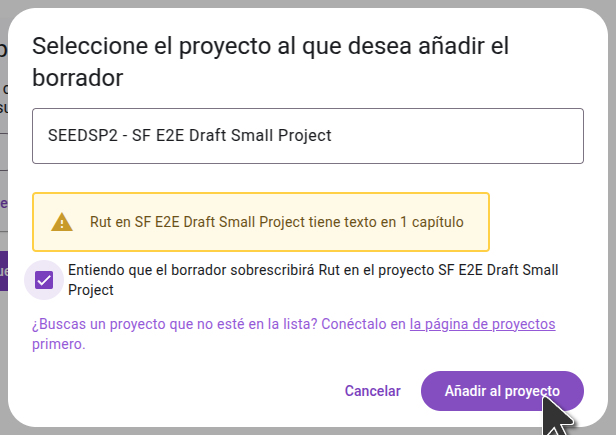

When your draft is finished, Scripture Forge will indicate that it's ready and list the books that were drafted. Generated drafts are **not** automatically imported to your project. You can preview or import drafts from the **Generate draft** page.

- To import **individual chapters**, preview the chapter and choose "Add to project." Individual chapters can only be added to the current project.
- To import a **full book**, open the three-dot menu next to the book name. You can choose to import the book into the current project or a different project.

## Previsualizar un borrador

Click on a book title to view the draft. El borrador se abrirá en una nueva pestaña en la página del editor.

:::tip

Para comparar el borrador con el texto del que se tradujo, establezca una fuente en la página de configuración. Esto le permitirá ver una fuente y el borrador resultante uno al lado del otro.

Si has hecho el borrador de un libro que el equipo ya ha terminado de traducir, puedes mover la pestaña del borrador al otro lado de la página y compararla con la traducción del equipo.

:::

## Importar un solo capítulo

When previewing the draft, you can import the draft of the current chapter into the project by clicking "Add to project". Puede ir a cada capítulo del libro y previsualizar e importar cada capítulo uno a la vez. This will add the chapter to the current project; not to a different project.

## Importar un libro entero

If you want to import an entire book, you can do this from the "Generate draft" page. Haga clic en el menú de tres puntos junto al libro y luego seleccione la opción para importarlo al proyecto actual o a un proyecto diferente.

En el cuadro de diálogo que se abre, seleccione el proyecto al que desea importar el borrador. Si el proyecto aún no ha sido conectado en Scripture Forge, necesitará conectarlo primero. **Importante:** La importación del borrador reemplazará cualquier contenido existente en el proyecto para ese libro.

:::note

El proyecto ya debe tener el libro que está importando. Asegúrese de que ya ha creado el libro en Paratext y lo sincronizó con Scripture Forge.

:::

Una vez que haya importado el borrador a un proyecto, sincronice el proyecto en Scripture Forge y haga un enviar/recibir en Paratext para ver los cambios.

## Exportación de archivos USFM

Si prefiere no importar el borrador directamente a su proyecto, también puede descargarlo como archivos USFM. En la página "Generar borrador", haga clic en "Descargar borrador" y extraiga los archivos en su computadora. A continuación, puede importar estos archivos a un proyecto en Paratext.

## Ver borradores en Paratext 10 Studio

Paratext 10 Studio includes a Scripture Forge extension. You can view drafts without importing them:

1. Open the Scripture Forge extension.
2. Iniciar sesión en Scripture Forge.
3. Select your project to view the draft.

