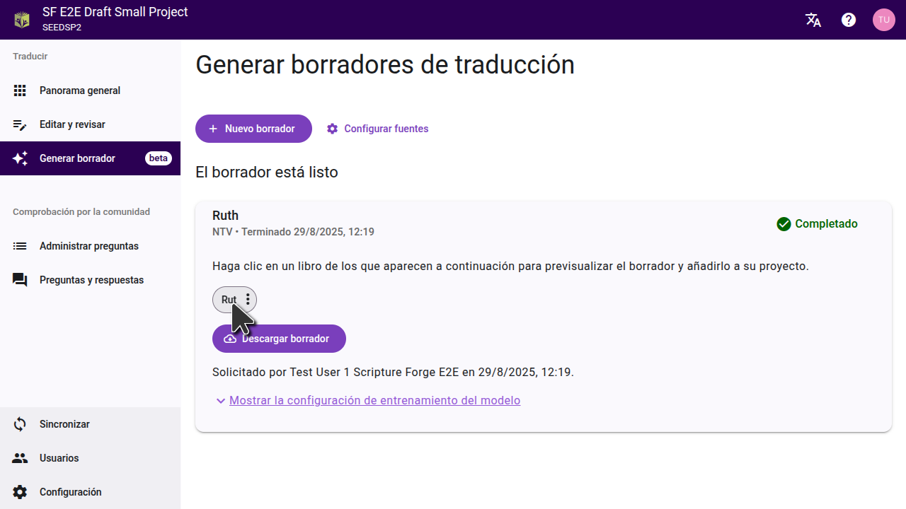
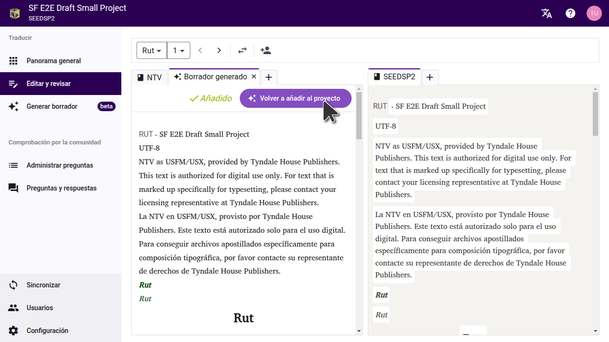
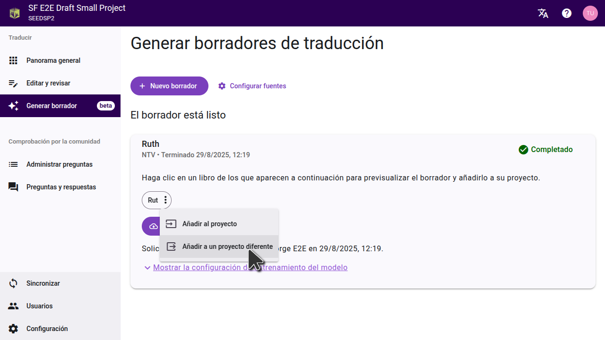

Cuando termine su borrador, Scripture Forge le indicará que está listo y listará los libros que fueron borrados. Los borradores generados **no** se importan automáticamente a su proyecto. Puedes previsualizar o importar borradores desde la página **Generar borrador**.

- Para importar **capítulos individuales**, previsualiza el capítulo y elige "Añadir al proyecto". Los capítulos individuales sólo pueden ser añadidos al proyecto actual.
- Para importar un **libro completo**, abra el menú de tres puntos situado junto al nombre del libro. Puede elegir importar el libro al proyecto actual o a un proyecto diferente.

## Previsualizar un borrador

Haga clic en el título de un libro para ver el borrador. El borrador se abrirá en una nueva pestaña en la página del editor.

:::tip

Para comparar el borrador con el texto del que se tradujo, establezca una fuente en la página de configuración. Esto le permitirá ver una fuente y el borrador resultante uno al lado del otro.

Si has hecho el borrador de un libro que el equipo ya ha terminado de traducir, puedes mover la pestaña del borrador al otro lado de la página y compararla con la traducción del equipo.

:::

## Importar un solo capítulo

Al previsualizar el borrador, puedes importar el borrador del capítulo actual al proyecto haciendo clic en "Añadir al proyecto". Puede ir a cada capítulo del libro y previsualizar e importar cada capítulo uno a la vez. Esto añadirá el capítulo al proyecto actual; no a un proyecto diferente.

## Importar un libro entero

Si desea importar un libro entero, puede hacerlo desde la página "Generar borrador". Haga clic en el menú de tres puntos junto al libro y luego seleccione la opción para importarlo al proyecto actual o a un proyecto diferente.

En el cuadro de diálogo que se abre, seleccione el proyecto al que desea importar el borrador. Si el proyecto aún no ha sido conectado en Scripture Forge, necesitará conectarlo primero. **Importante:** La importación del borrador reemplazará cualquier contenido existente en el proyecto para ese libro.

:::note

El proyecto ya debe tener el libro que está importando. Asegúrese de que ya ha creado el libro en Paratext y lo sincronizó con Scripture Forge.

:::

Una vez que haya importado el borrador a un proyecto, sincronice el proyecto en Scripture Forge y haga un enviar/recibir en Paratext para ver los cambios.

## Exportación de archivos USFM

Si prefiere no importar el borrador directamente a su proyecto, también puede descargarlo como archivos USFM. En la página "Generar borrador", haga clic en "Descargar borrador" y extraiga los archivos en su computadora. A continuación, puede importar estos archivos a un proyecto en Paratext.

## Ver borradores en Paratext 10 Studio

Paratext 10 Studio incluye una extensión de Scripture Forge. Puedes ver borradores sin importarlos:

1. Abra la extensión Scripture Forge.
2. Iniciar sesión en Scripture Forge.
3. Seleccione su proyecto para ver el borrador.

