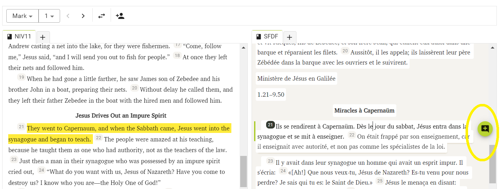

import ReactPlayer from "react-player";

# Aplicar y editar un borrador {#2a0f75e3f955442e9b4f4b375f8cc58f}

<ReactPlayer controls url="https://youtu.be/S4yvGDlcZ9o" />

# Cómo aplicar un borrador {#1430d745ac9e80878a51d2b8e2be7d05}

Una vez generado el borrador, está listo para ser revisado y editado por un traductor y debe pasar por los siguientes pasos de traducción.

Para empezar a editar, primero hay que añadir el borrador al proyecto. Hay 3 opciones para hacerlo:

### **1) Capítulo por capítulo** {#1430d745ac9e80a29085eecf41dc2997}

Haga clic en el nombre del Libro del borrador que se ha generado. Accederá a la interfaz "Editar y revisar". La imagen inferior muestra el borrador del Deuteronomio.

Aquí verá, por un lado, el borrador del primer capítulo disponible. En el otro lado verá su proyecto, que estará vacío y no tendrá datos para el capítulo seleccionado. Para añadir el borrador a su proyecto, haga clic en "Añadir al proyecto" Esto añadirá sólo el capítulo actual a su proyecto y podrá empezar a revisarlo y editarlo.

### 2. Añadir todo el libro {#1430d745ac9e803183c8d916bc54de64}

Una vez generados los borradores, haga clic en el menú de 3 puntos situado junto al nombre del libro que desea añadir a su proyecto. A continuación, haga clic en "Añadir al proyecto" para añadir todo el libro a su proyecto.

### 3. Descarga el Borrador y añádelo a través de Paratext {#1430d745ac9e80cdb498cad97099687e}

Haga clic en "Descargar borrador", que descargará el borrador en un archivo .usfm. Este archivo puede añadirse a su proyecto a través de Paratext. Después de que se haya añadido a través de Paratext, por favor asegúrese de ejecutar un envío/recepción en Paratext y luego una sincronización en Scripture Forge para reflejar esto en su proyecto en Scripture Forge.

# **Cómo editar un borrador** {#1430d745ac9e80cb8debce126560e7b5}

Esto puede hacerse en Scripture Forge haciendo clic en "Editar y revisar", lo que le llevará a la pantalla que se muestra a continuación. La imagen inferior muestra el libro de Marcos.

La interfaz le proporcionará dos secciones; una mostrará la traducción de referencia primaria (conocida como fuente), y la otra tendrá el borrador recién generado (conocido como destino). Aquí puedes revisar el borrador y hacer cambios si es necesario, igual que en Paratext.

### **Navegar por el borrador** {#1430d745ac9e803187c2ff37b7ee519c}

Si ha generado un borrador para más de un libro, puede navegar por los libros desde la lista desplegable disponible en la parte superior izquierda de la pantalla, como se muestra a continuación.

También puede navegar hasta un capítulo concreto utilizando la lista desplegable que aparece justo al lado. También puede navegar hasta el capítulo anterior o siguiente utilizando las flechas situadas junto al menú desplegable.

Si desea intercambiar la ubicación del origen y el destino (paneles izquierdo y derecho), puede hacerlo pulsando el botón de intercambio, como se muestra a continuación.

Observe que al seleccionar un versículo en el borrador se resaltará en amarillo el versículo correspondiente de la Traducción Primaria de Referencia.

Cuando seleccione un versículo y empiece a trabajar en él, la traducción de referencia primaria correspondiente navegará automáticamente y mostrará el mismo versículo en la lengua de origen, lo que facilitará el seguimiento del borrador.

### **Añadir comentarios** {#1430d745ac9e8038aee0f2290df4172b}

Scripture Forge permite a los usuarios añadir comentarios adicionales a medida que trabajan en los borradores.

Para ello, seleccione el versículo en el que desea añadir el comentario y pulse el botón "Añadir comentario".

Una vez añadido un comentario, se marcará con una estrella, como se muestra a continuación. Para actualizar o editar el comentario, simplemente haga clic en la estrella y se le pedirá que realice los cambios deseados.

Cuando el borrador se aplique a tu proyecto Paratext, los comentarios se exportarán a tu proyecto Paratext como notas.

### **Visualización del historial** {#1430d745ac9e809d90bbf0371c2d6c6d}

Scripture Forge guarda un historial de los borradores cada vez que se ejecuta una sincronización. Si alguna vez necesitas volver a una versión anterior del borrador, puedes hacerlo consultando su historial.

Para ello, haga clic en el botón Nueva pestaña, como se muestra a continuación, y seleccione "Historial"

Ahora, utilizando la lista desplegable, seleccione la fecha para abrir la versión deseada de su borrador.

**Tenga en cuenta que cuando se genere un nuevo borrador, se perderán los borradores anteriores que no se hayan guardado. Recuerda descargar el borrador o aplicarlo a tu proyecto Paratext y ejecutar una sincronización antes de generar un nuevo borrador.**
