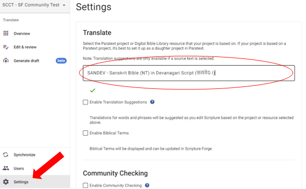

## **Inscríbase en Auto Drafting** {#c01e77600a3b440ead3f1b816837d614}

Para acceder al borrador automático de Scripture Forge, deberá hacer clic en el botón "Generar borrador" del menú principal. Si es la primera vez que genera un borrador en su proyecto, se le pedirá que se registre en Borrador de traducciones y que rellene el formulario de Borrador de traducciones. Verá el botón "Inscribirse en Drafting" como se muestra en la imagen inferior.

Después de rellenar el formulario, espere un par de días para que el equipo de incorporación de Scripture Forge lo revise e investigue los mejores ajustes para su proyecto. Una vez hecho esto, el equipo se pondrá en contacto con usted con más instrucciones para guiarle en el proceso de redacción.

### **Selección de la traducción de referencia primaria** {#26e1244e99c0459bad277d7cff4417b8}

Para seleccionar o cambiar su traducción de referencia primaria, vaya a la ventana "Configuración". Aquí, en la subsección Traducir, encontrará un menú desplegable que le mostrará una lista de recursos. Puede hacer clic aquí para seleccionar o cambiar la traducción de referencia para su proyecto.

Esto afectará a todo el proyecto y a cualquiera que tenga acceso a él en Scripture Forge.

_**No puede utilizar el dibujo automático sin seleccionar una traducción de referencia primaria.**_

También tiene la opción de seleccionar la casilla "Activar sugerencias de traducción" justo debajo de este menú desplegable. Este buzón permite hacer sugerencias a todos los usuarios del proyecto. Por favor, tenga en cuenta que esto es independiente del dibujo automático.

_**Le recomendamos que desactive las Sugerencias de traducción si piensa utilizar el dibujo automático.**_

## **Configuración de la generación de borradores de traducción** {#4e17f4ac70274b9d8d615ad3d2679a82}

Una vez que el equipo de incorporación de Scripture Forge le haya notificado que su proyecto está listo para Autoborrador, esta sección aparecerá en Configuración. El equipo de Scripture Forge le ayudará con instrucciones para estos ajustes como parte del proceso de incorporación.

Como se muestra en la imagen superior, se le presentarán algunas opciones. Puede optar por dejarlas sin marcar si no desea utilizarlas. Una vez seleccionada una casilla, utilice la lista desplegable que aparece para seleccionar su fuente alternativa.

**1) Casilla de verificación Utilizar una fuente diferente para la redacción**

- Esto le permitirá seleccionar una traducción que se utilizará **en lugar de** la Traducción de Referencia Primaria para generar un borrador.
- La traducción alternativa seleccionada aquí debe ser el **mismo idioma** que la Traducción de Referencia Primaria.
- Esta traducción influirá en el estilo y en el contenido léxico y exegético del borrador.

**2) Utilizar una fuente diferente para la casilla de verificación Formación**

- Esto le permitirá seleccionar una traducción que se utilizará **en lugar de** la Traducción de Referencia Primaria para entrenar el modelo lingüístico.
- La traducción alternativa seleccionada aquí debe ser el **mismo idioma** que la Traducción de Referencia Primaria.
- Se trata de una configuración técnica que sólo debe establecerse si así lo indica el equipo de Scripture Forge.

**3) Casilla de verificación de pretraducción de encabezados y material no transversal** - Le recomendamos que deje esta casilla sin marcar. Los títulos de las secciones se seguirán traduciendo.

**4) Casilla de verificación Permitir datos de entrenamiento adicionales** - Si selecciona esta casilla, podrá cargar cualquier documento adicional que pueda utilizarse para entrenar el modelo lingüístico. Estos archivos deben contener frases paralelas en las mismas lenguas de origen y de destino que la traducción de referencia primaria y el proyecto de destino. Tenga en cuenta que **sólo puede cargar archivos .csv** para este fin.
