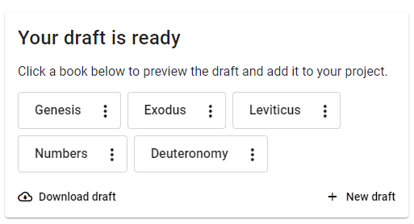

## **Questions about Scripture Forge** {#1b30d745ac9e80a38ebef8610e57c100}

1. How does Scripture Forge fit into my translation steps?

    _Scripture Forge is a tool designed to help you navigate the drafting phase more effectively and quickly while maintaining the quality of your work. It is not a replacement to the translation steps, instead think of it as a resource to help you be more productive while drafting and community checking_

2. Does Scripture Forge keep a backup of my project data? Who is responsible for keeping the data safe?

    _Scripture Forge maintains a version of the project on SIL-controlled servers, and is responsible for keeping that project secure. The project also syncs with your Paratext project, which is stored on the Paratext servers. Be aware that the data does travel over the Internet when you connect to the Scripture Forge interface online._

3. How can I get support or help from the SF team?

    _You may use the following links to contact us or find support:_

    - **Learning and Documentation:** [https://software.sil.org/ScriptureForge](https://software.sil.org/ScriptureForge)And [https://help.scriptureforge.org](https://help.scriptureforge.org/)
    - **Questions and Support:** email: support_team@scriptureforge.org
    - **Report an issue:**[https://scriptureforge.freshdesk.com/support/tickets/new](https://scriptureforge.freshdesk.com/support/tickets/new) email: help@scriptureforge.org

## **Questions on Sources and Training the model** {#1b30d745ac9e80e791d9f0c3ee971c5c}

1. How do I improve the quality of my Drafts?

    _There are 2 primary ways to improve drafts._

    - _The first is to add more data to the Translation model. You can do this by choosing more books in Step 2 - “Choose books for Training the Language Model.” The more data available for training the better will be the results of the drafts._
    - _The second way is to improve the quality of the data in the Translation Model. You can do this by making sure the books you have chosen are well checked for consistency in areas such as spelling, punctuation and content. The better the quality of the data, the better the system will learn to generate good drafts._
    - _Many teams also see benefit from using an up to date back translation as an additional training source_

2. Why do you want me to set a separate training source that isn't my main source?

    _If there’s a text that’s more closely aligned with your translation, it may make it easier for the model to learn the relationships between the two languages. A separate training source is not always needed but is an option we provide_

3. How do I change the source or use a different version to train the translation model?

    _You can change the source of your project by navigating to Settings and then selecting the required one as a resource under “Translate.”_

4. Why is the book I want not visible in my list of books?

    _The book needs to exist in both the source and target projects in Paratext. Please ensure this and then run a send/receive in Paratext and a synchronize in Scripture Forge so that Scripture Forge has the latest information from Paratext_

5. Why is there a red exclamation mark when I select a new Primary source translation in the Settings page?

    _It means that setting the source was unsuccessful. You can refresh the page and try again_

## **Questions on Drafting** {#1b30d745ac9e8095b256da102cecb88a}

1. How long does it take to generate my draft?

    _It currently takes roughly 3 hours to generate a draft. However, since this is dependent on server availability and how many books you have requested, we recommend generating no more than 3 books at a time. If the draft generation is taking an unusually long time please reach out to us to report the issue._

2. How will I know when my draft is done?

    _You may check the “Generate draft” page to see the status, and when it’s done, you’ll see a message similar to this:_

    

3. Why does my book only have Chapter 1 in the project?
    - _Adding a draft to the project happens on a chapter-by-chapter basis from the “Autodraft” window under “Edit and Review”. So if only one chapter is added, it will be the only chapter available in the project. Other chapters will have to be added individually._
    - _You can add the whole book by navigating to “Generate Draft” and finding the draft that has been generated. Click the 3 dot menu available next to the name of the book you wish to add, and then click “Add to project.” This will add the whole book to your project_

4. Why does my button say “re-add to project”

    _If you edit a chapter after “adding to project” and want to revert to the unedited SF draft, you can re-import the original draft by clicking the “Re-add to project” button_

5. What does the History tab show?

    _When you make changes to your draft, Scripture Forge saves a version of those changes that you may access via the history tab. You may revert your project to an older version from here by clicking the “Restore this version” button._

