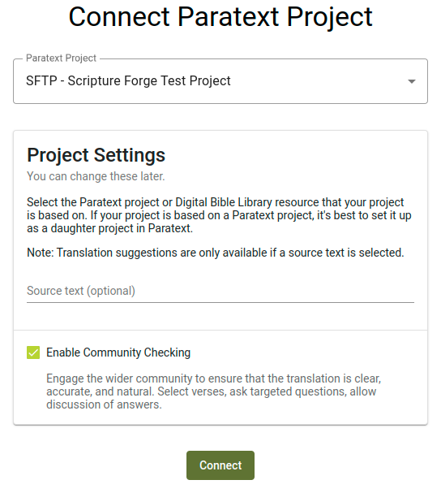
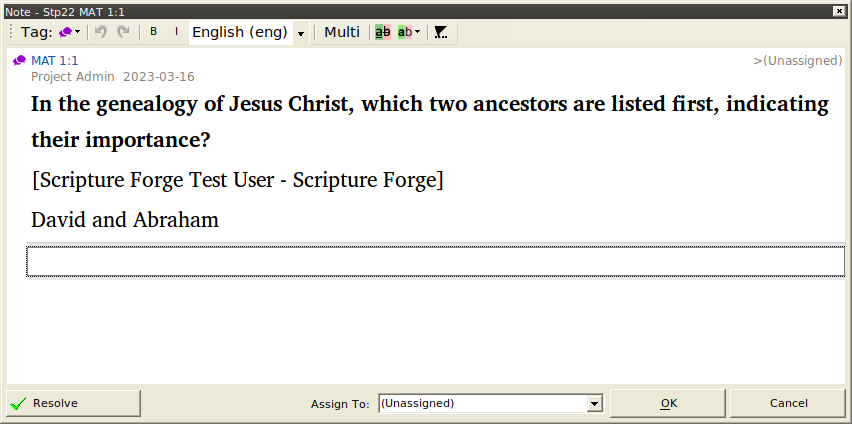

import ReactPlayer from "react-player";

Esta guía describe cómo utilizar [la Fragua de las Escrituras](https://scriptureforge.org/) para la verificación comunitaria. Los pasos básicos son los siguientes:

1. Conectar un proyecto [Paratext](https://paratext.org/) a Scripture Forge
2. Crea o importa preguntas para que las respondan los verificadores
3. Adjuntar grabación de audio del texto (opcional)
4. Invita a la gente a comprobar tu proyecto
5. Recibe las respuestas a las preguntas e interactúa con ellas
6. Sincroniza el proyecto para que las respuestas aparezcan como notas en Paratext

## Conectar un proyecto Paratext a Scripture Forge {#a49ffad707ee4ff69860080e6e805c3b}

1. Ve a [scriptureforge.org](https://scriptureforge.org/) y haz clic en **Iniciar sesión**.
2. En la página de inicio de sesión, haz clic en **Iniciar sesión con Paratext**.
3. Conéctate a través de Paratext y autoriza a Scripture Forge a acceder a tu cuenta de Paratext.
4. Cuando se te redirija de nuevo a Scripture Forge, ve a la [página de conectar proyecto](https://scriptureforge.org/connect-project). Si aún no tienes ningún proyecto, se te enviará allí automáticamente. Si ya tienes proyectos en Scripture Forge, haz clic en el selector de proyectos de la esquina superior izquierda y haz clic en **Conectar proyecto**.
5. La página conectar proyecto muestra una lista de los proyectos a los que tienes acceso en Paratext. Selecciona de la lista el proyecto al que quieres conectarte.
6. Asegúrate de que la casilla **Habilitar comprobación comunitaria** está seleccionada. No te preocupes ahora por el texto original. Esa configuración puede cambiarse posteriormente en la página de configuración del proyecto.
7. Haz clic en **Conectar**. En menos de un minuto deberías acceder al proyecto en Scripture Forge.

## Añadir preguntas al proyecto {#47b7c1e2e8a74a3489b167849470745e}

Para obtener comentarios sobre tu traducción, tendrás que añadir preguntas de comprobación de la comprensión. Puedes importar preguntas creadas por otra persona o crear las tuyas propias.

:::note

Actualmente, la única forma de obtener opiniones de los verificadores de la comunidad es hacer preguntas de verificación. Algunos administradores de proyectos han pedido que los verificadores puedan añadir comentarios al texto incluso sin que haya una pregunta presente. Si es algo de lo que puede beneficiarse tu proyecto, [expresa tu apoyo a la propuesta](https://community.scripture.software.sil.org/t/feature-request-comments-to-any-bible-verse-chosen/2506/6) en el [sitio de la comunidad de la Fragua de las Escrituras](https://community.scripture.software.sil.org/).

:::

<ReactPlayer controls url="https://youtu.be/J-led5En3D8" />

### Crear preguntas individualmente en la Fragua de las Escrituras {#0c67e74b02944b61a33b3ea2d101effd}

Para añadir preguntas a tu proyecto, haz clic en **Visión general** en la sección **Comprobación de la comunidad** de la barra lateral de navegación. A continuación, haz clic en el botón **Añadir pregunta**. Se abrirá un diálogo que te permitirá crear una pregunta.

Una pregunta puede aplicarse a un solo versículo o a varios. Escribe una referencia en la casilla de **referencia de la Escritura**, o haz clic en la flecha desplegable para seleccionar un libro, un capítulo y un versículo. Si quieres que la pregunta abarque varios versículos, introduce una referencia final en la segunda casilla. Una vez que hayas introducido una referencia, aparecerá el texto, con los versículos que hayas elegido resaltados.

Escribe tu pregunta en la casilla **Pregunta**. Si quieres añadir una versión de audio de la pregunta, haz clic en el botón **Grabar**. Puede que se te pida permiso para acceder a tu micrófono. Cuando hayas terminado de grabar, haz clic en **Detener grabación**. Luego puedes reproducir la grabación para oír cómo suena. Haz clic en el botón **Inténtalo de nuevo** si no estás satisfecho. También puedes subir un archivo de audio en lugar de grabar, si lo prefieres.

Haz clic en **Guardar** y tu pregunta se añadirá a la lista de preguntas de comprobación de la comunidad.

### Importar preguntas de una hoja de cálculo {#42107c9def434bf396442d0004577710}

Crear preguntas una a una puede ser tedioso, así que también hemos hecho posible importar preguntas desde una hoja de cálculo. Puedes utilizar un programa como Microsoft Excel, Google Sheets o LibreOffice Calc para crear o editar una lista de preguntas. Si buscas un conjunto de preguntas prefabricadas, considera las [Preguntas de traducción de unfoldingWord®](https://git.door43.org/unfoldingWord/en_tq). Si vas a la página enlazada y haces clic en uno de los archivos, podrás descargarlo, abrirlo como hoja de cálculo y editar la lista de preguntas.

Aquí tienes un ejemplo de cómo deben ser las filas de tu hoja de cálculo para poder importarla a Scripture Forge:

| Referencia | Pregunta                                                  |
| ---------- | --------------------------------------------------------- |
| HEB 1:1    | ¿A qué se refiere "nuestros padres"?                      |
| HEB 1:2    | ¿Qué significa que el Hijo es "heredero de todo"?         |
| HEB 1:2-3  | ¿Quién es el "Hijo" del que se habla en estos versículos? |

La hoja de cálculo también puede tener más columnas, pero no se utilizarán todas las columnas excepto las de "referencia" y "pregunta". Los archivos TSV publicados por unfoldingWord tienen un formato ligeramente distinto, pero también pueden importarse a Scripture Forge.

:::note

La referencia debe tener el nombre del libro abreviado de la misma forma que Paratext abrevia los nombres de los libros. Por ejemplo, **HEB 1:** 1 funcionará, pero **Hebreos 1:1** no funcionará.

:::

Si necesitas ayuda para poner tu hoja de cálculo en el formato adecuado para importarla a Scripture Forge, estaremos encantados de ayudarte. Sólo tienes que enviar un correo electrónico a [help@scriptureforge.org](mailto:help@scriptureforge.org).

1. Guarda tu hoja de cálculo como archivo CSV.
2. A continuación, en Scripture Forge, haz clic en **Visión general** en la sección **Comprobación de la comunidad** de la barra lateral de navegación.
3. A continuación, haz clic en el botón **Importación masiva**. Se abrirá un diálogo pidiéndote que elijas de dónde quieres importar las preguntas.
4. Haz clic en **Importar desde archivo CSV** y selecciona el archivo.
    1. Si tienes algunas filas en tu archivo que no tienen una referencia y una pregunta válidas, se mostrará una advertencia haciéndote saber que esas filas se omitirán.
    2. De lo contrario, se te mostrará una lista de preguntas.

### Importar todas las preguntas {#3f10139da5904f1883acafad811b422c}

Para importar todas las preguntas del archivo CSV, sigue estos pasos:

1. Pulsa la casilla situada en la parte superior de la lista. Esto seleccionará todas las preguntas.
2. Haz clic en **Importar preguntas seleccionadas**.

### Importar un subconjunto de preguntas {#f8f6b299154e4caca7aa04661a820efd}

También puedes filtrar por un subconjunto de preguntas:

1. Utiliza las casillas **Referencia desde** y **Referencia hasta** para especificar los versículos en los que quieres que empiecen y terminen las preguntas.
2. Por ejemplo, si sólo quieres importar preguntas para la Marca 5:
    1. Pon **MRK 5:1** en la casilla **Referencia de**.
    2. Pon **MRK 5:43** en la casilla **Referencia a**.
3. Haz clic en la casilla situada en la parte superior de la lista para seleccionar todas las preguntas. Sólo se seleccionarán las preguntas que se muestren.
4. Haz clic en **Importar preguntas seleccionadas**.

:::note

No hace falta que recuerdes que hay 43 versículos en Marcos 5 para filtrar todos los versículos del capítulo. Si haces clic en la flecha desplegable del cuadro **Referencia a**, se abrirá un cuadro de diálogo que te permitirá seleccionar un libro, un capítulo y un versículo. Una vez que selecciones Marcos 5, aparecerá una lista de los versículos de Marcos 5, y podrás seleccionar el último, que es el versículo 43. También puedes escribir **MRK 5:100** en la casilla **Referencia a**, y se incluirán todos los versículos de Marcos 5, aunque en realidad no haya un versículo 100 en Marcos 5.

:::

### Importar preguntas de Transcelerator {#1ed2e353d94847a3861ad3a69d531aac}

[Transcelerator](https://software.sil.org/transcelerator/) es un complemento para Paratext que cuenta con un banco de preguntas de comprobación de la comprensión ya preparadas en varios de los principales idiomas. Esas preguntas pueden traducirse en Paratext, exportarse a Scripture Forge y, tras una sincronización, importarse a Scripture Forge.

Para importar preguntas desde Transcelerator:

1. Descarga e instala Transcelerator desde [software.sil.org/transcelerator/download](https://software.sil.org/transcelerator/download/).
2. Desde Paratext, lanza Transcelerator.
3. Dentro de Transcelerator, abre el menú **Archivo** y haz clic en **Producir archivos Scripture Forge**.
4. Escribe las traducciones de las preguntas en inglés que quieras utilizar en la columna **Traducción**. Para cada pregunta que esté lista, selecciona la casilla **Confirmada** para las preguntas.
5. Cierra Transcelerator, y haz un envío y recepción con Paratext.
6. En Scripture Forge, en la barra lateral de navegación, haz clic en **Sincronizar**. En la página que se abre, haz clic en **Sincronizar** para enviar y recibir las preguntas del Transcelerator desde Paratext.
7. A continuación, en Scripture Forge, haz clic en **Visión general** en la sección **Comprobación de la comunidad** de la barra lateral de navegación. A continuación, haz clic en el botón **Importación masiva**.
8. Se abrirá un diálogo pidiéndote que elijas de dónde quieres importar las preguntas. Haz clic en **Importar desde Transcelerator**.
9. Selecciona las preguntas que quieres importar. Los pasos para hacerlo son exactamente los mismos que en la sección anterior titulada **Importar preguntas desde una hoja de cálculo**. Consulta esa sección para obtener instrucciones sobre cómo filtrar las preguntas que desees.
10. Haz clic en **Importar preguntas seleccionadas** y tus preguntas se añadirán al proyecto.

## Adjuntar grabación de audio del texto {#fd31ef9b6d74417099996e7dadb5068e}

Scripture Forge puede reproducir una grabación de audio de cada pasaje para las comprobaciones comunitarias. Para ello, deberá cargar un archivo de audio y un archivo de tiempo para cada capítulo. Los archivos de tiempo permiten a Scripture Forge resaltar cada versículo a medida que se pronuncia.

### Grabación del texto {#1926abf6118c46bba16353d2ef85169f}

Scripture Forge admite audio en formatos de archivo .mp3 y .wav. Los archivos de tiempo son compatibles con HearThis, aeneas, Audacity y Adobe Audition.

Una de las opciones más sencillas es utilizar [HearThis](http://software.sil.org/hearthis) para grabar la traducción. [Esta guía](https://software.sil.org/downloads/r/scriptureappbuilder/Scripture-App-Builder-08-Using-HearThis-for-Audio-Recording.pdf) le guiará a través del proceso de grabación de las escrituras y la producción de archivos de audio y tiempo. Sáltese los pasos del final sobre el uso de Scripture App Builder.

Los [recursos](https://software.sil.org/scriptureappbuilder/resources/) para Scripture App Builder tratan enfoques más avanzados, como el uso de Glyssen para una grabación de audio dramatizada.

### Creación de archivos de temporización {#066182aa22c64dc7a74ad0556619c4b9}

Si ya tiene audio grabado, existen varias opciones para crear datos de temporización.

Puede generar automáticamente archivos de temporización utilizando aeneas siguiendo [estas instrucciones](https://software.sil.org/downloads/r/scriptureappbuilder/Scripture-App-Builder-07-Using-aeneas-for-Audio-Text-Synchronization.pdf).

Alternativamente, puede crear manualmente archivos de sincronización utilizando Audacity siguiendo [esta guía](https://software.sil.org/downloads/r/scriptureappbuilder/Scripture-App-Builder-06-Using-Audacity-for-Audio-Text-Synchronization.pdf). Otra opción es Adobe Audition. Los datos de tiempo de Adobe Audition se admiten en formatos de tiempo decimal o FPS. No admitimos el formato "muestras".

### Adjuntar audio {#a4d3ee4a4d8b4e1d9bca42b837e57f77}

Para cargar archivos de audio y cronometraje, en la barra lateral haga clic en **Preguntas y respuestas**, navegue hasta el capítulo al que desee adjuntar audio y, a continuación, haga clic en el icono **Gestionar audio** de la esquina superior derecha. Haga clic en **Examinar archivos** y seleccione la grabación de audio y el archivo de sincronización asociado para ese capítulo, después haga clic en **Guardar**.

## Invita a la gente a comprobar tu proyecto {#678dca00aaa54fd79319ecf815049301}

<ReactPlayer controls url="https://youtu.be/aBPHCF56hxA" />

Una vez que tengas las preguntas sobre tu proyecto, es hora de invitar a los verificadores de la comunidad.

En la barra lateral, haz clic en **Configuración** y desplázate hasta **Configuración de la comprobación comunitaria**.

### Ajustes de interacción con el usuario {#84a006f1fbaa4c50a8ce8bac248c0e1d}

El primer ajuste a tener en cuenta es **Permitir que los correctores vean las respuestas de los demás**. Cuando se presenta una pregunta a los verificadores de la comunidad, no se muestran las respuestas existentes de otros verificadores de la comunidad para que no influyan en la respuesta que se dé. Una vez contestada una pregunta, se mostrarán las demás respuestas a la pregunta, y los verificadores podrán comentar y dar "me gusta" a las respuestas de los demás. Si no deseas esta interacción y quieres que las respuestas de otros correctores estén siempre ocultas, desactiva **Permitir que los correctores vean las respuestas de los demás**.

### Ajustes compartidos {#5aa7e3d8451f40cfa6b33c5dd39a3c6f}

Si quieres que los verificadores de la comunidad puedan invitar a amigos al proyecto, asegúrate de que la opción **Permitir que los usuarios inviten a otros** al proyecto está activada. Si esta opción está desactivada, sólo los administradores del proyecto podrán añadir verificadores comunitarios al proyecto.

Si activas este ajuste, puedes elegir entre dos modos de compartir. Si seleccionas **Cualquiera con un enlace**, puedes enviar a la gente un enlace al proyecto, y cualquiera que haga clic en el enlace puede unirse al proyecto. Esto es ideal si quieres invitar a un grupo de personas (por ejemplo, podrías compartir el enlace en un grupo de Facebook o WhatsApp). Cualquiera que tenga el enlace podrá enviarlo a otra persona para que se una al proyecto. También puedes seleccionar **Sólo invitaciones por correo electrónico**, y los verificadores de la comunidad sólo podrán invitar a amigos enviando una invitación en Scripture Forge (Scripture Forge enviará una invitación por correo electrónico a la persona).

### Invitar a verificadores comunitarios {#2271d918980445fd8bc89587ccf33c4f}

En la barra lateral, haz clic en **Usuarios**, y se te presentarán las opciones para compartir.

Si activaste la opción de compartir enlaces en el paso anterior, habrá un enlace que podrás copiar para compartir el proyecto. Para copiar el enlace, haz clic en el icono de copia situado a la derecha del enlace.

Si el uso compartido de enlaces está desactivado, o si quieres enviar invitaciones por correo electrónico a los usuarios, escribe el correo electrónico del usuario al que quieres invitar, selecciona el rol de **Community Checker** y elige un idioma de invitación. Luego haz clic en **Enviar**. Se enviará un correo electrónico con un enlace a la persona, que tendrá que hacer clic en el enlace e inscribirse para unirse al proyecto.

## Recibe las respuestas a las preguntas e interactúa con ellas {#d09b7e47859e451783e6dcca8a80f40a}

<ReactPlayer controls url="https://youtu.be/C3bgh3yufVg" />

Para supervisar las respuestas de la comprobación comunitaria, haz clic en **Resumen** en la sección **Comprobación comunitaria** de la barra lateral de navegación. Junto con una lista de preguntas, se mostrarán estadísticas básicas sobre las respuestas.

Para ver las respuestas de los verificadores comunitarios, haz clic en uno de los libros de la sección **Verificación comunitaria** de la barra lateral de navegación. A continuación, haz clic en una pregunta para ver las respuestas que se han dado. Si quieres que una respuesta se exporte a Paratext, haz clic en **Marcar para exportar** en esa respuesta. Si no quieres hacer nada más con la respuesta, haz clic en **Resolver**. Esto no elimina la respuesta, sino que la marca como que no necesita ninguna otra acción.

Si quieres encontrar respuestas que no han sido marcadas para exportar, o marcadas como resueltas, utiliza el filtro situado encima de la lista de preguntas para encontrar **Respuestas no revisadas**.

Si prefieres que todas las respuestas se exporten a Paratext sin marcarlas individualmente para su exportación, ve a la configuración del proyecto y busca la sección **Exportar respuestas**. La opción por defecto es exportar sólo **las Respuestas marcadas para exportar**, pero este ajuste puede cambiarse a **Todas las respuestas** o **Sin respuestas**.

## Sincroniza el proyecto para que las respuestas aparezcan como notas en Paratext {#1502b9d293ff4c3aacbe91834fd02bb2}

En la barra lateral de navegación, haz clic en **Sincronizar**. En la página que se abre, haz clic en **Sincronizar** para enviar y recibir cambios desde Paratext. Después abre tu proyecto en Paratext y haz un envío y una recepción. Las respuestas de los verificadores de la comunidad aparecerán en tu proyecto como notas. Ten en cuenta que si respondes a estas notas en Paratext, tus respuestas no aparecerán como comentarios sobre la respuesta en Scripture Forge.

La nota mostrará la pregunta original, el nombre del verificador de la comunidad que respondió y la propia respuesta, como se muestra a continuación.

Las notas generadas a partir de las respuestas de comprobación comunitaria tendrán una etiqueta de nota única, con un icono diferente al de otras notas de tu proyecto Paratext. Puedes cambiar el icono editando la etiqueta de la nota. Para más detalles, consulta [el artículo de ayuda de Paratext sobre etiquetas de notas personalizadas](https://paratext.org/paratext-training/tutorials/custom-project-note-tags-tutorial/). También puedes [filtrar las notas por su etiqueta de nota](https://paratext.org/2022/08/15/custom-note-tags/#Filter_for_Custom_Note_Tags), lo que te permite mostrar sólo las respuestas de comprobación de la comunidad, u ocultarlas por completo de la vista.

./673009763.png

Actualmente las respuestas de audio aparecen en Paratext pero no se puede reproducir el audio. Para reproducir el audio de una respuesta hay que abrirla en Scripture Forge. Esto puede mejorarse en el futuro.

:::

## Comentarios {#f7d132ecbb04437e9d5a81440f84b6df}

Si tiene preguntas, problemas o sugerencias, póngase en contacto con el equipo de Scripture Forge en [help@scriptureforge.org](mailto:help@scriptureforge.org). También puede publicar en el [sitio de apoyo a la comunidad](https://community.scripture.software.sil.org/c/scripture-forge/19), que permite a otros participar en la conversación. Valoramos tus comentarios y con frecuencia hacemos cambios o solucionamos problemas a petición de nuestros usuarios.

