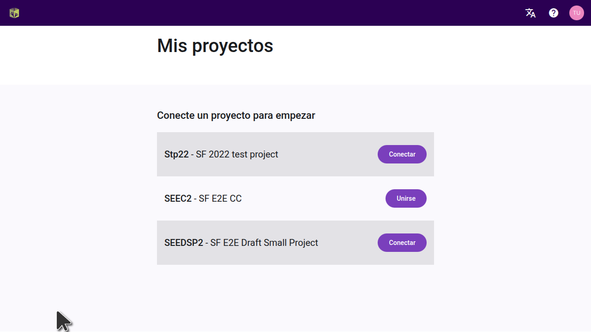
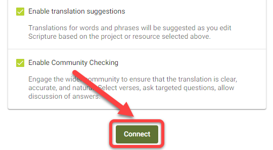
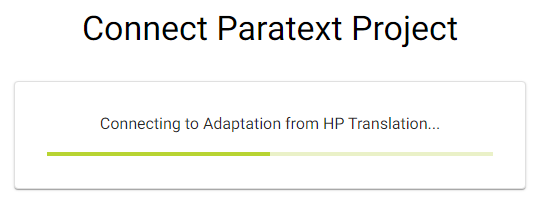

import ReactPlayer from "react-player";

## Introducción {#6222bdf3db3a44b4bf01a9cc6ffdaa80}

:::tip

Los proyectos Paratext sólo necesitan conectarse una vez dentro de Scripture Forge.

:::

Después de conectar un proyecto Paratext a Scripture Forge, todos los usuarios que sean miembros del proyecto en Paratext (en Permisos de usuario) podrán abrir el proyecto en Scripture Forge.

Para poder abrir un proyecto en [Scripture](/log-in) Forge, el usuario sólo tiene que [iniciar sesión en Scripture Forge con los datos de su cuenta Paratext](/log-in).

<ReactPlayer controls url="https://youtu.be/exEJxc19Zm4" />

## Cómo conectar un proyecto de paratexto a Scripture Forge {#a71dfc268ebb43a0b19c0ab7018f92b4}

1. Si **nunca has conectado** un proyecto a Scripture Forge:
    1. Haz clic en el botón Conectar proyecto:

        

2. Si ya has conectado un proyecto a Scripture Forge, sigue estas instrucciones para conectar cualquier proyecto adicional:

    Para ver la lista de proyectos a los que tiene acceso en Paratext, haga clic en el icono de Scripture Forge, en la parte superior izquierda de la pantalla.

También puede hacer clic en el icono de su perfil en la parte superior derecha de la pantalla y, en el menú desplegable, hacer clic en "Mis proyectos".

En la lista mostrada, podrá abrir proyectos si ya están conectados. También puede unirse a un proyecto o hacer clic en "Conectar" para conectar un proyecto por primera vez en Scripture Forge.

Tras hacer clic en "Conectar", se le pedirá que seleccione la fuente del proyecto. En la lista desplegable disponible, seleccione la fuente que desea utilizar para su proyecto.

Opcional: Activar las sugerencias de traducción (nº 1 más abajo)

Opcional: Activar la comprobación comunitaria (nº 2 arriba)

Cuando esté listo, haga clic en Conectar:

Espera a que Scripture Forge conecte el proyecto Paratext:

Scripture Forge puede tardar un poco en conectar tu proyecto, la barra verde de progreso dejará de moverse cuando tu proyecto esté completamente conectado:

Nota: Es posible que pueda trabajar en Scripture Forge antes de que esté totalmente conectado.

