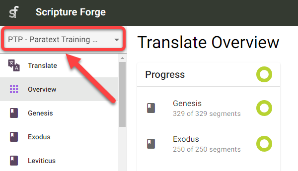
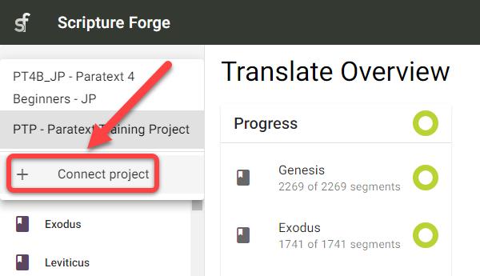
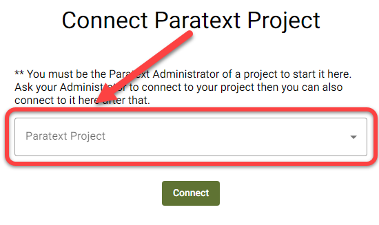
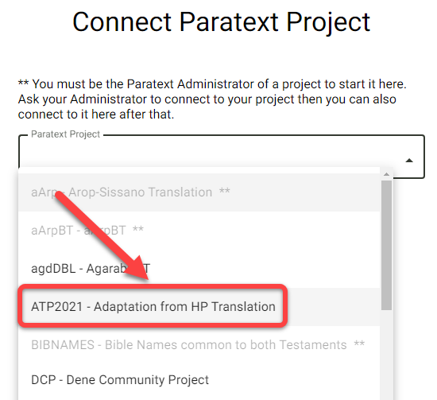

## Introducción {#6222bdf3db3a44b4bf01a9cc6ffdaa80}

:::tip

Los proyectos Paratext sólo necesitan conectarse una vez dentro de Scripture Forge.

:::

Después de conectar un proyecto Paratext a Scripture Forge, todos los usuarios que sean miembros del proyecto en Paratext (en Permisos de usuario) podrán abrir el proyecto en Scripture Forge.

Para poder abrir un proyecto en [Scripture](/log-in) Forge, el usuario sólo tiene que [iniciar sesión en Scripture Forge con los datos de su cuenta Paratext](/log-in).

## Cómo conectar un proyecto de paratexto a Scripture Forge {#a71dfc268ebb43a0b19c0ab7018f92b4}

1. Si **nunca has conectado** un proyecto a Scripture Forge:
    1. Haz clic en el botón Conectar proyecto:

        

2. Si ya has conectado un proyecto a Scripture Forge, sigue estas instrucciones para conectar cualquier proyecto adicional:
    1. Haga clic en el panel de navegación de Scripture Forge:

        

    2. La página de navegación también puede tener este aspecto:

        

    3. Haz clic en Conectar proyecto:

        

3. Haga clic en el desplegable Proyecto Paratexto:

    

4. Elija el proyecto que desea conectar:

    

5. Opcional: Si desea utilizar las Sugerencias de traducción o ver otro proyecto/recurso junto a su proyecto:
    1. Haga clic en el área de texto Fuente:

        

    2. Seleccione el proyecto de origen:

        

6. Opcional: Activar las sugerencias de traducción (nº 1 más abajo)

    

7. Opcional: Activar la comprobación comunitaria (nº 2 arriba)
8. Haz clic en Conectar:

    

9. Espera a que Scripture Forge conecte el proyecto Paratext:

    

10. Scripture Forge puede tardar un poco en conectar tu proyecto, la barra verde de progreso dejará de moverse cuando tu proyecto esté completamente conectado:

    

Nota: Es posible que pueda trabajar en Scripture Forge antes de que esté totalmente conectado.

