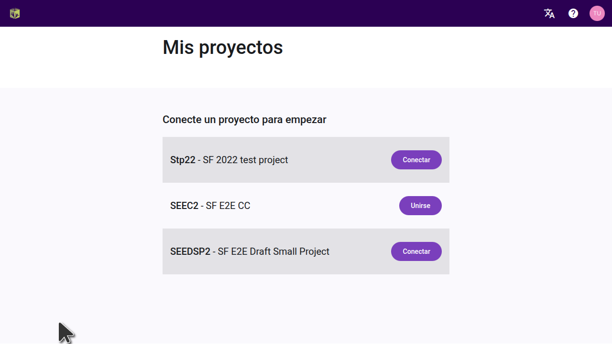

Antes de poder acceder a un proyecto Paratext en Scripture Forge, debe estar conectado a Scripture Forge. Al conectar un proyecto se crea una copia del proyecto Paratext en Scripture Forge que puede [sincronizarse con Paratext](syncing-with-paratext).

<!-- The following paragraph is an EXACT copy of one of the paragraphs on the /syncing-with-paratext page and should be kept in sync with it. Both pages have the need to explain the relationship between Paratext and Scripture Forge projects, and having them identical means translators only have to translate it once. -->

En Paratext, cada miembro del proyecto tiene una copia del proyecto en su propio ordenador, y Enviar/Recibir se utiliza para compartir cambios con otros miembros. Cuando un proyecto está conectado a Scripture Forge, todos los miembros del proyecto en Scripture Forge trabajan en una única copia del proyecto, por lo que cualquier cambio realizado por un miembro es visto inmediatamente por otro miembro, si ambos miembros están conectados. Estos cambios se enviarán al proyecto Paratext cuando se realice una sincronización en Scripture Forge, y cualquier cambio realizado en Paratext se sincronizará con el proyecto Scripture Forge.

Para conectar un proyecto Paratext en Scripture Forge, [inicia sesión con Paratext](log-in). Cuando inicie una sesión, la página **Mis proyectos** se cargará. Si se encuentra en otra página de Scripture Forge, puede acceder a la página **Mis proyectos** haciendo clic en el logotipo de Scripture Forge situado en la esquina superior izquierda de la página. La página **Mis proyectos** enumera todos los proyectos de los que es miembro en Paratext, incluidos los que están conectados a Scripture Forge y los que aún no lo están. Si ya ha vinculado un proyecto y es miembro del proyecto Paratext, puede unirse al proyecto Scripture Forge haciendo clic en **Unirse**. Si el proyecto aún no se ha conectado y usted es su administrador, haga clic en **Conectar**. Sólo los administradores pueden conectar un proyecto en esta página.

