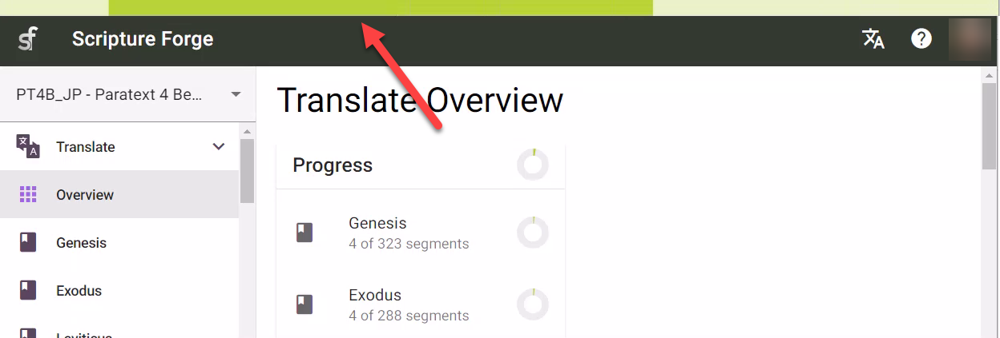

import ReactPlayer from "react-player";

## Introducción {#6222bdf3db3a44b4bf01a9cc6ffdaa80}

:::tip

Los proyectos Paratext sólo necesitan conectarse una vez dentro de Scripture Forge.

:::

Después de conectar un proyecto Paratext a Scripture Forge, todos los usuarios que sean miembros del proyecto en Paratext (en Permisos de usuario) podrán abrir el proyecto en Scripture Forge.

Para poder abrir un proyecto en [Scripture](/log-in) Forge, el usuario sólo tiene que [iniciar sesión en Scripture Forge con los datos de su cuenta Paratext](/log-in).

<ReactPlayer controls url="https://youtu.be/exEJxc19Zm4" />

## Cómo conectar un proyecto de paratexto a Scripture Forge {#a71dfc268ebb43a0b19c0ab7018f92b4}

1. Si **nunca has conectado** un proyecto a Scripture Forge:
    1. Haz clic en el botón Conectar proyecto:

        

2. If you have already connected a project to Scripture Forge, follow these instructions to connect any additional projects:

    To view the list of projects you have access to in Paratext, click on the Scripture Forge icon on the top left of the screen.

Alternatively, you can also click on your profile icon on the top right of the screen and from the drop-down menu click “My Projects.”

From the displayed list, you shall be able to Open projects if they are already connected. You can also join a project or click on “Connect” to connect a project for the first time in Scripture Forge.

After clicking on “Connect” you will be asked to select your Project Source. From the available drop-down list, select the source you wish to use for your project.

Opcional: Activar las sugerencias de traducción (nº 1 más abajo)

Opcional: Activar la comprobación comunitaria (nº 2 arriba)

When you are ready, Click Connect:

Espera a que Scripture Forge conecte el proyecto Paratext:

Scripture Forge puede tardar un poco en conectar tu proyecto, la barra verde de progreso dejará de moverse cuando tu proyecto esté completamente conectado:

Nota: Es posible que pueda trabajar en Scripture Forge antes de que esté totalmente conectado.

