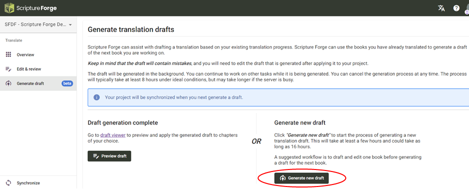

Una vez que se haya dado de alta en Drafting y haya configurado los ajustes necesarios, podrá acceder a Scripture Forge AI Drafting haciendo clic en el botón "Generar borrador" del menú principal. Ahora tendrá acceso al botón "Generar nuevo borrador".

Una vez que haga clic en él, accederá a un **proceso de 2 pasos** para generar su borrador.

- **Paso 1:** El primer paso para generar un borrador es seleccionar los libros que desea traducir. Aquí sólo se mostrarán los libros que ya estén añadidos en su proyecto Paratext. Recomendamos seleccionar hasta 5 libros para traducir a la vez.

- **Paso 2:** A continuación, seleccionará los libros que se utilizarán para entrenar el modelo lingüístico. Estos libros deben estar bien revisados pero no es necesario que los consultores los revisen. Cuantos más libros, mejor será el resultado de la redacción. Si ha elegido un libro para traducir en el paso 1, no puede elegirlo para entrenar el modelo en este paso

- Paso 3 (opcional): A continuación, también puede cargar cualquier archivo adicional para el entrenamiento del modelo lingüístico. Deben estar en formato .csv. Este paso es opcional.

Una vez completados estos pasos, verá disponible el botón "Generar borrador". Una vez que haga clic en él, dé tiempo a la Fragua de las Escrituras para generar los borradores. Esto puede tardar unas 8 horas o más dependiendo de lo ocupados que estén nuestros servidores.
