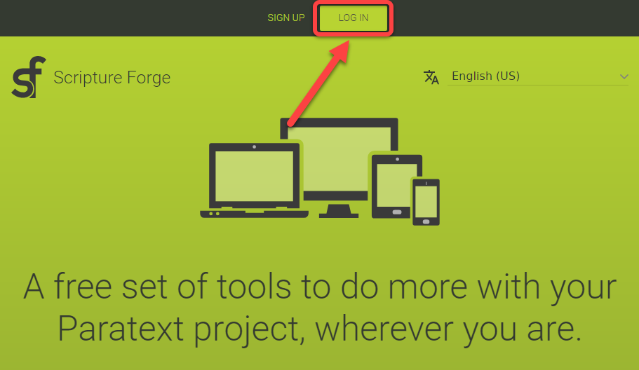
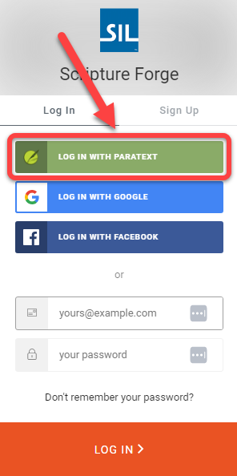
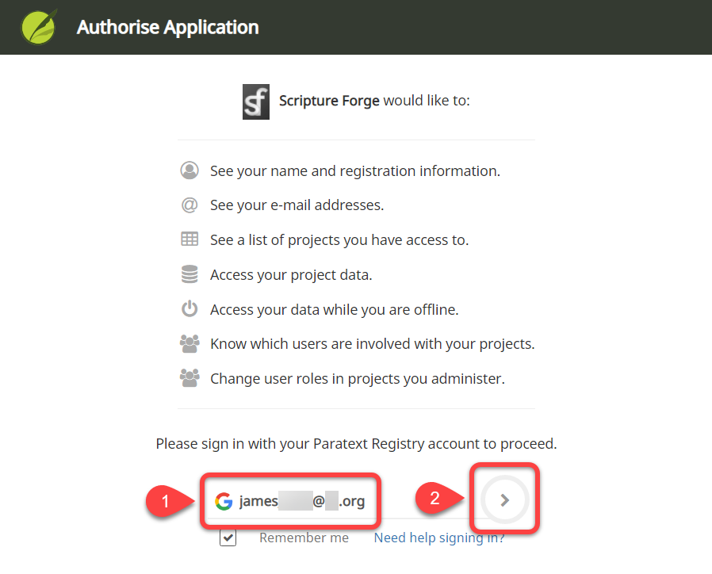

## Iniciar sesión en Scripture Forge con una cuenta de Paratext {#68acbb7da03045a7b357e41c0107f6d1}

1. Ir a [https://scriptureforge.org/](https://scriptureforge.org/)
1. Si ya tiene un registro de Paratext (o ha creado una cuenta de Scripture Forge), haga clic en el botón Iniciar sesión:

    

1. Haga clic en Iniciar sesión con Paratext:

    

1. Autorizar Scripture Forge para conectarse con su cuenta de Paratext.
    1. Escriba la dirección de correo electrónico asociada con su cuenta [de Registro de Paratext](https://registry.paratext.org/users/me) (#1 abajo):

        

    2. Haga clic en la flecha de inicio de sesión (#2 arriba).
