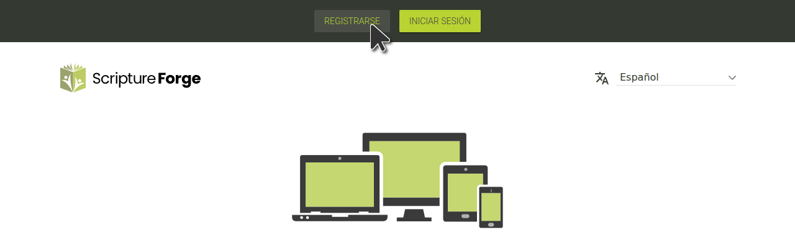
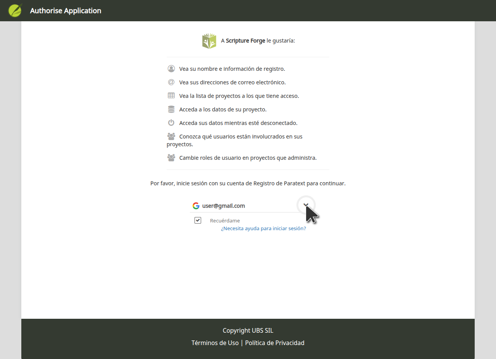

## Iniciar sesión en Scripture Forge con una cuenta de Paratext

1. Ir a [https://scriptureforge.org/](https://scriptureforge.org/)
2. If you already have a Paratext registration (or have created a Scripture Forge account), click the **Log In** button. Otherwise click the **Sign Up** button.

Then click **Log in with Paratext** or **Sign up with Paratext**, depending on which button you clicked previously:

A continuación, autoriza a Scripture Forge a conectarse con tu cuenta Paratext. Cuando se le solicite, escriba la dirección de correo electrónico asociada con su cuenta [de Registro de Paratext](https://registry.paratext.org/users/me) y luego haga clic en la flecha de inicio de sesión (o presione la tecla Ingresar)

