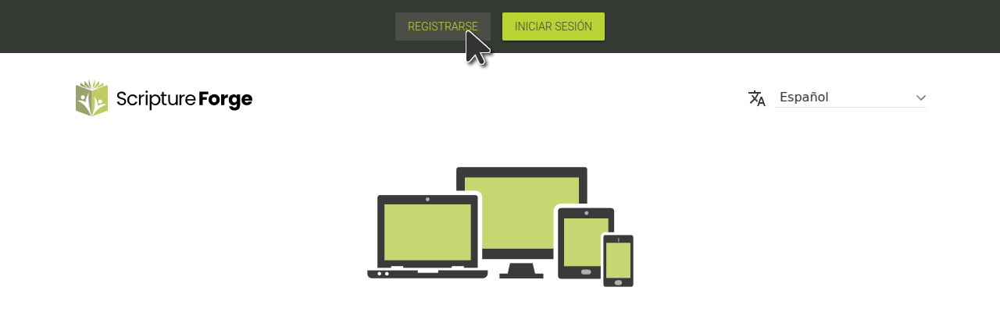

## Iniciar sesión en Scripture Forge con una cuenta de Paratext

1. Ir a [https://scriptureforge.org/](https://scriptureforge.org/)
2. Si ya tiene un registro de Paratext (o ha creado una cuenta de Scripture Forge), haga clic en el botón Iniciar sesión:

A continuación, haga clic en Iniciar sesión con Paratext:

A continuación, autoriza a Scripture Forge a conectarse con tu cuenta Paratext. Cuando se le solicite, escriba la dirección de correo electrónico asociada con su cuenta [de Registro de Paratext](https://registry.paratext.org/users/me) y luego haga clic en la flecha de inicio de sesión (o presione la tecla Ingresar)

