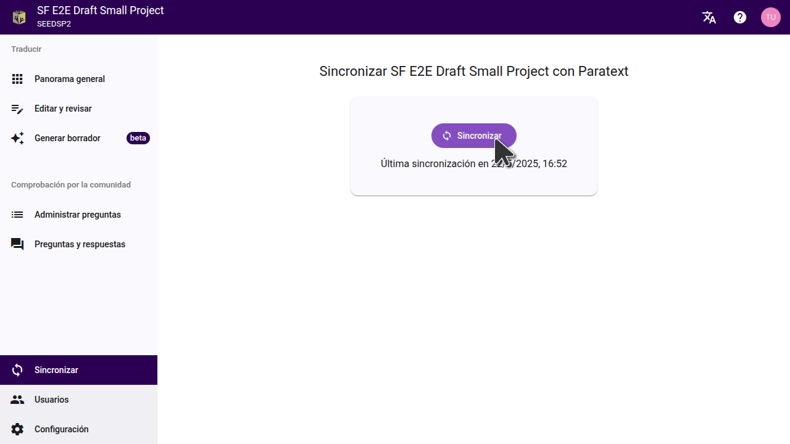

Sincronizar su proyecto de Scripture Forge con Paratext es muy importante, ya que esto permite que los cambios que haya realizado en Scripture Forge se guarden en los servidores de Paratext y también extrae los datos más recientes de su proyecto de Paratext a Scripture Forge.

Es similar a la función Enviar/Recibir de Paratext.

_Nótese que la sincronización de un proyecto en Scripture Forge se aplica a_ _**TODOS LOS USUARIOS**_ _del proyecto SF. También se aplicará al servidor Paratext como una función de envío/recepción._

## **Cómo sincronizar su proyecto** {#d0af3ae0f98640c6a88fe4132a015be0}

Para sincronizar un proyecto, debe hacer clic en "Sincronizar" en el menú principal. Esto le mostrará el botón "Sincronizar" en su ventana. Una vez que lo pulse, espere a que se complete la sincronización y las dos flechas dejen de dar vueltas, antes de hacer nada más, como se muestra en la imagen inferior.

## **Cuándo es necesario sincronizar un proyecto** {#b19f92d1a5714c4fb57b61672d95b898}

- Se produce una sincronización automática cuando conecta por primera vez un proyecto a Scripture Forge desde Paratext. Scripture Forge sigue importando los datos de su proyecto desde el servidor Paratext mientras se sincroniza. Es importante esperar a que se complete la sincronización (las dos flechas dejan de dar vueltas) antes de intentar hacer cualquier otra cosa.
- Después de realizar cualquier cambio en su proyecto Paratext y hacer clic en "enviar/recibir", es importante ejecutar una sincronización en Scripture Forge para permitir que estos cambios se importen a Scripture Forge. La mera ejecución de la función "enviar/recibir" en Paratext no es suficiente para que los cambios se reflejen en Scripture Forge.
- Se produce una sincronización automática cuando selecciona una traducción de referencia o genera un borrador. No obstante, en caso de problemas de conectividad con la sincronización automática, recomendamos hacerlo también manualmente para garantizar que el borrador se basa en los datos más recientes del proyecto.
- Después de añadir un borrador a su proyecto en Scripture Forge, recuerde ejecutar una sincronización para guardar los datos en el servidor Paratext. No genere un nuevo borrador a menos que el primero haya sido añadido a su proyecto o no se guardará en el servidor Paratext y se perderán los datos.
- Cualquier cambio o edición que realice en su proyecto en Scripture Forge debe sincronizarse para guardarlo en el servidor Paratext. Una vez hecho esto, también tendrá que ejecutar un envío/recepción en su proyecto Paratext local para importar estos cambios.
