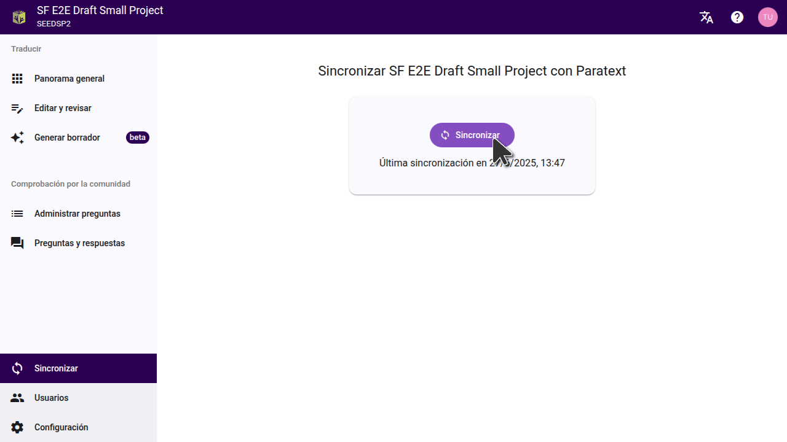

<!-- The following paragraph is an EXACT copy of one of the paragraphs on the /connect-paratext-project page and should be kept in sync with it. Both pages have the need to explain the relationship between Paratext and Scripture Forge projects, and having them identical means translators only have to translate it once. -->

En Paratext, cada miembro del proyecto tiene una copia del proyecto en su propio ordenador, y Enviar/Recibir se utiliza para compartir cambios con otros miembros. Cuando un proyecto está conectado a Scripture Forge, todos los miembros del proyecto en Scripture Forge trabajan en una única copia del proyecto, por lo que cualquier cambio realizado por un miembro es visto inmediatamente por otro miembro, si ambos miembros están conectados. Estos cambios se enviarán al proyecto Paratext cuando se realice una sincronización en Scripture Forge, y cualquier cambio realizado en Paratext se sincronizará con el proyecto Scripture Forge.

## Cómo sincronizar su proyecto {#d0af3ae0f98640c6a88fe4132a015be0}

Para sincronizar un proyecto, haga clic en **Sincronizar con Paratext** en el menú de navegación principal. A continuación, haga clic en el botón **Sincronizar con Paratext**, como se muestra a continuación. Se mostrará el progreso mientras se ejecuta la sincronización, que suele tardar entre 1 y 3 minutos, dependiendo del tamaño del proyecto.

Si Scripture Forge está ocupado sincronizando otros proyectos, es posible que tarde un poco en iniciarse la sincronización, aunque esto es poco frecuente. A veces la sincronización falla y hay que intentarlo de nuevo. Si una sincronización sigue fallando, o está tardando mucho tiempo, por favor [contáctenos para obtener ayuda](mailto:help@scriptureforge.org).

## Cuándo sincronizar un proyecto {#b19f92d1a5714c4fb57b61672d95b898}

En varias ocasiones, Scripture Forge sincronizará automáticamente su proyecto con Paratext. Estos incluyen:

- La primera vez que conectas un proyecto.
- Cuando empieces a generar un nuevo borrador.
- Cuando se modifica la fuente de un proyecto o se configuran fuentes de redacción.

Debe ejecutar una sincronización cada vez que desee enviar cambios de Paratext a Scripture Forge, o de Scripture Forge a Paratext. Aquí hay algunos ejemplos de cuándo debería ejecutar una sincronización:

- Un libro acaba de completarse en Paratext y desea generar un borrador de otro libro. Debe hacer un enviar/recibir en Paratext y luego una sincronización en Scripture Forge para que el libro completo esté disponible como datos de entrenamiento en Scripture Forge.
- El libro está listo para ser revisado por la comunidad. Debe hacer un enviar/recibir en Paratext y luego una sincronización en Scripture Forge para que la última copia del libro se muestre a los revisores de la comunidad.
- Los traductores han editado el texto en Scripture Forge, o han hecho otros cambios que desea en Paratext. Debe hacer una sincronización en Forja bíblica y luego enviar/recibir en Paratext para obtener los últimos cambios.

Debes evitar esperar mucho tiempo para sincronizar después de editar el texto en Scripture Forge. Si alguien hace ediciones en Paratext antes de sincronizar los cambios en Paratext, puede causar conflictos en Paratext.