## ¿Qué son las sugerencias de traducción? {#5f721bd65922446f8eefb001acc89f30}

Las sugerencias de traducción permiten a Scripture Forge analizar conjuntamente un idioma de origen y uno de destino, y sugerir automáticamente palabras/frases para utilizar en el proceso de traducción.

- Las sugerencias de traducción se basan en que Scripture Forge analiza los versículos del proyecto de destino que ya han sido traducidos del proyecto de origen.
- Cuantos más versos tenga tanto en el origen como en el destino, mejores serán las sugerencias.
- Las sugerencias funcionan mejor con las lenguas que son más parecidas, y no funcionan bien con las lenguas que no están relacionadas entre sí.
- Antes de empezar a utilizar las sugerencias de traducción, un administrador del proyecto Paratext debe habilitar las sugerencias de traducción para su proyecto.

## Configure su ventana de sugerencias de traducción {#055dfd61aa9442e3b6c787613c8085d6}

:::note

Esto debe hacerlo cada usuario que desee utilizar las sugerencias de traducción.

:::

### Seleccione su proyecto {#4de2ee23101e4a498e465465740c5a51}

:::tip

Primero debe **seleccionar su proyecto** en la página de navegación, si aún no lo ha hecho.

:::

1. Haga clic en el panel de navegación de Scripture Forge:

    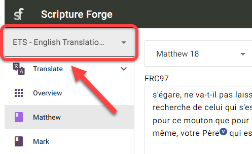

1. Seleccione su proyecto:

    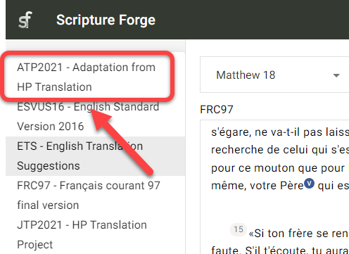

**O**

1. Haga clic en el icono del menú Scripture Forge:

    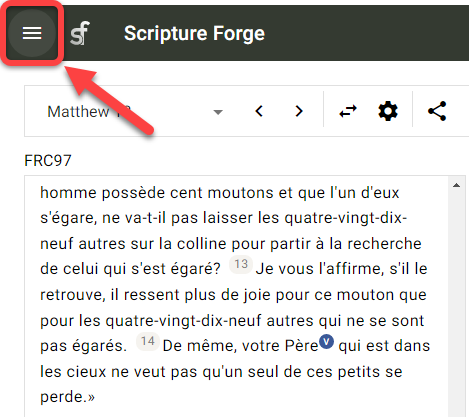

1. Haga clic en el desplegable del proyecto:

    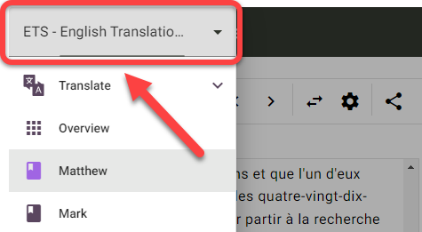

1. Haga clic en su proyecto:

    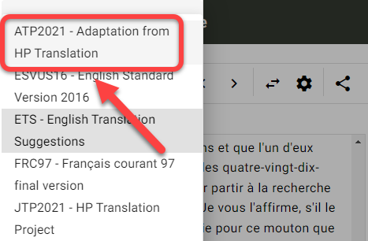

### Configurar la ventana de sugerencias de traducción {#8798a078b0464f5190de5d6dd7e4d132}

1. En el panel de navegación, haga clic en la sección Traducir:

    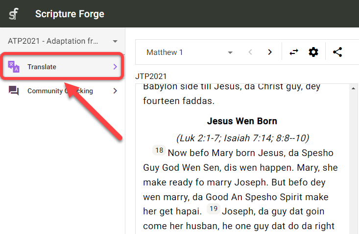

1. Haga clic en el libro en el que desea trabajar:

    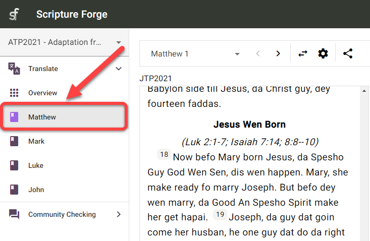

1. El texto de origen aparecerá en la sección de la izquierda y el proyecto de texto de destino en la de la derecha:

    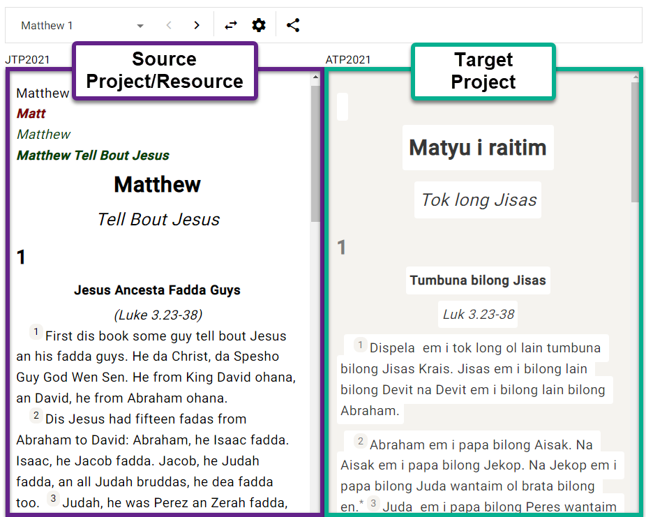

    1. **Nota:** El nombre del proyecto/recurso que está utilizando aparece en la esquina superior izquierda de cada ventana:

        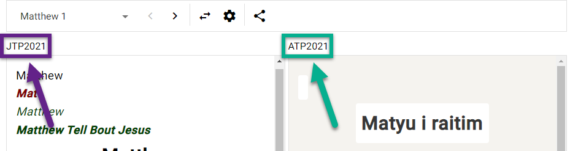

1. Para pasar de un libro a otro:
    1. Vaya al panel de navegación > sección Traducir.
    2. Haga clic en el nombre del libro:

    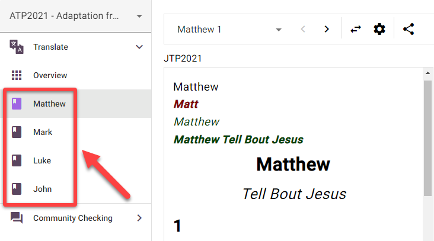

1. Para pasar de un capítulo a otro:
    1. Pulse las flechas derecha e izquierda de la parte superior de la ventana:

    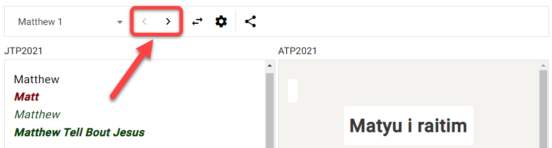

1. Para cambiar los lados del proyecto de origen y de destino:
    1. Pulse el botón "intercambiar origen y destino":

    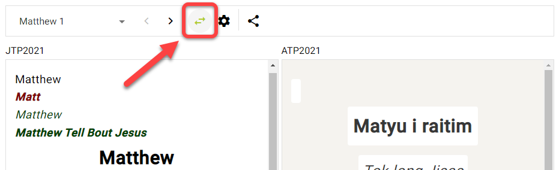

    1. Esto moverá el proyecto de destino al lado izquierdo, y el proyecto/recurso de origen al lado derecho:

    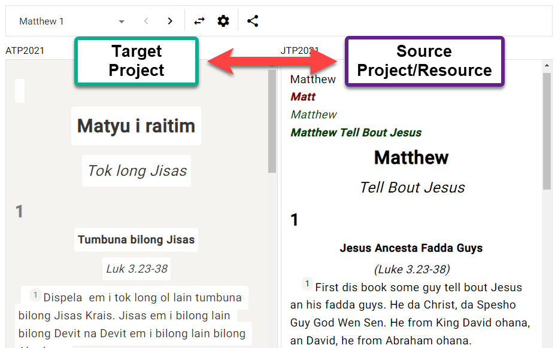

## ¿Qué es un segmento? {#3931f83c77104d27bfa1bcd797303914}

:::tip

Antes de realizar trabajos de traducción en Scripture Forge, debe entender qué es un "**segmento**".

:::

En Scripture Forge, un segmento es una sección de las Escrituras que debe traducirse. Puede tratarse del título de una sección, de un verso o de una parte de un verso (como en la poesía).

Por ejemplo, el siguiente pasaje tiene 6 segmentos (Título, Encabezamiento de sección, Versículo 1, etc.):

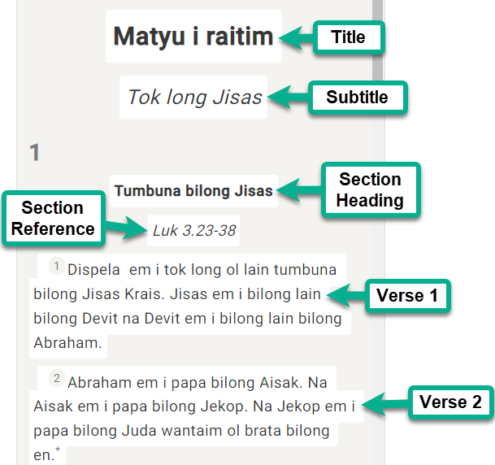

En este pasaje siguiente, hay 8 segmentos en total (nota: el versículo 23 tiene 6 segmentos):

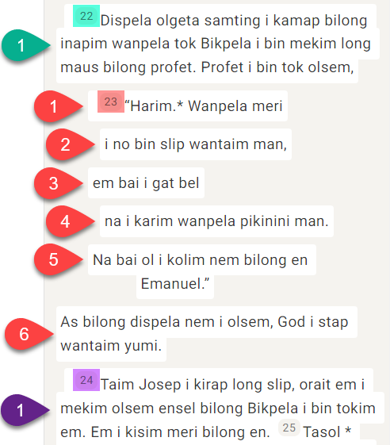

## Cómo utilizar las sugerencias de traducción {#007fd10ab17d498ea44ffb913d92663f}

Ahora que ya sabe cómo navegar en Scripture Forge, es el momento de aprender a utilizar **las sugerencias de traducción**. Recuerde que las sugerencias de traducción se producen cuando Scripture Forge analiza su trabajo de traducción y sugiere automáticamente palabras/frases para utilizar en el proceso de traducción.

1. En su proyecto, vaya al libro y al capítulo que desea traducir.
1. Pulse en el segmento que desea traducir.
1. Comience a escribir su traducción (lado derecho):

    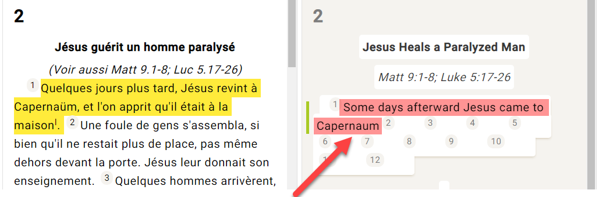

    1. Nota: Scripture Forge guardará las ediciones a medida que escriba.
1. A medida que escribe, pueden aparecer sugerencias en un recuadro situado debajo de donde está escribiendo:

    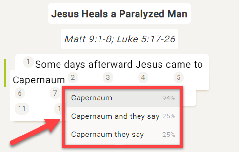

1. Junto a las sugerencias hay un porcentaje:

    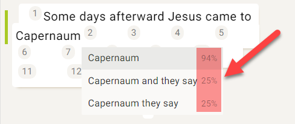

    1. Esto indica el grado de confianza del sistema en que esta sugerencia es correcta. Una sugerencia con un porcentaje más alto tiene más probabilidades de ser una sugerencia de mayor calidad.
1. Si desea utilizar una sugerencia, haga clic en ella o pulse **Intro** cuando dicha sugerencia aparezca resaltada.

    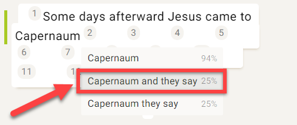

1. Esto insertará esa sugerencia en el texto:

    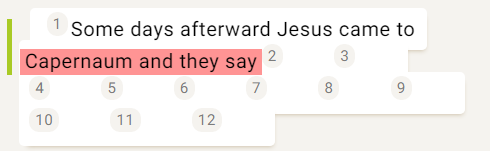

1. Si no le gusta alguna sugerencia que se haya insertado en el texto:
    1. Sólo tiene que borrar o editar las palabras que necesite cambiar.

        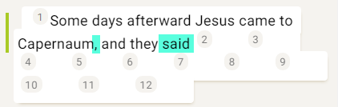

1. Si ninguna de las sugerencias es suficientemente buena, puede ignorarlas y seguir traduciendo.

### Seguir traduciendo {#9e130c3ad9c048a4822e37e0d0ba0750}

:::tip

La Scripture Forge seguirá aprendiendo y haciendo mejores sugerencias a medida que usted traduzca.

Para ajustar la _**configuración de las sugerencias de traducción**_ para tu usuario, consulta los [pasos aquí 🔗](/translation-suggestions).

:::

### Atajos de teclado {#228a943ddd984192b78ae4ccb39c6211}

1. Cuando Scripture Forge le muestre sugerencias de traducción, puede utilizar las **teclas de flecha** **arriba** y **abajo** para resaltar la sugerencia que desee.

    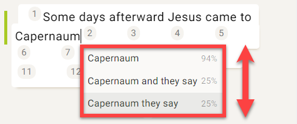

    1. A continuación, pulse **Intro** para utilizar la sugerencia.
1. También puede pulsar **CTRL + &lt;tecla numérica&gt;** para insertar ese número de palabras para la sugerencia resaltada.
    1. Por ejemplo, si se resaltara "Capernaum y dicen":

        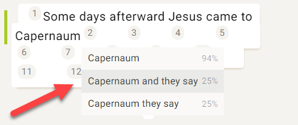

    2. Esto es lo que insertarían las teclas de acceso directo:

        | Acceso directo | Palabras insertadas |
        | -------------- | ------------------- |
        | Ctrl + 1       | Cafarnaún           |
        | Ctrl + 2       | Cafarnaún y         |
        | Ctrl + 3       | Cafarnaúm y ellos   |
        | Ctrl + 4       | Cafarnaúm y dicen   |

## Ajustar la configuración de las sugerencias de traducción - Por usuario {#3822d035acfd42ae888cefbd7b71fcb5}

:::note

Puede configurar los ajustes de sugerencia de traducción para su usuario individual.

:::

1. Seleccione su proyecto en el panel de navegación.
1. Haga clic en la sección Traducir.
1. Haga clic en el libro en el que desea trabajar:
    1. **Nota:** En realidad puede seleccionar cualquier libro para esta parte, los ajustes son los mismos para todos los libros.
1. Pulse el botón Configuración de las sugerencias de traducción:

    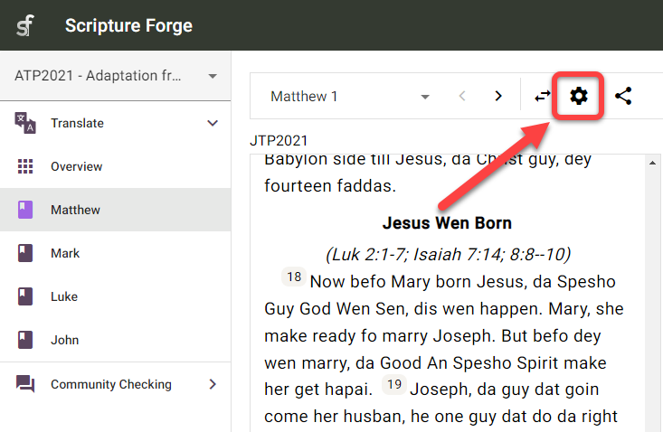

1. Aparecerá el cuadro de diálogo Configuración de las sugerencias de traducción:

    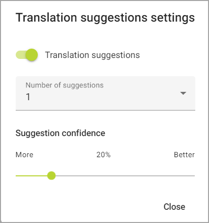

1. Sugerencias de **traducción**: Esto sólo muestra u oculta las sugerencias en el **proyecto actual** para **su usuario**.
    1. Pulse el interruptor Sugerencias de traducción para mostrar u ocultar las sugerencias de traducción mientras escribe:

    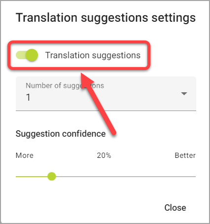

1. **Número de** sugerencias: Cambia el número de sugerencias que verá a la vez.
    1. Haga clic en el área del número de sugerencias:

        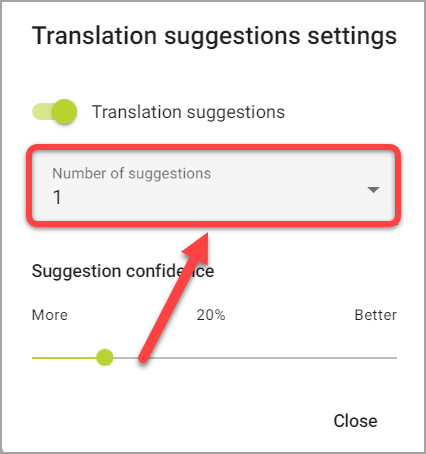

    2. A continuación, pulse el número máximo de sugerencias que desea ver a la vez:

        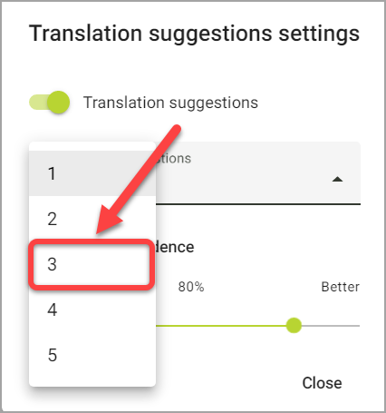

1. **Confianza de las sugerencias:** El valor porcentual que aparece sobre el deslizador muestra el nivel de confianza mínimo de las sugerencias que se ofrecerán.
    1. Haga clic y arrastre el control deslizante para ajustar el nivel de confianza:

        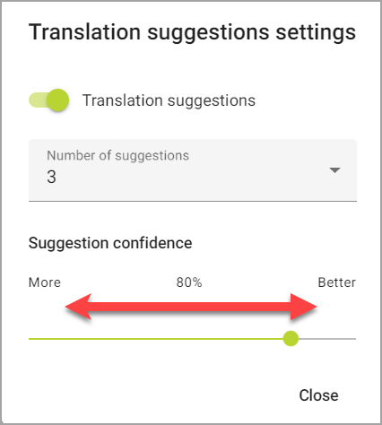

    2. **Más** _aumenta_ el número de sugerencias al incluir _más_ sugerencias que tienen un nivel de confianza bajo.
    3. **Mejor** _disminuye_ el número de sugerencias al incluir sugerencias _mejores_ que tienen un mayor nivel de confianza.
1. Pulse Cerrar cuando haya terminado.
