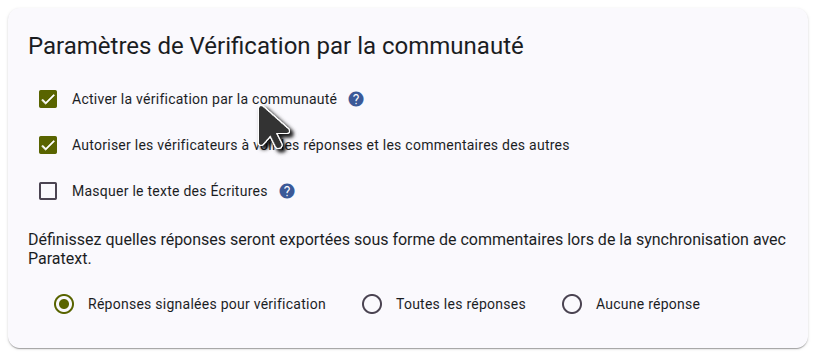

Pour configurer la vérification de la communauté dans Scripture Forge, [connectez-vous avec Paratext](log-in). Vous devez être un administrateur du projet pour configurer la vérification de la communauté.

Si le projet n'a pas encore été connecté à Scripture Forge, [connectez le projet](connect-paratext-project) et gardez la case à cocher **Activer la vérification de la communauté** .

Si le projet a déjà été connecté, vous pouvez activer la vérification de la communauté sur la page **Paramètres**. Dans la section **Vérification de la communauté** de la page des paramètres, cochez la case **Activer le contrôle de la communauté** comme indiqué dans la capture d'écran ci-dessous.

