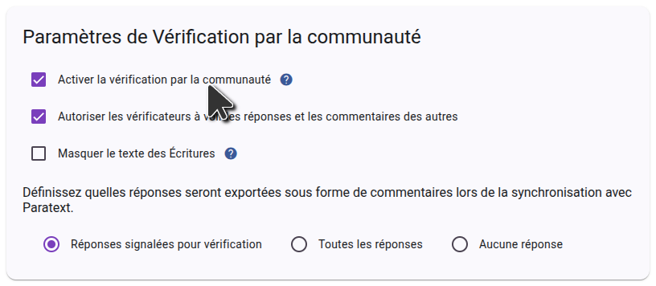

Pour utiliser la vérification communautaire de Scripture Forge, vous devez d'abord vous connecter à Scripture Forge à l'aide de vos identifiants Paratext et connecter votre projet. Une fois que votre projet est connecté, accédez aux Paramètres et descendez jusqu'à la section Vérification de la Communauté. Assurez-vous que la case à cocher « Activer la vérification de la communauté » est sélectionnée comme indiqué dans la capture d'écran ci-dessous

