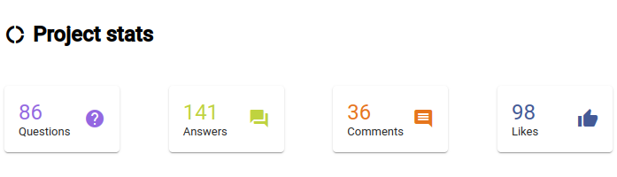
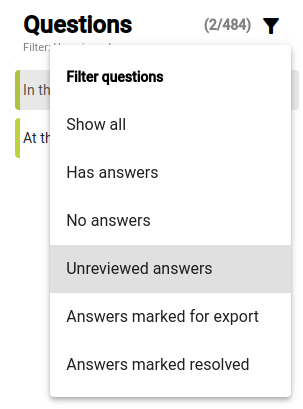

import ReactPlayer from "react-player";

## Recevez les réponses aux questions et interagissez avec elles {#1850d745ac9e800db3dacdee0053beca}

<ReactPlayer controls url="https://youtu.be/C3bgh3yufVg" />

Pour surveiller les réponses à la vérification par la communauté, cliquez sur **Vue d'ensemble** dans la section **Vérification par la communauté** dans la barre latérale de navigation. Outre une liste de questions, des statistiques de base concernant les réponses seront affichées.

Pour afficher les réponses des vérificateurs de la communauté, cliquez sur l'un des livres dans la section **Vérification par la communauté** dans la barre latérale de navigation. Cliquez ensuite sur une question pour voir les réponses qui ont été données. Si vous souhaitez qu'une réponse soit exportée vers Paratext, cliquez sur **Marquer pour l'exportation** sur cette réponse. Si vous ne voulez rien faire d'autre avec la réponse, cliquez sur **Résoudre**. Cela ne supprime pas la réponse, mais la marque comme ne nécessitant pas d'autre action.

Si vous souhaitez trouver des réponses qui n'ont pas été marquées pour l'exportation ou qui ont été marquées comme résolues, utilisez le filtre au-dessus de la liste des questions pour trouver **Réponses non examinées**.

Si vous préférez que toutes les réponses soient exportées vers Paratext sans les marquer individuellement pour l'exportation, allez dans les paramètres du projet et trouvez la section **Exportation des réponses** . L'option par défaut est de n'exporter que **les réponses marquées pour exportation**, mais ce paramètre peut être modifié en**toutes les réponses** ou **aucune réponse**.

## Synchronisez le projet pour que les réponses apparaissent sous forme de remarques dans Paratext {#1850d745ac9e80a8b3f0f50bcdd0be58}

Dans la barre latérale de navigation, cliquez sur **Synchroniser**. Sur la page qui s'ouvre, cliquez sur **Synchroniser** pour envoyer et recevoir les modifications depuis Paratext. Ouvrez ensuite votre projet dans Paratext et effectuez un envoyer recevoir. Les réponses des vérificateurs de la communauté apparaîtront dans votre projet sous forme de remarques. Veuillez noter que si vous répondez à ces remarques dans Paratext, vos réponses n'apparaîtront pas sous forme de commentaires sur la réponse dans Scripture Forge.

La remarque indiquera la question originale, le nom du vérificateur de la communauté qui a répondu, et la réponse elle-même, comme indiqué ci-dessous.

Les remarques générées à partir des réponses de vérification par la communauté auront une étiquette de remarque unique, avec une icône différente des autres remarques de votre projet Paratext. Vous pouvez modifier l'icône en éditant la balise de la remarque. Pour plus de détails, voir [la rubrique d'aide de Paratext sur les balises de remarques personnalisées](https://paratext.org/paratext-training/tutorials/custom-project-note-tags-tutorial/). Vous pouvez également [filtrer les remarques par leur étiquette de remarque](https://paratext.org/2022/08/15/custom-note-tags/#Filter_for_Custom_Note_Tags), ce qui vous permet d'afficher uniquement les réponses de vérification par la communauté ou de les masquer complètement.

:::note

Actuellement, les réponses audio apparaissent dans le Paratext mais l'audio ne peut pas être lancé. Pour lire l'audio d'une réponse, il faut l'ouvrir dans Scripture Forge. Cela pourrait être amélioré à l'avenir.

:::
