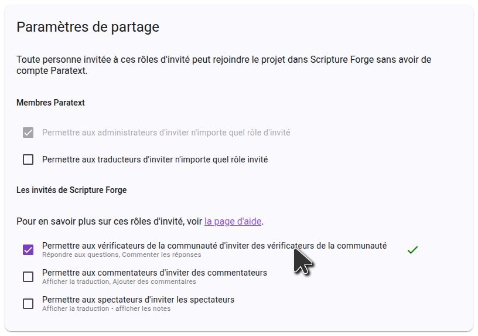
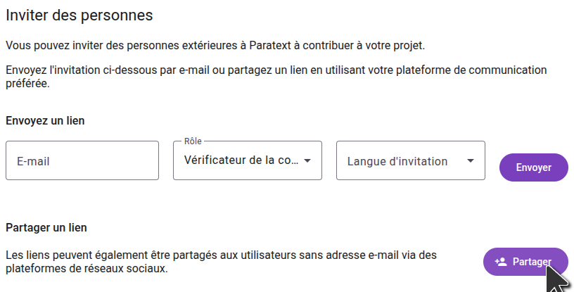

import ReactPlayer from "react-player";

## Invitez des personnes à vérifier votre projet {#1850d745ac9e80caacf5e643bb216f77}

<ReactPlayer controls url="https://youtu.be/aBPHCF56hxA" />

Une fois que vous avez les questions pour votre projet, il est temps d'inviter les vérificateurs de la communauté.

Dans la barre latérale, cliquez sur **Paramètres**, et défilez vers le bas jusqu'à **Paramètres de Vérification par la communauté**.

### Paramètres d'interaction utilisateur {#1850d745ac9e8018b5a7ff9f3ea349e9}

Le premier paramètre à considérer est **Permettre aux vérificateurs de voir leurs réponses respectives**. Lorsqu'une question est présentée aux vérificateurs de la communauté, les réponses existantes des autres vérificateurs de la communauté ne sont pas affichées afin qu'elles n'influencent pas la réponse donnée. Une fois qu'une réponse a été donnée à une question, toutes les autres réponses à cette question s'affichent et les vérificateurs peuvent commenter et mettre des J'aime sur les réponses des autres. Si vous ne souhaitez pas cette interaction et si vous voulez que les réponses des autres vérificateurs soient toujours cachées, désactivez **Permettre aux vérificateurs de voir leurs réponses respectives**.

### Paramètres de partage {#1850d745ac9e8097ad4efcb063fc2603}

Si vous souhaitez que les vérificateurs de la communauté puissent inviter des amis à participer au projet, assurez-vous que l'option **Permettre aux utilisateurs d'inviter d'autres personnes dans le projet** est activée. Si ce paramètre est désactivé, seuls les administrateurs du projet pourront ajouter des vérificateurs de la communauté au projet.

### Inviter les vérificateurs de la communauté {#1850d745ac9e802d84d8e00da4fe25c2}

Dans la barre latérale, cliquez sur **Utilisateurs**, et vous verrez apparaître les options de partage.

Pour inviter quelqu'un en envoyant un lien, cliquez sur **Share**, sélectionnez la langue que vous voulez que Scripture Forge montre au destinataire, et copiez le lien. Vous pouvez ensuite envoyer ce lien à toute personne que vous souhaitez inviter au projet. En cliquant sur le lien, ils pourront rejoindre le projet en tant que vérificateur de la communauté.

Si le partage de lien est désactivé ou si vous souhaitez envoyer des invitations par e-mail aux utilisateurs, saisissez l'e-mail de l'utilisateur que vous souhaitez inviter, sélectionnez le rôle **Vérificateur de la communauté** et choisissez une langue d'invitation. Puis cliquez sur **Envoyer**. Un e-mail contenant un lien sera envoyé à la personne, qui devra cliquer sur le lien et s'inscrire pour participer au projet.

