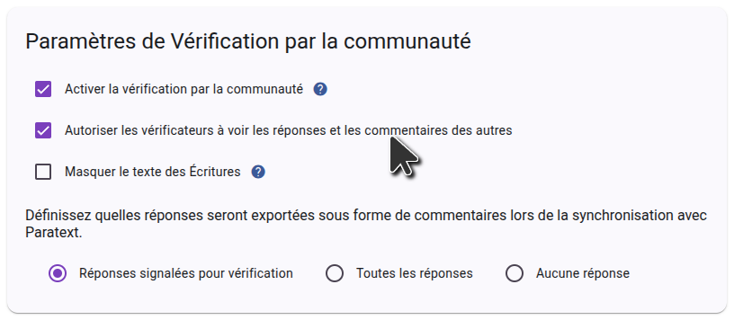

import ReactPlayer from "react-player";

## Invitez des personnes à vérifier votre projet {#1850d745ac9e80caacf5e643bb216f77}

<ReactPlayer controls url="https://youtu.be/aBPHCF56hxA" />

Une fois que vous avez les questions pour votre projet, il est temps d'inviter les vérificateurs de la communauté.

In the side bar, click **Settings**, and scroll down to **Sharing settings**.

### Paramètres d'interaction utilisateur {#1850d745ac9e8018b5a7ff9f3ea349e9}

The first setting to consider is **Allow checkers to see each other's answers and comments**. Lorsqu'une question est présentée aux vérificateurs de la communauté, les réponses existantes des autres vérificateurs de la communauté ne sont pas affichées afin qu'elles n'influencent pas la réponse donnée. Une fois qu'une réponse a été donnée à une question, toutes les autres réponses à cette question s'affichent et les vérificateurs peuvent commenter et mettre des J'aime sur les réponses des autres. If you don’t want this interaction and want answers from other checkers to always be hidden, turn off **Allow checkers to see each other's answers and comments**.

### Paramètres de partage {#1850d745ac9e8097ad4efcb063fc2603}

If you want community checkers to be able to invite friends to the project, make sure **Allow community checkers to invite community checkers** is enabled. Si ce paramètre est désactivé, seuls les administrateurs du projet pourront ajouter des vérificateurs de la communauté au projet.

### Inviter les vérificateurs de la communauté {#1850d745ac9e802d84d8e00da4fe25c2}

Dans la barre latérale, cliquez sur **Utilisateurs**, et vous verrez apparaître les options de partage.

To invite someone by sending a link, click **Share**, select the language you want Scripture Forge to show the recipient, and copy the link. You can then send this link to anyone you want to invite to the project. When they click the link, they will be able to join the project as a community checker.

If you want to send email invitations to users, type the email of the user you want to invite, select the **Community Checker** role, and choose an invitation language. Puis cliquez sur **Envoyer**. Un e-mail contenant un lien sera envoyé à la personne, qui devra cliquer sur le lien et s'inscrire pour participer au projet.

