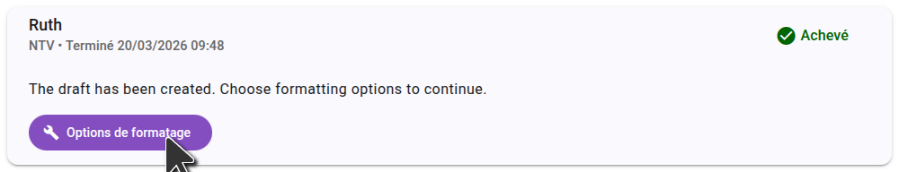
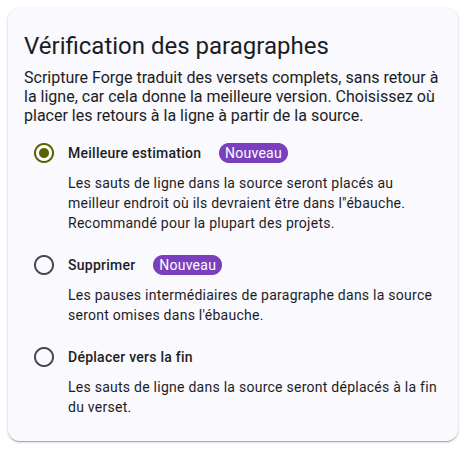
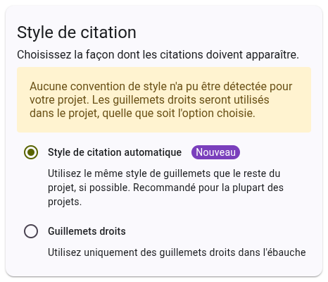

After generating a draft in Scripture Forge, you will need to select formatting options. These options control how Scripture Forge formats the draft text.

Formatting options are saved in your project, so you only need to choose them once, though you can change them later if needed.

## Selecting paragraph break options

There are three options for paragraph breaks. The default is "best guess" which is recommended for most projects. When you select an option, a preview is shown on the right side of the page to help you understand how the options will affect the formatting of your draft.

## Selecting quote style options

There are two options for quote style. The default is "automatic" which is recommended for most projects. When you select an option, a preview is shown on the right side of the page to help you understand how the options will affect the formatting of your draft.

Once you have selected your formatting options, click "Save" to save the options to your project. These options will be used for all future drafts generated for the project. Vous pouvez modifier ces options à tout moment, et elles seront appliquées à tous les futurs brouillons.