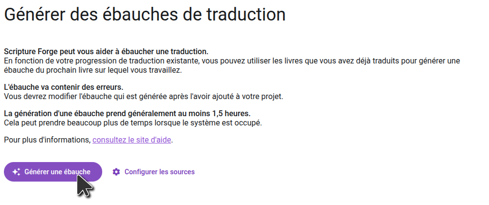
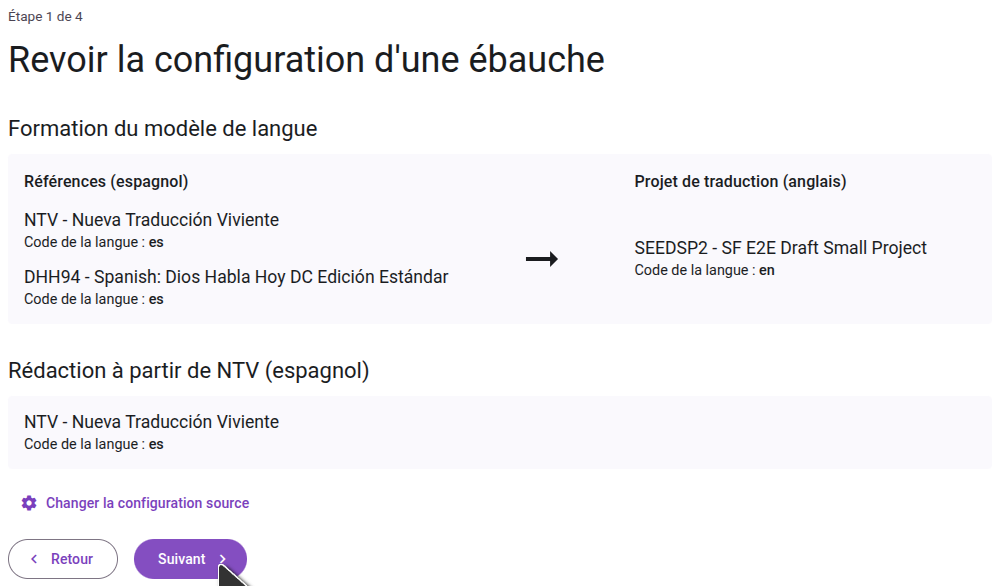
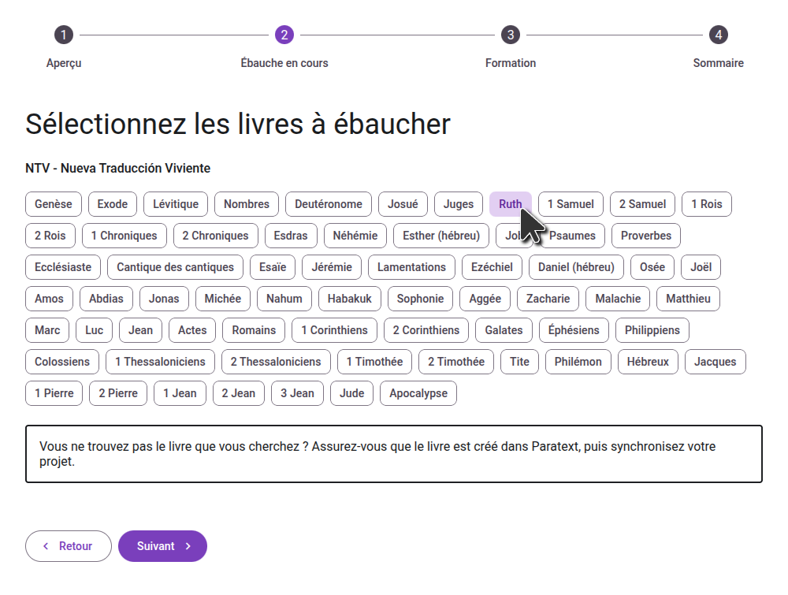
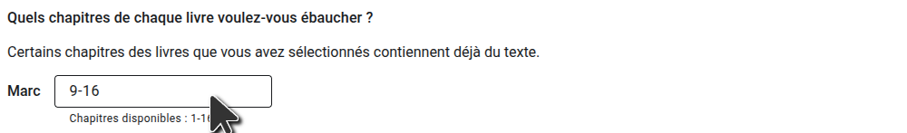
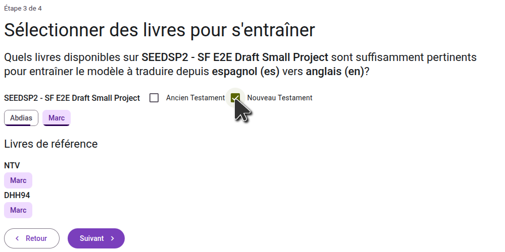
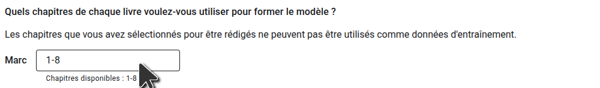
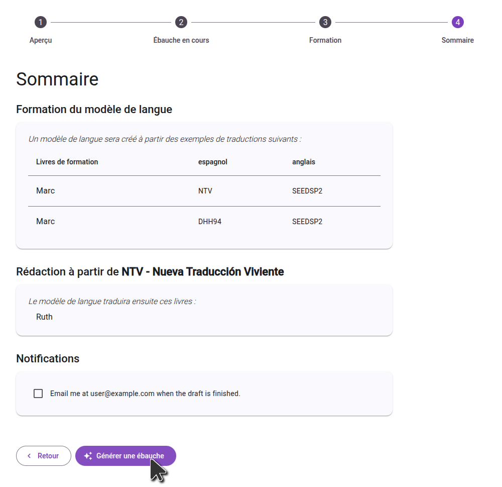

import ReactPlayer from "react-player";

<ReactPlayer controls url="https://youtu.be/binHoeAGGvU" />

## Générer une ébauche

Une fois que votre projet a été activé et que les sources ont été configurées, cliquez sur le bouton Générer l'ébauche pour démarrer :

### Confirmer la configuration du projet

Sur le premier écran, vérifiez les sources et les codes de langue configurés et vérifiez qu'ils sont corrects. Passons ensuite à l'étape suivante.

:::note

Si vous utilisez un projet Paratext séparé pour stocker les ébauches générées par l'IA, vérifiez que votre projet de traduction principal figure dans la section **Données de la langue cible**. Les ébauches doivent être générées à partir de votre projet principal afin que le modèle puisse tirer des enseignements de votre travail de traduction achevée.

:::

### Sélectionnez les livres à ébaucher {#select-the-books-to-draft}

Dans la deuxième étape, sélectionnez les livres que vous voulez traduire. Si le livre que vous voulez ébaucher n'existe pas dans votre projet Paratext, vous devrez d'abord créer le livre dans Paratext. En général, nous suggérons de rédiger un livre à la fois, mais si vous rédigez des livres plus petits, vous voudrez peut-être en rédiger plusieurs à la fois. Pour les livres longs, envisagez de produire une nouvelle ébauche après avoir complété une partie importante du livre.

:::note

**Génération progressive des ébauches :** si vous sélectionnez un livre comportant au moins 12 chapitres et contenant déjà du texte, vous verrez apparaître une option vous permettant de choisir les chapitres pour lesquels vous souhaitez créer une ébauche. Si vous sélectionnez de ne rédiger que quelques chapitres, vous pourrez choisir une partie ou la totalité des chapitres restants pour former le modèle à l'étape suivante. Séparez les chapitres par des virgules et utilisez un tiret pour les tranches de chapitres, par exemple : 1-10,25,40-50.

:::

:::tip

Si vous utilisez la fonction de génération d'ébauches dès les premières phases d'un projet, nous vous recommandons de commencer par les Évangiles et les Actes, puis de générer une nouvelle ébauche incrémentale chaque fois que 8 à 10 chapitres supplémentaires sont terminés. Voir [les directives pour la rédaction d'ébauches du Nouveau Testament](https://help.scriptureforge.org/new-testament-drafting). Les recommandations spécifiques pour la rédaction incrémentielle des livres de l'Ancien Testament ne sont pas disponibles pour le moment. Nous vous suggérons de générer une nouvelle ébauche après avoir traduit chaque 1/3 d'un long livre pour vérifier les améliorations possibles.

:::

### Sélectionnez les livres pour former le modèle de langue

À l'étape suivante, sélectionnez les livres à utiliser pour former le modèle de langue, tant dans votre projet principal que dans les projets de référence. **Choisissez tous les livres de votre projet qui ont été correctement revus. Bien qu'ils n'aient pas besoin d'être vérifiés par un consultant, ils devraient être des traductions exactes du livre source.**

:::note

Si, à l'étape précédente, vous avez choisi de ne rédiger que certains chapitres d'un livre, vous pouvez décider d'inclure tout ou partie des chapitres restants dans l'entraînement. Tous les chapitres sélectionnés pour ébaucher ne seront pas disponibles pour la formation. Séparez les chapitres par des virgules et utilisez un tiret pour indiquer des plages de chapitres, par exemple : 1-10,25,40-50.

:::

### Confirme ta sélection

Lors de la dernière étape, consultez les livres que vous avez sélectionnés pour former le modèle, et les livres que vous avez sélectionnés pour ébaucher. Si vous devez apporter des modifications, vous pouvez passer aux étapes précédentes. Une fois que vous êtes satisfait de vos sélections, cliquez sur le bouton "Générer un brouillon" pour démarrer le processus.

