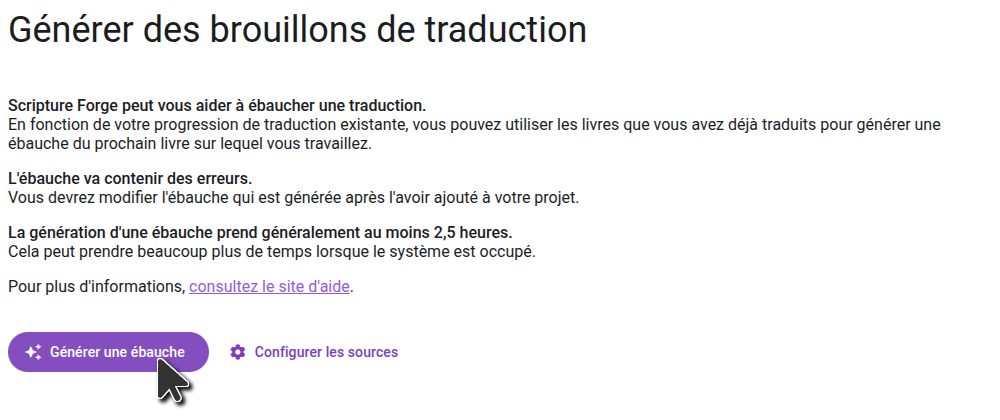
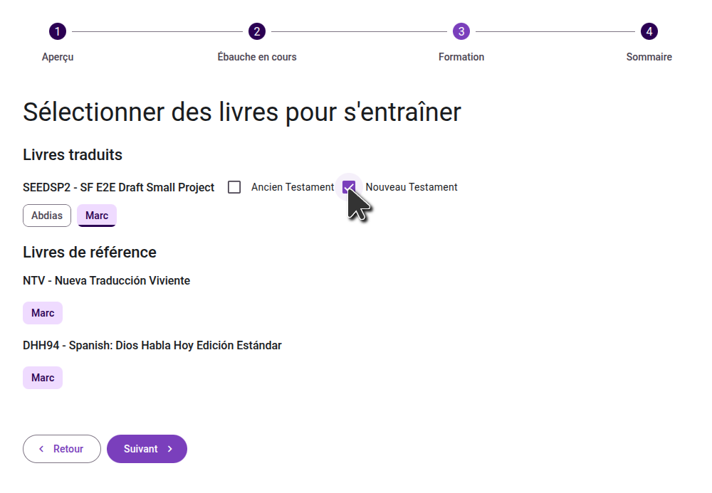
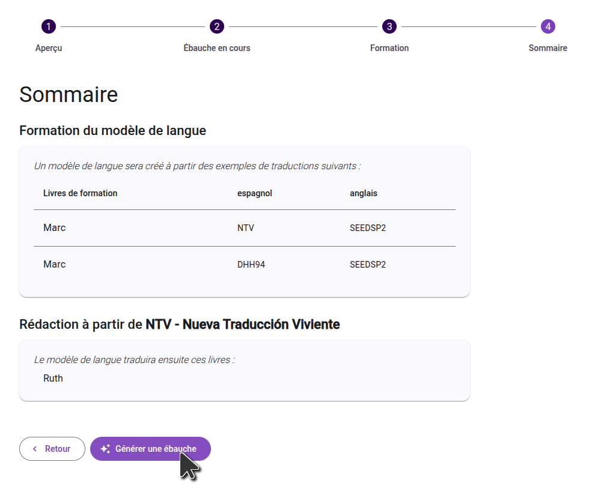

import ReactPlayer from "react-player";

<ReactPlayer controls url="https://youtu.be/binHoeAGGvU" />

## Générer une ébauche

Une fois que votre projet a été activé et que les sources ont été configurées, cliquez sur le bouton Générer l'ébauche pour démarrer :

### Confirmer la configuration du projet

Sur le premier écran, vérifiez les sources et les codes de langue configurés et vérifiez qu'ils sont corrects. Passons ensuite à l'étape suivante.

### Sélectionnez les livres à ébaucher

Dans la deuxième étape, sélectionnez les livres que vous voulez traduire. Si le livre que vous voulez ébaucher n'existe pas dans votre projet Paratext, vous devrez d'abord créer le livre dans Paratext. En général, nous suggérons de rédiger un livre à la fois, mais si vous rédigez des livres plus petits, vous voudrez peut-être en rédiger plusieurs à la fois.

### Sélectionnez les livres pour former le modèle de langue

À l'étape suivante, sélectionnez les livres à utiliser pour former le modèle de langue, tant dans votre projet principal que dans les projets de référence. **Choisissez tous les livres de votre projet qui ont été correctement revus. Bien qu'ils n'aient pas besoin d'être vérifiés par un consultant, ils devraient être des traductions exactes du livre source.**

### Confirme ta sélection

Lors de la dernière étape, consultez les livres que vous avez sélectionnés pour former le modèle, et les livres que vous avez sélectionnés pour ébaucher. Si vous devez apporter des modifications, vous pouvez passer aux étapes précédentes. Une fois que vous êtes satisfait de vos sélections, cliquez sur le bouton "Générer un brouillon" pour démarrer le processus.

