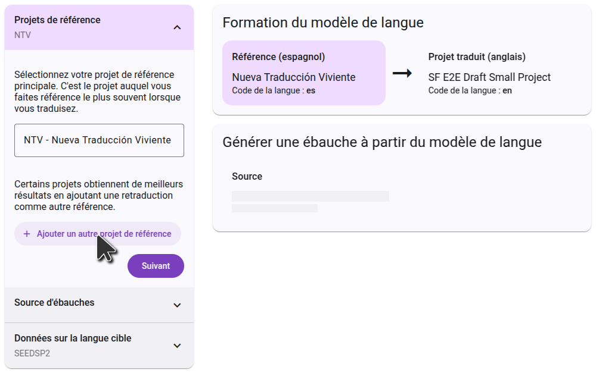

## Inscrivez-vous pour l'ébauche automatique.\*\* {#c01e77600a3b440ead3f1b816837d614}

Pour générer des ébauches dans la Forge des Écritures, cliquez sur le bouton « Générer une ébauche  » dans le menu principal. Cliquez ensuite sur le bouton "S'inscrire à l'ébauche", et remplissez le formulaire qui s'ouvre, pour avoir accès à votre projet. Les projets de retraduction sont activés par défaut et n'ont pas besoin de remplir le formulaire.

Après avoir rempli le formulaire, L'équipe d'intégration de l'Écriture Forge examinera votre demande et travaillera pour trouver les meilleurs paramètres pour votre projet. Vous recevrez une ou plusieurs ébauches à examiner. Si vous décidez que la génération de l'ébauche est correcte pour votre projet, l'équipe activera la rédaction de votre projet et vous guidera dans le processus de sélection des paramètres qui ont été trouvés les meilleurs.

## Configuration d'ébauche  {#26e1244e99c0459bad277d7cff4417b8}

Une fois que la rédaction de votre projet a été activée, le bouton « S'inscrire pour ébaucher » sera remplacé par le bouton « Configurer les sources ». Cliquez sur ce bouton pour sélectionner les projets qui seront utilisés comme source de votre ébauche .

### Choix des projets de référence

Le projet de référence est utilisé pour la formation du modèle linguistique. Usually this is the project that you refer to most often as you are translating, but in some cases you can get better results by using a different project. Certains projets peuvent sélectionner un deuxième projet de référence. Un cas d'utilisation courant est de sélectionner votre traduction de retour comme deuxième projet de référence.

Chaque projet est différent, donc suivez les instructions que vous avez reçues de l'équipe d'intégration.

### Choix du projet source

The second step is to select the project you want the draft to be translated from. Ceci peut être un projet Paratext ou une ressource de bibliothèque biblique numérique. Commencez à taper le nom du projet (ou du nom abrégé du projet), et la liste filtrera pour ne montrer que les projets qui correspondent. Cliquez sur le projet que vous voulez utiliser comme source, puis passez à l'étape suivante.

### Confirmation des langues

La dernière étape montre les données de la langue cible. Cela inclura toujours votre projet lui-même, qui est déjà sélectionné et ne peut pas être supprimé. You can add additional training data on this step by uploading a spreadsheet with paired data, with the source language in the first column, and the target language in the second column.

Sur le côté droit, vous verrez un diagramme de la façon dont les projets que vous avez sélectionnés seront utilisés pour générer l'ébauche . Dans un premier temps, le modèle linguistique apprend en comparant les projets de référence au projet traduit. Dans un deuxième temps, il utilisera ces connaissances pour traduire le projet source.

