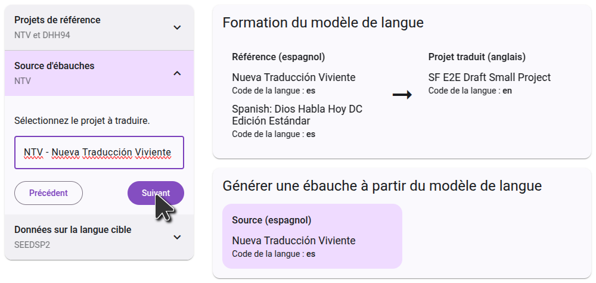

## Inscrivez-vous pour l'ébauche automatique.\*\* {#c01e77600a3b440ead3f1b816837d614}

Pour générer des brouillons dans la Forge des Écritures, cliquez sur le bouton « Générer un brouillon » dans le menu principal. Cliquez ensuite sur le bouton "S'inscrire à l'ébauche", et remplissez le formulaire qui s'ouvre, pour avoir accès à votre projet. Les projets de retraduction sont activés par défaut et n'ont pas besoin de remplir le formulaire.

Après avoir rempli le formulaire, L'équipe d'intégration de l'Écriture Forge examinera votre demande et travaillera pour trouver les meilleurs paramètres pour votre projet. Vous recevrez une ou plusieurs ébauches à examiner. Si vous décidez que la génération de brouillons est correcte pour votre projet, l'équipe activera la rédaction de votre projet et vous guidera dans le processus de sélection des paramètres qui ont été trouvés les meilleurs.

## Configuration du brouillon {#26e1244e99c0459bad277d7cff4417b8}

Une fois que la rédaction de votre projet a été activée, le bouton « S'inscrire pour ébaucher » sera remplacé par le bouton « Configurer les sources ». Cliquez sur ce bouton pour sélectionner les projets qui seront utilisés comme source de votre brouillon.

### Choix du projet source

La première étape est de sélectionner le projet dont vous voulez que le brouillon soit traduit. Habituellement, ce sera dans une langue de communication plus large. Ceci peut être un projet Paratext ou une ressource de bibliothèque biblique numérique. Commencez à taper le nom du projet (ou du nom abrégé du projet), et la liste filtrera pour ne montrer que les projets qui correspondent. Cliquez sur le projet que vous voulez utiliser comme source, puis passez à l'étape suivante.

### Choix des projets de référence

Le projet de référence est utilisé pour la formation du modèle linguistique. Souvent, vous utiliserez le même projet que le projet source, mais dans certains cas, vous pouvez obtenir de meilleurs résultats en utilisant un projet différent. Certains projets peuvent sélectionner un deuxième projet de référence. Un cas d'utilisation courant est de sélectionner votre traduction de retour comme deuxième projet de référence.

Chaque projet est différent, donc suivez les instructions que vous avez reçues de l'équipe d'intégration.

### Confirmation des langues

La dernière étape montre les données de la langue cible. Cela inclura toujours votre projet lui-même, qui est déjà sélectionné et ne peut pas être supprimé. Actuellement, il n'est pas possible d'ajouter des données de formation supplémentaires à cette étape.

Sur le côté droit, vous verrez un diagramme de la façon dont les projets que vous avez sélectionnés seront utilisés pour générer le brouillon. Dans la première étape, le modèle de langue apprendra de la

