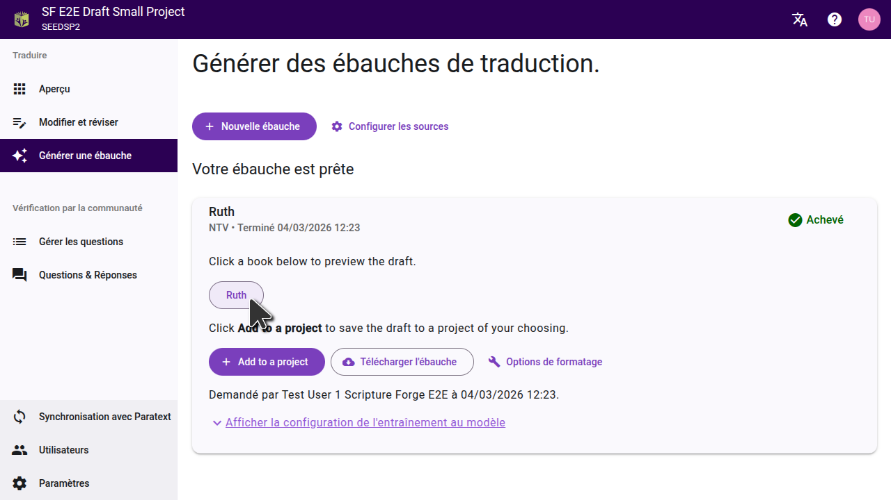
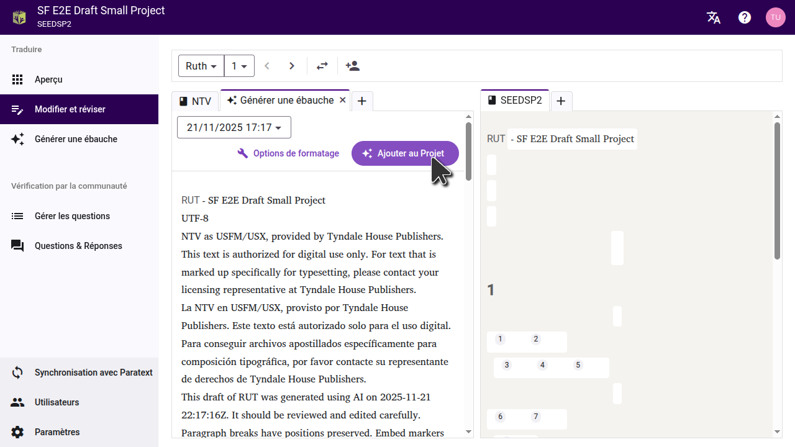
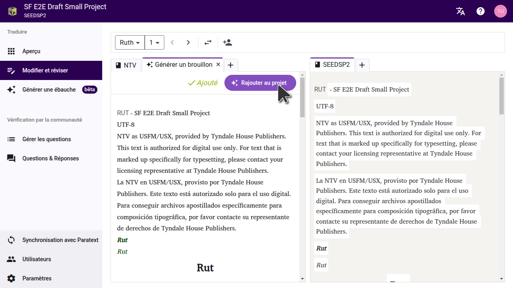
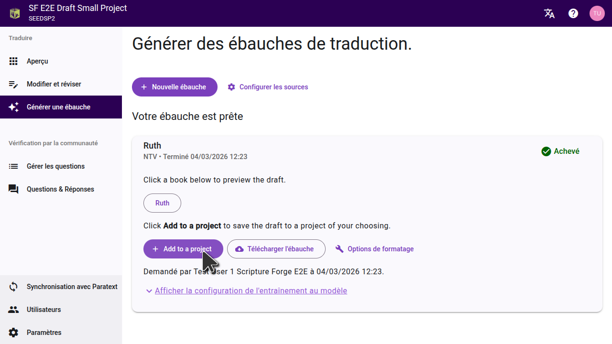
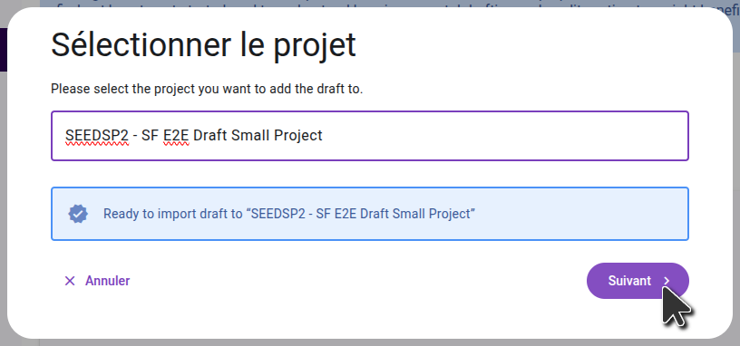
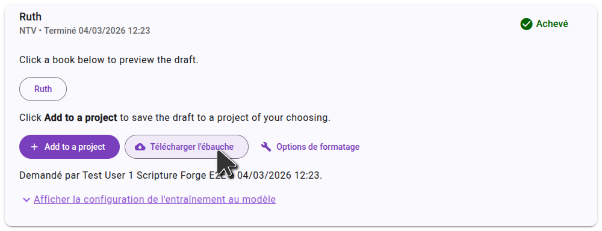

Scripture Forge will show when your draft is ready and list the books that were drafted. Les ébauches générées ne sont **pas** automatiquement importés dans votre projet. Vous pouvez prévisualiser ou importer des ébauches depuis la page **Générer ébauche**.

- To import **individual chapters**, click on a book, then above the chapter that opens, click "Add to project." Les chapitres individuels ne peuvent être ajoutés qu'au projet en cours.
- To import a **full book**, click on "Add to a project". You can choose to import the book into your main project, or to a different project.

## Prévisualiser l'ébauche

Cliquez sur un livre pour voir l'ébauche. L'ébauche s'ouvrira dans un nouvel onglet sur la page de l'éditeur.

:::tip

Pour comprendre l'ébauche au texte à partir duquel il a été traduite, définissez une source sur la page des paramètres Cela vous permettra de voir une source et le brouillon qui en résulte côte à côte.

Si vous avez rédigé un livre, l'équipe a déjà fini de traduire, vous pouvez déplacer l'onglet brouillon vers l'autre côté de la page, et le comparer avec la traduction de l'équipe.

:::

## Importation d'un seul chapitre

Lorsque vous prévisualisez l'ébauche, vous pouvez importer l'ébauche du chapitre en cours dans le projet en cliquant sur "Ajouter au projet". Vous pouvez aller à chaque chapitre du livre et prévisualiser et importer chaque chapitre un à la fois. This will add the chapter to the current project, not to a different project.

## Importation d'un livre entier

If you want to import an entire book, or multiple books, you can do this from the "Generate draft" page. Click "Add to a project" and then select the project you want to import to.

Dans la boîte de dialogue qui s'ouvre, sélectionnez le projet dans lequel vous voulez importer l'ébauche. **Important:** Importer l'ébauche remplacera tout contenu existant dans le projet pour ce livre.

Une fois que vous avez importé l'ébauche dans un projet, synchronisez le projet dans Scripture Forge puis faites un Envoyer/Recevoir dans Paratext pour voir les changements.

## Exportation des fichiers USFM

Si vous préférez ne pas importer l'ébauche directement dans votre projet, vous pouvez également télécharger l'ébauche sous forme de fichiers USFM. Dans la page "Générer l'ébauche ", cliquez sur "Télécharger l'ébauche ", et extrayez les fichiers sur votre ordinateur. Vous pouvez ensuite importer ces fichiers dans un projet dans Paratext.

## Visualisation des ébauches  dans Paratext 10 Studio

Paratext 10 Studio inclut une extension Scripture Forge. Vous pouvez consulter les ébauches sans les importer :

1. Ouvrez l'extension Scripture Forge.
2. Se connecter à Scripture Forge.
3. Sélectionnez votre projet pour en visualiser l'ébauche.
