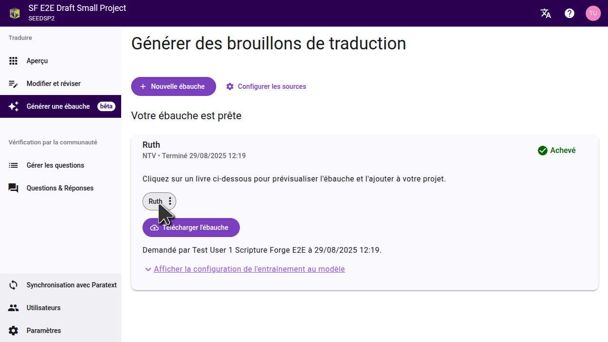
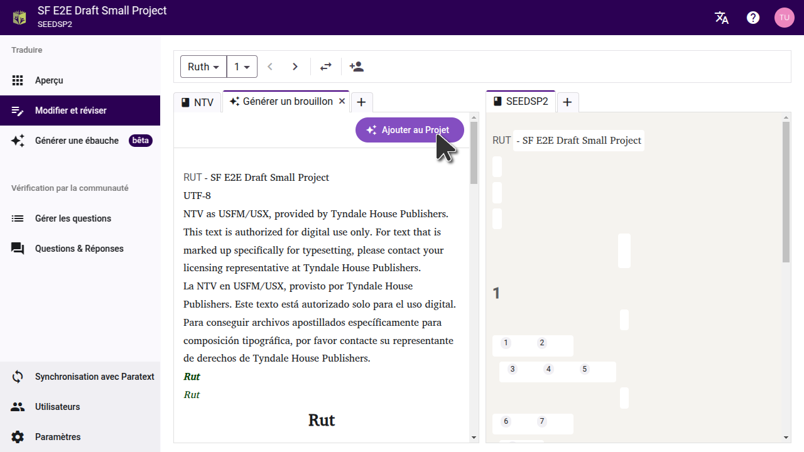
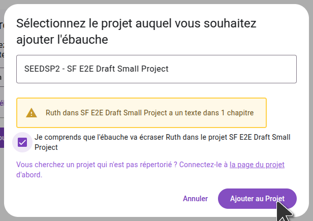
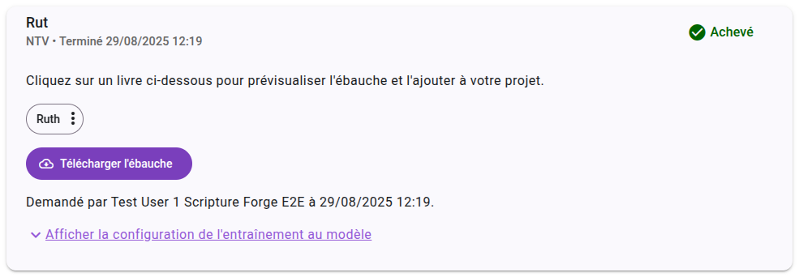

Lorsque votre ébauche est terminée, Scripture Forge vous indiquera qu'il est prêt et affichera la liste des livres qui ont été rédigés.

## Prévisualiser l'ébauche

L'ébauche créée par Scripture Forge ne sera pas automatiquement importé dans votre projet. Vous pouvez prévisualiser l'ébauche et ensuite importer un chapitre ou un livre à la fois dans votre projet, ou dans un projet différent.

Cliquez sur un livre pour voir l'ébauche. L'ébauche s'ouvrira dans un nouvel onglet sur la page de l'éditeur.

:::tip
Pour comprendre l'ébauche au texte à partir duquel il a été traduite, définissez une source sur la page des paramètres Cela vous permettra de voir une source et le brouillon qui en résulte côte à côte.

Si vous avez rédigé un livre, l'équipe a déjà fini de traduire, vous pouvez déplacer l'onglet brouillon vers l'autre côté de la page, et le comparer avec la traduction de l'équipe.
:::

## Importation d'un seul chapitre

Pour importer le brouillon du chapitre en cours dans le projet, cliquez sur "Ajouter au projet". Vous pouvez aller à chaque chapitre du livre et prévisualiser et importer chaque chapitre un à la fois.

## Importation d'un livre entier

Si vous voulez importer un livre entier dans le projet, vous pouvez le faire à partir de la page "Générer le brouillon". Cliquez sur le menu à trois points à côté du livre, puis sélectionnez l'option pour l'importer dans le projet en cours ou dans un autre projet.

Dans la boîte de dialogue qui s'ouvre, sélectionnez le projet dans lequel vous voulez importer le brouillon. Si le projet n'a pas encore été connecté à Scripture Forge, vous devrez d'abord le connecter. **Important:** Importer le brouillon remplacera tout contenu existant dans le projet pour ce livre.

:::note
Le projet doit déjà avoir le livre que vous importez. Assurez-vous que le livre a déjà été créé dans Paratext et qu'il a été synchronisé avec la Forge des Écritures.
:::

Une fois que vous avez importé le brouillon dans un projet, synchronisez le projet dans Scripture Forge puis faites un Envoyer/Recevoir dans Paratext pour voir les changements.

## Exportation des fichiers USFM

Si vous préférez ne pas importer le brouillon directement dans votre projet, vous pouvez également télécharger le brouillon sous forme de fichiers USFM. Dans la page "Générer le brouillon", cliquez sur "Télécharger le brouillon", et extrayez les fichiers sur votre ordinateur. Vous pouvez ensuite importer ces fichiers dans un projet dans Paratext.

## Visualisation des brouillons dans Paratext 10 Studio

Paratext 10 Studio s'intègre directement à la Forge, et vous permet de visualiser un brouillon sans l'importer dans un projet. L'extension Scripture Forge est pré-installée, donc tout ce que vous avez à faire est de vous connecter à Scripture Forge dans l'extension, puis de sélectionner votre projet pour voir le brouillon.
