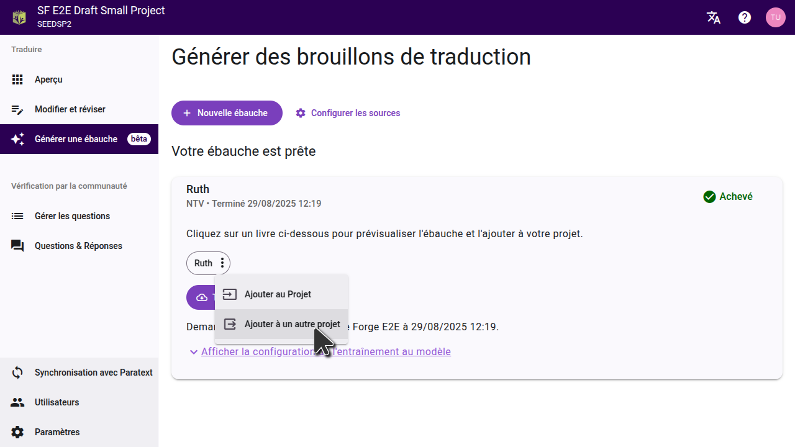

When your draft is finished, Scripture Forge will indicate that it's ready and list the books that were drafted. Generated drafts are **not** automatically imported to your project. You can preview or import drafts from the **Generate draft** page.

- To import **individual chapters**, preview the chapter and choose "Add to project." Individual chapters can only be added to the current project.
- To import a **full book**, open the three-dot menu next to the book name. You can choose to import the book into the current project or a different project.

## Prévisualiser l'ébauche

Click on a book title to view the draft. L'ébauche s'ouvrira dans un nouvel onglet sur la page de l'éditeur.

:::tip

Pour comprendre l'ébauche au texte à partir duquel il a été traduite, définissez une source sur la page des paramètres Cela vous permettra de voir une source et le brouillon qui en résulte côte à côte.

Si vous avez rédigé un livre, l'équipe a déjà fini de traduire, vous pouvez déplacer l'onglet brouillon vers l'autre côté de la page, et le comparer avec la traduction de l'équipe.

:::

## Importation d'un seul chapitre

When previewing the draft, you can import the draft of the current chapter into the project by clicking "Add to project". Vous pouvez aller à chaque chapitre du livre et prévisualiser et importer chaque chapitre un à la fois. This will add the chapter to the current project; not to a different project.

## Importation d'un livre entier

If you want to import an entire book, you can do this from the "Generate draft" page. Cliquez sur le menu à trois points à côté du livre, puis sélectionnez l'option pour l'importer dans le projet en cours ou dans un autre projet.

Dans la boîte de dialogue qui s'ouvre, sélectionnez le projet dans lequel vous voulez importer l'ébauche. Si le projet n'a pas encore été connecté à Scripture Forge, vous devrez d'abord le connecter. **Important:** Importer l'ébauche remplacera tout contenu existant dans le projet pour ce livre.

:::note

Le projet doit déjà avoir le livre que vous importez. Assurez-vous que le livre a déjà été créé dans Paratext et qu'il a été synchronisé avec la Forge des Écritures.

:::

Une fois que vous avez importé l'ébauche dans un projet, synchronisez le projet dans Scripture Forge puis faites un Envoyer/Recevoir dans Paratext pour voir les changements.

## Exportation des fichiers USFM

Si vous préférez ne pas importer l'ébauche directement dans votre projet, vous pouvez également télécharger l'ébauche sous forme de fichiers USFM. Dans la page "Générer l'ébauche ", cliquez sur "Télécharger l'ébauche ", et extrayez les fichiers sur votre ordinateur. Vous pouvez ensuite importer ces fichiers dans un projet dans Paratext.

## Visualisation des ébauches  dans Paratext 10 Studio

Paratext 10 Studio includes a Scripture Forge extension. You can view drafts without importing them:

1. Open the Scripture Forge extension.
2. Se connecter à Scripture Forge.
3. Select your project to view the draft.

