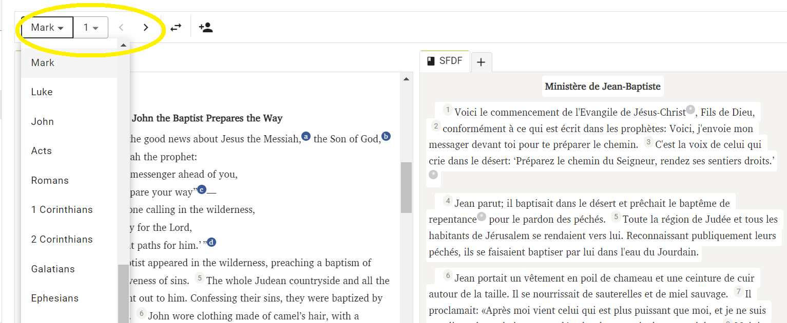
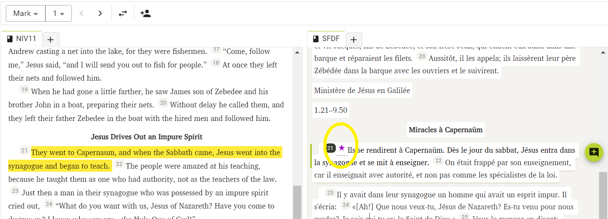

import ReactPlayer from "react-player";

# Appliquer et modifier un projet {#2a0f75e3f955442e9b4f4b375f8cc58f}

<ReactPlayer controls url="https://youtu.be/S4yvGDlcZ9o" />

# Comment appliquer un projet {#1430d745ac9e80878a51d2b8e2be7d05}

Après la génération d'un brouillon, il est prêt à être révisé et édité par un traducteur et doit passer par les étapes suivantes de traduction.

Pour commencer à éditer, le brouillon doit d'abord être ajouté à votre projet. Il y a deux manières de procéder:

### **1) Chapitre par chapitre** {#1430d745ac9e80a29085eecf41dc2997}

Cliquez sur le nom du livre du brouillon qui a été généré. Ceci vous mènera à l’interface « Édition et Révision ». L'image ci-dessous montre la ébauche de Deuteronomy.

Vous trouverez ici la ébauche du premier chapitre disponible d'un côté. De l'autre côté, vous verrez votre projet, qui sera vide et n'a aucune donnée pour le chapitre sélectionné. Pour ajouter le brouillon à votre projet, cliquez sur « Ajouter au projet». Cela n'ajoutera que le chapitre en cours à votre projet et vous pourrez commencer à le réviser et le modifier.

### 2. Ajouter tout le livre {#1430d745ac9e803183c8d916bc54de64}

Une fois vos brouillons générés, cliquez sur le menu à 3 points situé à côté du nom du livre que vous souhaitez ajouter à votre projet. Ensuite, cliquez sur « Ajouter au projet » pour ajouter le livre entier à votre projet.

### 3. Téléchargez le brouillon et ajoutez-le via Paratext {#1430d745ac9e80cdb498cad97099687e}

Cliquez sur « Télécharger le brouillon » qui téléchargera le brouillon dans un fichier .usfm. Ce fichier peut ensuite être ajouté à votre projet via Paratext. Après avoir été ajouté via Paratext, assurez-vous de lancer un Envoyer/Recevoir dans Paratext et ensuite une synchronisation dans Scripture Forge pour refléter cela dans votre projet dans Scripture Forge.

# **Comment modifier un brouillon** {#1430d745ac9e80cb8debce126560e7b5}

Vous pouvez le faire dans Scripture Forge en cliquant sur "Edit and Review", ce qui vous amènera à l'écran ci-dessous. L'image ci-dessous montre le livre de Marque.

L'interface vous fournira deux sections ; l'un montrera la traduction de référence principale (connue sous le nom de source), et l'autre aura le nouveau brouillon généré (appelé cible). Ici, vous pouvez examiner le brouillon et apporter des modifications si nécessaire, comme dans Paratext.

### **Naviguer dans le brouillon** {#1430d745ac9e803187c2ff37b7ee519c}

Si vous avez généré un projet pour plus d'un livre, vous pouvez naviguer entre les livres à partir de la liste déroulante disponible dans la partie supérieure gauche de l'écran, comme indiqué ci-dessous.

Vous pouvez également naviguer vers un chapitre spécifique en utilisant la liste déroulante juste à côté. Vous pouvez également naviguer vers le chapitre précédent ou suivant en utilisant les flèches situées à côté de la liste déroulante.

Si vous souhaitez changer le placement de la source et de la cible (panneaux de gauche et de droite), vous pouvez le faire en cliquant sur le bouton de swap comme indiqué ci-dessous.

Notez que la sélection d'un verset dans le brouillon mettra en surbrillance le verset correspondant de la traduction de référence principale en jaune.

Lorsque vous sélectionnez un verset et commencez à travailler dessus, la traduction de référence principale correspondante naviguera automatiquement et affichera le même verset dans la langue source, en facilitant le suivi et le suivi du brouillon.

### **Ajout de commentaires** {#1430d745ac9e8038aee0f2290df4172b}

Scripture Forge permet aux utilisateurs d'ajouter des commentaires supplémentaires lorsqu'ils travaillent sur les brouillons.

Cela peut être fait en sélectionnant le verset où le commentaire doit être ajouté, puis en cliquant sur le bouton « Ajouter un commentaire ».

Une fois qu'un commentaire est ajouté, il sera marqué par une étoile comme indiqué ci-dessous. Pour mettre à jour ou modifier le commentaire, cliquez simplement sur l'étoile et vous serez invité à apporter les modifications souhaitées.

Lorsque le brouillon est appliqué à votre projet Paratext, les commentaires seront exportés vers votre projet Paratext sous forme de notes.

### **Visualisation de l'historique** {#1430d745ac9e809d90bbf0371c2d6c6d}

Scripture Forge enregistre un historique des brouillons à chaque fois qu'une synchronisation est effectuée. Si vous avez besoin de revenir à une version plus ancienne du projet, vous pouvez le faire en consultant son historique.

Pour cela, cliquez sur le bouton Nouvel onglet comme indiqué ci-dessous et sélectionnez « Historique ».

Maintenant, en utilisant la liste déroulante, sélectionnez la date pour ouvrir la version désirée de votre brouillon.

**Veuillez noter que lorsqu'un nouveau brouillon est généré, tous les anciens brouillons qui n'ont pas été sauvegardés seront perdus. N'oubliez pas de télécharger le brouillon ou de l'appliquer à votre projet Paratext et d'exécuter une synchronisation avant de générer un nouveau brouillon.**
