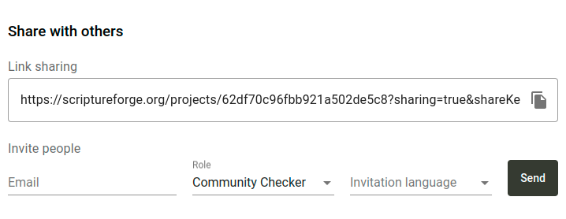
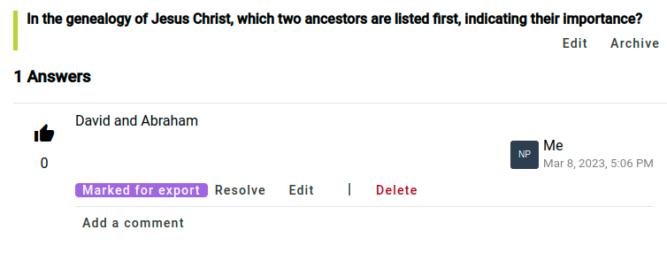

import ReactPlayer from "react-player";

Ce guide décrit comment utiliser [Scripture Forge](https://scriptureforge.org/) pour la Vérification communautaire. Les étapes de base sont les suivantes :

1. Connectez un projet [Paratext](https://paratext.org/) à Scripture Forge
2. Créez ou importez des questions auxquelles les vérificateurs répondront
3. Attacher un enregistrement audio du texte (facultatif)
4. Invitez des personnes à vérifier votre projet
5. Recevez les réponses aux questions et interagissez avec elles
6. Synchronisez le projet pour que les réponses apparaissent sous forme de remarques dans Paratext

## Connectez un projet Paratext à Scripture Forge {#a49ffad707ee4ff69860080e6e805c3b}

1. Allez sur [scriptureforge.org](https://scriptureforge.org/) et cliquez sur **Se connecter**.
2. Sur la page de connexion, cliquez sur **Connectez-vous avec Paratext**.
3. Connectez-vous sur Paratext et autorisez Scripture Forge à accéder à votre compte Paratext.
4. Lorsque vous êtes redirigé vers Scripture Forge, allez sur la [page Connecter un projet](https://scriptureforge.org/connect-project). Si vous n'avez pas encore de projet, vous y serez automatiquement envoyé. Si vous avez déjà des projets dans Scripture Forge, cliquez sur le sélecteur de projet dans le coin supérieur gauche, puis sur **Connecter un projet**.
5. La page Connecter un projet affiche une liste des projets auxquels vous avez accès dans Paratext. Sélectionnez le projet que vous souhaitez connecter dans la liste.
6. Assurez-vous que la case **Activer la vérification par la communauté** est cochée. Ne vous préoccupez pas du texte source pour l'instant. Ce paramètre peut être modifié ultérieurement sur la page des paramètres du projet.
7. Cliquez sur **Connecter**. En moins d'une minute, vous devriez être dirigé vers le projet dans Scripture Forge.

## Ajouter des Questions au projet {#47b7c1e2e8a74a3489b167849470745e}

Pour obtenir des commentaires sur votre traduction, vous devrez ajouter des questions de vérification de la compréhension. Vous pouvez importer des questions créées par quelqu'un d'autre ou créer vos propres questions.

:::note

Actuellement, le seul moyen d'obtenir des commentaires de la part des vérificateurs de la communauté est de poser des questions de vérification. Certains administrateurs de projets ont demandé que les vérificateurs puissent ajouter des commentaires au texte même en l'absence de question. Si c'est quelque chose qui peut être utile pour votre projet, veuillez [exprimer votre soutien à la proposition](https://community.scripture.software.sil.org/t/feature-request-comments-to-any-bible-verse-chosen/2506/6) sur le [site de la communauté Scripture Forge](https://community.scripture.software.sil.org/).

:::

<ReactPlayer controls url="https://youtu.be/J-led5En3D8" />

### Créer des questions individuellement dans Scripture Forge {#0c67e74b02944b61a33b3ea2d101effd}

Pour ajouter des questions à votre projet, cliquez sur **Vue d'ensemble** dans la section **Vérification par la communauté** dans la barre latérale de navigation. Clique ensuite sur le bouton **Ajouter une question**. Une boîte de dialogue s'ouvrira pour vous permettre de créer une question.

Une question peut s'appliquer à un seul verset, ou à plusieurs versets. Tapez une référence dans la boîte de dialogue**Référence biblique**, ou cliquez sur la flèche du menu déroulant pour sélectionner un livre, un chapitre et un verset. Si vous souhaitez que la question s'étende sur plusieurs versets, saisissez une référence de fin dans la deuxième case. Une fois que vous avez saisi une référence, le texte s'affiche, avec, en surbrillance, les versets que vous avez choisis.

Saisissez votre question dans la case **Question** . Si vous souhaitez ajouter une version audio de la question, cliquez sur le bouton **Enregistrer** . Il se peut que vous soyez invité à donner l'autorisation d'accéder à votre microphone. Lorsque vous avez terminé l'enregistrement, cliquez sur **Arrêter l'enregistrement**. Vous pouvez ensuite écouter l'enregistrement pour voir comment il sonne. Cliquez sur le bouton **Essayer à nouveau** si vous n'êtes pas satisfait. Vous pouvez également télétransmettre un fichier audio au lieu d'enregistrer, si vous préférez.

Cliquez sur **Sauver** et votre question sera ajoutée à la liste des questions de vérification par la communauté.

### Importer des questions à partir d'une feuille de calcul {#42107c9def434bf396442d0004577710}

Créer des questions une par une peut s'avérer fastidieux, c'est pourquoi nous avons également prévu la possibilité d'importer des questions à partir d'une feuille de calcul. Vous pouvez utiliser un programme tel que Microsoft Excel, Google Sheets ou LibreOffice Calc pour créer ou modifier une liste de questions. Si vous recherchez un ensemble de questions préétablies, vous pouvez consulter le site [unfoldingWord® Translation Questions](https://git.door43.org/unfoldingWord/en_tq). Si vous allez sur la page liée et que vous cliquez sur l'un des fichiers, vous pouvez le télécharger, l'ouvrir en tant que feuille de calcul et modifier la liste des questions.

Voici un exemple de ce à quoi doivent ressembler les lignes de votre feuille de calcul pour pouvoir l'importer dans Scripture Forge :

| Référence | Question                                                                  |
| --------- | ------------------------------------------------------------------------- |
| HEB 1:1   | À quoi fait référence l'expression "nos pères" ?                          |
| HEB 1:2   | Qu'est-ce que cela signifie que le Fils est "héritier de toutes choses" ? |
| HEB 1:2-3 | Qui est le "Fils" dont il est question dans ces versets ?                 |

La feuille de calcul peut comporter davantage de colonnes, mais aucune ne sera utilisée, à l'exception des colonnes "référence" et "question". Les fichiers TSV publiés par unfoldingWord sont dans un format légèrement différent, mais peuvent également être importés dans Scripture Forge.

:::note

La référence doit comporter le nom du livre abrégé de la même manière que Paratext abrège les noms de livres. Par exemple, **HEB 1:1** fonctionnera, mais **Hébreux 1:1** ne fonctionnera pas.

:::

Si vous avez besoin d'aide pour formater votre feuille de calcul correctement afin de pouvoir l'importer dans Scripture Forge, nous serons heureux de vous aider. Envoyez simplement un e-mail à [help@scriptureforge.org](mailto:help@scriptureforge.org).

1. Enregistrez votre feuille de calcul en tant que fichier CSV.
2. Ensuite, dans Scripture Forge, cliquez sur **Vue d'ensemble** sous la section **Vérification par la communauté** dans la barre latérale de navigation.
3. Cliquez ensuite sur le bouton **Importation en lots** . Une boîte de dialogue s'ouvrira vous demandant de choisir depuis où vous souhaitez importer les questions.
4. Cliquez sur **Importer à partir du fichier CSV** et sélectionnez le fichier.
    1. Si certaines lignes de votre fichier n'ont pas de référence et de question valides, un avertissement s'affichera pour vous indiquer que ces lignes seront ignorées.
    2. Dans le cas contraire, une liste de questions s'affichera.

### Importer toutes les questions {#3f10139da5904f1883acafad811b422c}

Pour importer toutes les questions du fichier CSV, procédez comme suit :

1. Cliquez sur la case à cocher en haut de la liste. Ceci sélectionnera toutes les questions.
2. Cliquez sur **Importer les questions sélectionnées**.

### Importer un sous-ensemble de questions {#f8f6b299154e4caca7aa04661a820efd}

Vous pouvez également filtrer pour avoir un sous-ensemble de questions :

1. Utilisez les cases **Référence de début** et **Référence de fin** pour spécifier les versets sur lesquels vous souhaitez que les questions commencent et se terminent.
2. Par exemple, si vous voulez seulement importer des questions pour Marc 5 :
    1. Indiquez **MRK 5:1** dans la case **Référence de début** .
    2. Indiquez **MRK 5:43** dans la case **Référence de fin** .
3. Cliquez sur la case à cocher en haut de la liste pour sélectionner toutes les questions. Seules les questions affichées seront sélectionnées.
4. Cliquez sur **Importer les questions sélectionnées**.

:::note

Il n'est pas nécessaire de se rappeler qu'il y a 43 versets dans Marc 5 pour filtrer tous les versets du chapitre. Si vous cliquez sur la flèche déroulante dans la boîte **Référence de fin**, une boîte de dialogue s'ouvrira pour vous permettre de sélectionner un livre, chapitre et verset. Une fois que vous sélectionnez Marc 5, la liste des versets de Marc 5 s'affiche, et vous pouvez sélectionner le dernier verset, qui est le verset 43. Vous pouvez également saisir **MRK 5:100** dans la case **Référence de fin** , et tous les versets de Marc 5 seront inclus, même s'il n'y a pas de verset 100 dans Marc 5.

:::

### Importation des questions depuis Transcelerator {#1ed2e353d94847a3861ad3a69d531aac}

[Transcelerator](https://software.sil.org/transcelerator/) est un plugin pour Paratext qui contient une banque de questions prêtes à l'emploi pour vérifier la compréhension dans plusieurs langues majeures. Ces questions peuvent être traduites dans Paratext, exportées vers Scripture Forge, puis importées dans Scripture Forge après synchronisation.

Pour importer des questions depuis Transcelerator:

1. Téléchargez et installez Transcelerator à partir de [software.sil.org/transcelerator/download](https://software.sil.org/transcelerator/download/).
2. Depuis Paratext, lancez Transcelerator.
3. Dans Transcelerator, ouvrez le menu **Fichier** et cliquez sur **Produire des fichiers Scripture Forge**.
4. Saisissez dans la colonne **Traduction** les traductions des questions en anglais que vous voulez utiliser. Pour chaque question qui est prête, cochez la case **Confirmée** pour ces questions.
5. Fermez Transcelerator et effectuez un envoyer recevoir avec Paratext.
6. Dans Scripture Forge, dans la barre latérale de navigation, cliquez sur **Synchroniser**. Sur la page qui s'ouvre, cliquez sur **Synchroniser** pour envoyer et recevoir les questions Transcelerator depuis Paratext.
7. Cliquez sur **Vue d'ensemble** sous la section **Vérification par la communauté** dans la barre de navigation latérale. Cliquez ensuite sur le bouton **Importation en lots** .
8. Une boîte de dialogue s'ouvrira vous demandant de choisir depuis où vous souhaitez importer les questions. Cliquez sur **Importer depuis Transcelerator**.
9. Sélectionnez les questions que vous souhaitez importer. Les étapes à suivre pour faire cela sont exactement les mêmes que dans la section ci-dessus intitulée **Importer des questions à partir d'une feuille de calcul**. Reportez-vous à cette section pour savoir comment filtrer les questions que vous souhaitez.
10. Cliquez sur **Importer les questions sélectionnées** et vos questions seront ajoutées au projet.

## Attacher un enregistrement audio du texte {#fd31ef9b6d74417099996e7dadb5068e}

Scripture Forge peut jouer un enregistrement audio de chaque passage pour les vérificateurs de la communauté. Pour ce faire, vous devrez téléverser un fichier audio et un fichier de synchronisation pour chaque chapitre. Les fichiers de synchronisation permettent à Scripture Forge de mettre en surbrillance chaque verset au fur et à mesure qu'il est prononcé.

### Enregistrement du texte {#1926abf6118c46bba16353d2ef85169f}

Scripture Forge prend en charge les fichiers audio aux formats .mp3 et .wav. Les fichiers de synchronisation sont pris en charge par HearThis, aeneas, Audacity et Adobe Audition.

L'une des options les plus simples est d'utiliser [HearThis](http://software.sil.org/hearthis) pour enregistrer la traduction. [Ce guide ](https://software.sil.org/downloads/r/scriptureappbuilder/Scripture-App-Builder-08-Using-HearThis-for-Audio-Recording.pdf) vous expliquera le processus d'enregistrement des écritures et de production des fichiers audio et de synchronisation. Ignorez les étapes à la fin concernant l'utilisation de Scripture App Builder.

Les [ressources](https://software.sil.org/scriptureappbuilder/resources/) de Scripture App Builder abordent des approches plus avancées, telles que l'utilisation de Glyssen pour un enregistrement audio dramatisé.

### Création de fichiers de synchronisation {#066182aa22c64dc7a74ad0556619c4b9}

Si vous avez déjà enregistré des données audio, plusieurs options s'offrent à vous pour créer des données de synchronisation.

Vous pouvez générer automatiquement des fichiers de synchronisation à l'aide d'aeneas en suivant [ces instructions](https://software.sil.org/downloads/r/scriptureappbuilder/Scripture-App-Builder-07-Using-aeneas-for-Audio-Text-Synchronization.pdf).

Alternativement, vous pouvez créer manuellement des fichiers de minutage en utilisant Audacity en suivant [this guide](https://software.sil.org/downloads/r/scriptureappbuilder/Scripture-App-Builder-06-Using-Audacity-for-Audio-Text-Synchronization.pdf). Une autre option est Adobe Audition. Les données de synchronisation provenant d'Adobe Audition sont prises en charge dans les formats de temps décimal ou FPS. Nous ne prenons pas en charge le format « échantillons ».

### Joindre un fichier audio {#a4d3ee4a4d8b4e1d9bca42b837e57f77}

Pour télécharger des fichiers audio et synchronisation, cliquez sur **Questions & réponses**, accédez au chapitre auquel vous voulez attacher de l'audio, puis cliquez sur l'icône **Gérer l'audio** dans le coin supérieur droit. Cliquez sur **Parcourir les fichiers** et sélectionnez l'enregistrement audio et le fichier de synchronisation associé pour ce chapitre, puis cliquez sur **Enregistrer**.

## Invitez des personnes à vérifier votre projet {#678dca00aaa54fd79319ecf815049301}

<ReactPlayer controls url="https://youtu.be/aBPHCF56hxA" />

Une fois que vous avez les questions pour votre projet, il est temps d'inviter les vérificateurs de la communauté.

Dans la barre latérale, cliquez sur **Paramètres**, et défilez vers le bas jusqu'à **Paramètres de Vérification par la communauté**.

### Paramètres d'interaction utilisateur {#84a006f1fbaa4c50a8ce8bac248c0e1d}

Le premier paramètre à considérer est **Permettre aux vérificateurs de voir leurs réponses respectives**. Lorsqu'une question est présentée aux vérificateurs de la communauté, les réponses existantes des autres vérificateurs de la communauté ne sont pas affichées afin qu'elles n'influencent pas la réponse donnée. Une fois qu'une réponse a été donnée à une question, toutes les autres réponses à cette question s'affichent et les vérificateurs peuvent commenter et mettre des J'aime sur les réponses des autres. Si vous ne souhaitez pas cette interaction et si vous voulez que les réponses des autres vérificateurs soient toujours cachées, désactivez **Permettre aux vérificateurs de voir leurs réponses respectives**.

### Paramètres de partage {#5aa7e3d8451f40cfa6b33c5dd39a3c6f}

Si vous souhaitez que les vérificateurs de la communauté puissent inviter des amis à participer au projet, assurez-vous que l'option **Permettre aux utilisateurs d'inviter d'autres personnes dans le projet** est activée. Si ce paramètre est désactivé, seuls les administrateurs du projet pourront ajouter des vérificateurs de la communauté au projet.

Si vous activez ce paramètre, vous avez le choix entre deux modes de partage. Si vous sélectionnez **Toute personne ayant le lien**, vous pouvez envoyer à d'autres personnes un lien vers le projet, et toute personne qui clique sur le lien peut rejoindre le projet. Cette option est idéale si vous souhaitez inviter un groupe de personnes (par exemple, vous pouvez partager le lien dans un groupe Facebook ou WhatsApp). Toute personne ayant le lien pourra l'envoyer à d'autres personnes pour leur permettre de se joindre au projet. Vous pouvez également sélectionner **Envoyer les invitations par e-mail uniquement**, et les vérificateurs de la communauté ne pourront inviter des amis qu'en envoyant une invitation dans Scripture Forge (Scripture Forge enverra une invitation par e-mail à la personne).

### Inviter les vérificateurs de la communauté {#2271d918980445fd8bc89587ccf33c4f}

Dans la barre latérale, cliquez sur **Utilisateurs**, et vous verrez apparaître les options de partage.

Si vous avez activé le partage de lien à l'étape précédente, vous trouverez un lien que vous pouvez copier pour partager le projet. Pour copier le lien, cliquez sur l'icône de copie à droite du lien.

Si le partage de lien est désactivé ou si vous souhaitez envoyer des invitations par e-mail aux utilisateurs, saisissez l'e-mail de l'utilisateur que vous souhaitez inviter, sélectionnez le rôle **Vérificateur de la communauté** et choisissez une langue d'invitation. Puis cliquez sur **Envoyer**. Un e-mail contenant un lien sera envoyé à la personne, qui devra cliquer sur le lien et s'inscrire pour participer au projet.

## Recevez les réponses aux questions et interagissez avec elles {#d09b7e47859e451783e6dcca8a80f40a}

Pour surveiller les réponses à la vérification par la communauté, cliquez sur **Vue d'ensemble** dans la section **Vérification par la communauté** dans la barre latérale de navigation. Outre une liste de questions, des statistiques de base concernant les réponses seront affichées.

Pour afficher les réponses des vérificateurs de la communauté, cliquez sur l'un des livres dans la section **Vérification par la communauté** dans la barre latérale de navigation. Cliquez ensuite sur une question pour voir les réponses qui ont été données. Si vous souhaitez qu'une réponse soit exportée vers Paratext, cliquez sur **Marquer pour l'exportation** sur cette réponse. Si vous ne voulez rien faire d'autre avec la réponse, cliquez sur **Résoudre**. Cela ne supprime pas la réponse, mais la marque comme ne nécessitant pas d'autre action.

Si vous souhaitez trouver des réponses qui n'ont pas été marquées pour l'exportation ou qui ont été marquées comme résolues, utilisez le filtre au-dessus de la liste des questions pour trouver **Réponses non examinées**.

Si vous préférez que toutes les réponses soient exportées vers Paratext sans les marquer individuellement pour l'exportation, allez dans les paramètres du projet et trouvez la section **Exportation des réponses** . L'option par défaut est de n'exporter que **les réponses marquées pour exportation**, mais ce paramètre peut être modifié en**toutes les réponses** ou **aucune réponse**.

## Synchronisez le projet pour que les réponses apparaissent sous forme de remarques dans Paratext {#1502b9d293ff4c3aacbe91834fd02bb2}

Dans la barre latérale de navigation, cliquez sur **Synchroniser**. Sur la page qui s'ouvre, cliquez sur **Synchroniser** pour envoyer et recevoir les modifications depuis Paratext. Ouvrez ensuite votre projet dans Paratext et effectuez un envoyer recevoir. Les réponses des vérificateurs de la communauté apparaîtront dans votre projet sous forme de remarques. Veuillez noter que si vous répondez à ces remarques dans Paratext, vos réponses n'apparaîtront pas sous forme de commentaires sur la réponse dans Scripture Forge.

La remarque indiquera la question originale, le nom du vérificateur de la communauté qui a répondu, et la réponse elle-même, comme indiqué ci-dessous.

Les remarques générées à partir des réponses de vérification par la communauté auront une étiquette de remarque unique, avec une icône différente des autres remarques de votre projet Paratext. Vous pouvez modifier l'icône en éditant la balise de la remarque. Pour plus de détails, voir [la rubrique d'aide de Paratext sur les balises de remarques personnalisées](https://paratext.org/paratext-training/tutorials/custom-project-note-tags-tutorial/). Vous pouvez également [filtrer les remarques par leur étiquette de remarque](https://paratext.org/2022/08/15/custom-note-tags/#Filter_for_Custom_Note_Tags), ce qui vous permet d'afficher uniquement les réponses de vérification par la communauté ou de les masquer complètement.

:::note

Actuellement, les réponses audio apparaissent dans le Paratext mais l'audio ne peut pas être lancé. Pour lire l'audio d'une réponse, il faut l'ouvrir dans Scripture Forge. Cela pourrait être amélioré à l'avenir.

:::

## Vos commentaires {#f7d132ecbb04437e9d5a81440f84b6df}

Si vous avez des questions, des problèmes ou des suggestions, veuillez contacter l'équipe de Scripture Forge à [help@scriptureforge.org](mailto:help@scriptureforge.org). Vous pouvez également publier des messages sur le [site de soutien communautaire](https://community.scripture.software.sil.org/c/scripture-forge/19), ce qui permet à d'autres personnes de participer à la conversation. Nous apprécions vos commentaires et nous apportons fréquemment des modifications ou corrigeons des problèmes à la demande de nos utilisateurs.

