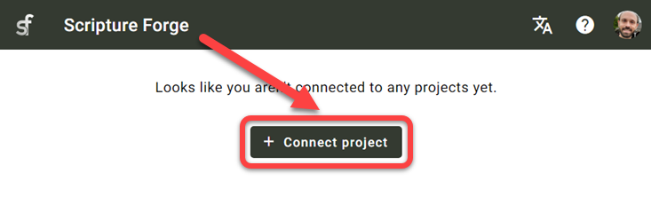
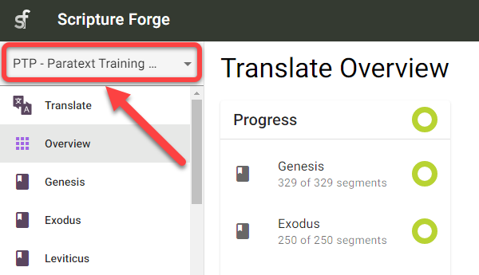
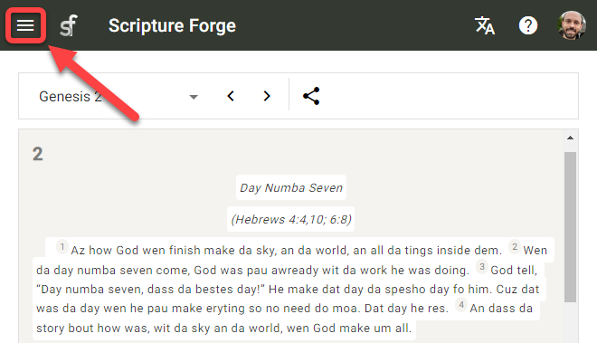
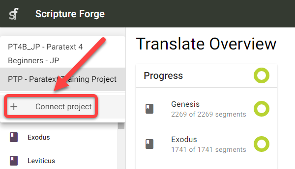
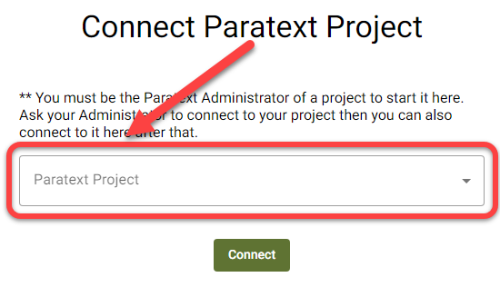
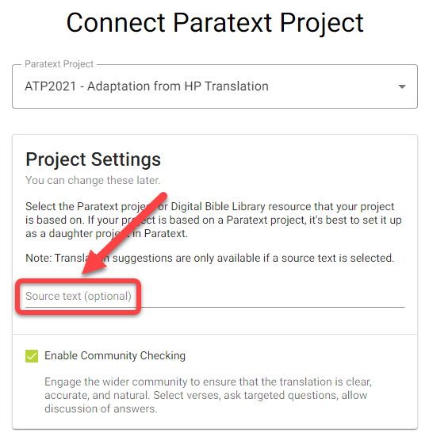
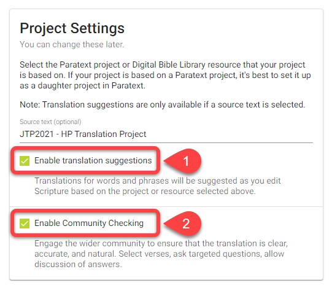
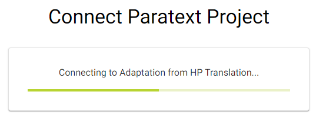
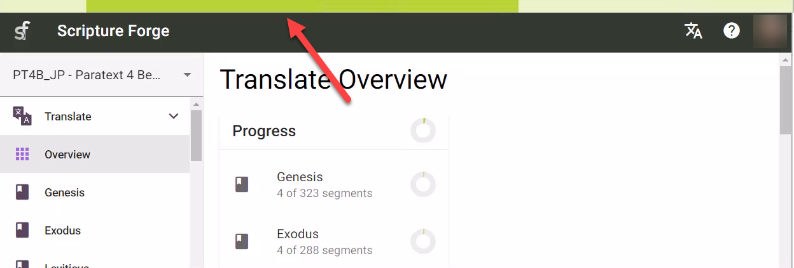

## Introduction {#6222bdf3db3a44b4bf01a9cc6ffdaa80}

:::tip

Les projets Paratext ne doivent être connectés qu'une seule fois dans Scripture Forge.

:::

Une fois qu'un projet Paratext a été connecté à Scripture Forge, tous les utilisateurs qui sont membres du projet dans Paratext (sous Permissions utilisateurs) pourront ouvrir le projet dans Scripture Forge.

Pour pouvoir ouvrir un projet dans Scripture Forge, un utilisateur doit simplement [se connecter à Scripture Forge avec ses informations de compte Paratext](/log-in).

## Comment connecter un projet Paratext à Scripture Forge {#a71dfc268ebb43a0b19c0ab7018f92b4}

1. Si vous n'avez **jamais connecté** un projet à Scripture Forge :
    1. Cliquez sur le bouton Connecter un projet :

        

1. Si vous avez déjà connecté un projet à Scripture Forge, suivez ces instructions pour connecter d'autres projets :
    1. Cliquez sur le volet de navigation Scripture Forge :

        

    2. La page de navigation peut aussi ressembler à ceci:

        

    3. Cliquez sur Connecter un projet :

        

1. Cliquez sur le menu déroulant Projet Paratext :

    

1. Choisissez le projet que vous souhaitez connecter :

    

1. Facultatif : Si vous souhaitez utiliser les suggestions de traduction ou afficher un autre projet/ressource à côté de votre projet :
    1. Cliquez sur la zone Texte source :

        

    2. Sélectionnez le projet source :

        

1. Facultatif : Activer les suggestions de traduction (#1 ci-dessous)

    

1. Facultatif : Activer la Vérification par la communauté (#2 ci-dessus)
1. Cliquez sur Connecter :

    

1. Attendez que Scripture Forge connecte le projet Paratext :

    

1. Scripture Forge peut prendre un certain temps pour connecter votre projet, la barre de progression verte cessera de bouger lorsque votre projet sera complètement connecté :

    

Remarque : il se peut que vous puissiez travailler dans Scripture Forge avant qu'il ne soit complètement connecté.

