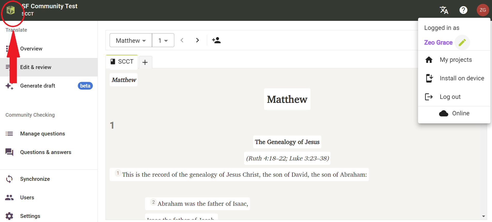
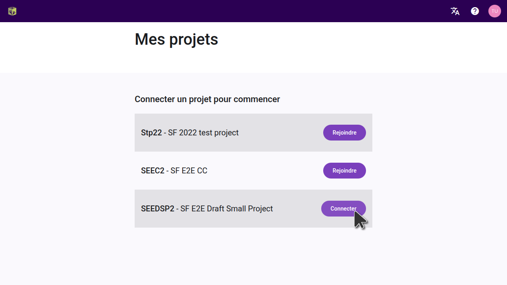
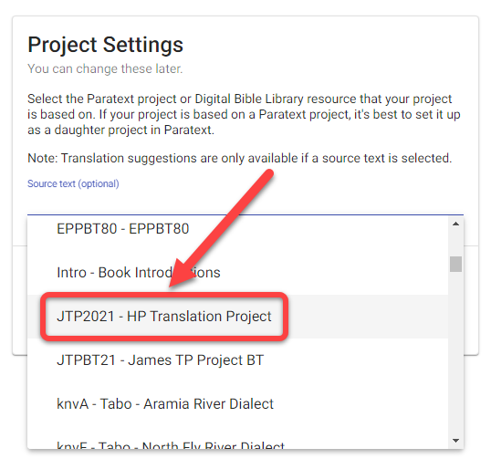
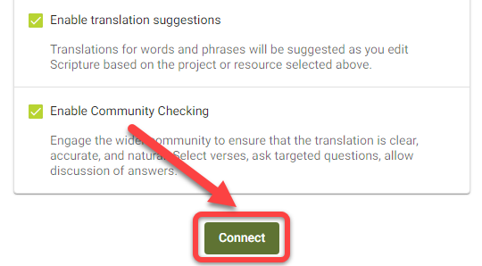

import ReactPlayer from "react-player";

## Introduction {#6222bdf3db3a44b4bf01a9cc6ffdaa80}

:::tip

Les projets Paratext ne doivent être connectés qu'une seule fois dans Scripture Forge.

:::

Une fois qu'un projet Paratext a été connecté à Scripture Forge, tous les utilisateurs qui sont membres du projet dans Paratext (sous Permissions utilisateurs) pourront ouvrir le projet dans Scripture Forge.

Pour pouvoir ouvrir un projet dans Scripture Forge, un utilisateur doit simplement [se connecter à Scripture Forge avec ses informations de compte Paratext](/log-in).

<ReactPlayer controls url="https://youtu.be/exEJxc19Zm4" />

## Comment connecter un projet Paratext à Scripture Forge {#a71dfc268ebb43a0b19c0ab7018f92b4}

1. Si vous n'avez **jamais connecté** un projet à Scripture Forge :
    1. Cliquez sur le bouton Connecter un projet :

        

2. Si vous avez déjà connecté un projet à Scripture Forge, suivez ces instructions pour connecter d'autres projets :

    Pour afficher la liste des projets auxquels vous avez accès dans Paratext, cliquez sur l'icône de la Forge biblique en haut à gauche de l'écran.

Vous pouvez également cliquer sur l’icône de votre profil en haut à droite de l’écran et dans le menu déroulant cliquer sur « Mes projets ».

À partir de la liste affichée, vous pourrez ouvrir des projets s'ils sont déjà connectés. Vous pouvez également rejoindre un projet ou cliquer sur "Connect" pour connecter un projet pour la première fois dans Scripture Forge.

Après avoir cliqué sur « Connecter », il vous sera demandé de sélectionner votre source de projet. Dans la liste déroulante disponible, sélectionnez la source que vous souhaitez utiliser pour votre projet.

Facultatif : Activer les suggestions de traduction (#1 ci-dessous)

Facultatif : Activer la Vérification par la communauté (#2 ci-dessus)

Lorsque vous êtes prêt, cliquez sur Connecter :

Attendez que Scripture Forge connecte le projet Paratext :

Scripture Forge peut prendre un certain temps pour connecter votre projet, la barre de progression verte cessera de bouger lorsque votre projet sera complètement connecté :

Remarque : il se peut que vous puissiez travailler dans Scripture Forge avant qu'il ne soit complètement connecté.

