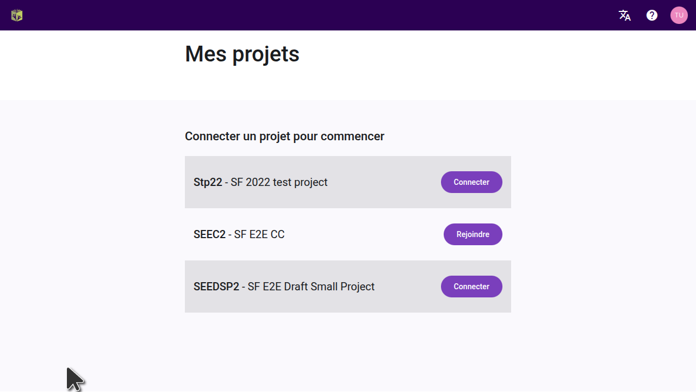

Before you can access a Paratext project in Scripture Forge, it needs to be connected to Scripture Forge. La connexion d'un projet crée une copie du projet Paratext dans Scripture Forge qui peut être [synchronisée avec Paratext](syncing-with-paratext).

<!-- The following paragraph is an EXACT copy of one of the paragraphs on the /syncing-with-paratext page and should be kept in sync with it. Both pages have the need to explain the relationship between Paratext and Scripture Forge projects, and having them identical means translators only have to translate it once. -->

Dans Paratext, chaque membre du projet a une copie du projet sur son propre ordinateur, et Envoyer/Recevoir est utilisé pour partager les changements avec d'autres membres. Quand un projet est connecté à Scripture Forge, tous les membres du projet dans Scripture Forge travaillent sur une seule copie du projet, de sorte que tout changement effectué par un membre est immédiatement vu par un autre membre, si les deux membres sont en ligne. These changes will be sent to the Paratext project when a sync is done in Scripture Forge, and any changes made in Paratext will be synced to the Scripture Forge project.

To connect a Paratext project in Scripture Forge, [log in with Paratext](log-in). When you log in, the **My projects** page will load. If you are on a different page in Scripture Forge you can get to the **My projects** page by clicking the Scripture Forge logo in the top-left corner of the page. The **My projects** page lists all projects you are a member of in Paratext, including those that are connected to Scripture Forge, and those that are not yet connected. If a project has already been connected and you are a member of the Paratext project, you can join the Scripture Forge project by clicking **Join**. If the project hasn't been connected yet, and you are an admin of the project, click **Connect**. Seuls les administrateurs peuvent connecter un projet sur cette page.

