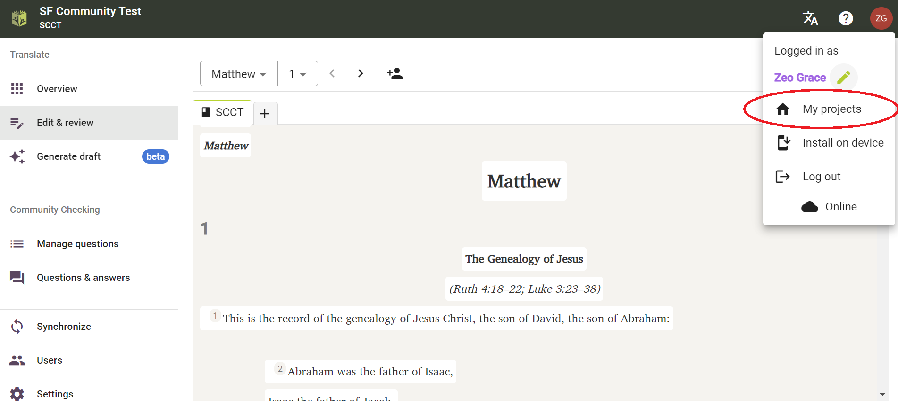

import ReactPlayer from "react-player";

## Introduction {#6222bdf3db3a44b4bf01a9cc6ffdaa80}

:::tip

Les projets Paratext ne doivent être connectés qu'une seule fois dans Scripture Forge.

:::

Une fois qu'un projet Paratext a été connecté à Scripture Forge, tous les utilisateurs qui sont membres du projet dans Paratext (sous Permissions utilisateurs) pourront ouvrir le projet dans Scripture Forge.

Pour pouvoir ouvrir un projet dans Scripture Forge, un utilisateur doit simplement [se connecter à Scripture Forge avec ses informations de compte Paratext](/log-in).

<ReactPlayer controls url="https://youtu.be/exEJxc19Zm4" />

## Comment connecter un projet Paratext à Scripture Forge {#a71dfc268ebb43a0b19c0ab7018f92b4}

1. Si vous n'avez **jamais connecté** un projet à Scripture Forge :
    1. Cliquez sur le bouton Connecter un projet :

        

2. If you have already connected a project to Scripture Forge, follow these instructions to connect any additional projects:

    To view the list of projects you have access to in Paratext, click on the Scripture Forge icon on the top left of the screen.

Alternatively, you can also click on your profile icon on the top right of the screen and from the drop-down menu click “My Projects.”

From the displayed list, you shall be able to Open projects if they are already connected. You can also join a project or click on “Connect” to connect a project for the first time in Scripture Forge.

After clicking on “Connect” you will be asked to select your Project Source. From the available drop-down list, select the source you wish to use for your project.

Facultatif : Activer les suggestions de traduction (#1 ci-dessous)

Facultatif : Activer la Vérification par la communauté (#2 ci-dessus)

When you are ready, Click Connect:

Attendez que Scripture Forge connecte le projet Paratext :

Scripture Forge peut prendre un certain temps pour connecter votre projet, la barre de progression verte cessera de bouger lorsque votre projet sera complètement connecté :

Remarque : il se peut que vous puissiez travailler dans Scripture Forge avant qu'il ne soit complètement connecté.

