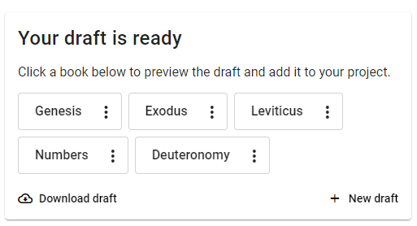

## Questions sur Scripture Forge {#1b30d745ac9e80a38ebef8610e57c100}

1. Comment Scripture Forge s'intègre-t-il dans ma démarche de traduction ?

   _Scripture Forge est un outil conçu pour vous aider à naviguer plus efficacement et plus rapidement dans la phase de rédaction tout en maintenant la qualité de votre travail. Il ne remplace pas les étapes de la traduction. Au lieu de cela, pensez à cela comme une ressource pour vous aider à être plus productif pendant la rédaction et la vérification de la communauté._

2. Scripture Forge conserve-t-il une sauvegarde des données de mon projet ? Qui est responsable de la sécurité des données ?

   _Scripture Forge maintient une version du projet sur les serveurs contrôlés par SIL, et est responsable de la sécurisation de ce projet. Le projet est également synchronisé avec votre projet Paratext, qui est stocké sur les serveurs Paratext. Sachez que les données voyagent sur Internet lorsque vous vous connectez à l'interface de Scripture Forge en ligne._

3. Comment puis-je obtenir le soutien ou l'aide de l'équipe SF ?

   _Vous pouvez utiliser les liens suivants pour nous contacter ou trouver de l'aide:_

   - **Apprentissage et documentation:** [https://software.sil.org/ScriptureForge](https://software.sil.org/ScriptureForge) et [https://help.scriptureforge.org](https://help.scriptureforge.org/)
   - **Signaler un problème :** [https://scriptureforge.freshdesk.com/support/tickets/new](https://scriptureforge.freshdesk.com/support/tickets/new) email: help@scriptureforge.org
   - **Questions et Assistance :** courriel : help@scriptureforge.org

## Questions sur les sources et la formation du modèle {#1b30d745ac9e80e791d9f0c3ee971c5c}

1. Comment puis-je améliorer la qualité de mes ébauches

   _Il y a 2 façons principales d'améliorer les brouillons._

   - _Le premier est d'ajouter plus de données au modèle de traduction. Vous pouvez le faire en choisissant plus de livres à l'étape 2 - "Sélectionnez les livres à former". Plus il y aura de données disponibles pour la formation, mieux ce seront les résultats des ébauches._
   - _La seconde façon est d'améliorer la qualité des données dans le Modèle de traduction. Vous pouvez le faire en vous assurant que les livres que vous avez choisis sont bien vérifiés pour la cohérence dans des domaines tels que l'orthographe, la ponctuation et le contenu. Plus la qualité des données est élevée, plus le système apprendra à générer de bonnes ébauches._
   - _De nombreuses équipes voient également les avantages d'utiliser une traduction à jour comme source de formation supplémentaire_

2. Pourquoi voulez-vous que je définisse une source de formation distincte de ma source principale ?

   _S'il y a un texte plus proche de votre traduction, il peut faciliter l'apprentissage des relations entre les deux langues. Une source de formation séparée n'est pas toujours nécessaire, mais est une option que nous fournissons_

3. Comment puis-je changer la source ou utiliser une version différente pour former le modèle de traduction?

   _Vous pouvez changer la source de votre projet en naviguant dans Paramètres puis en sélectionnant celui requis en tant que ressource sous « Traduire »._

4. Pourquoi le livre que je veux n'est-il pas visible dans ma liste de livres?

   _Le livre doit exister à la fois dans les projets source et cible dans Paratext. Veuillez vous assurer que ceci et ensuite exécuter un Envoyer/Recevoir dans Paratext et une synchronisation dans Scripture Forge afin que Scripture Forge ait les dernières informations de Paratext_

5. Pourquoi y a-t-il un point d'exclamation rouge lorsque je sélectionne une nouvelle traduction de source principale dans la page Paramètres?

   _Cela signifie que la configuration de la source a échoué. Vous pouvez actualiser la page et essayer à nouveau_

## Questions sur l'ébauchage {#1b30d745ac9e8095b256da102cecb88a}

1. Combien de temps faut-il pour générer mon ébauche

   _La génération des ébauches prend actuellement environ une heure et demie, mais peut parfois prendre beaucoup plus de temps en fonction de la disponibilité des serveurs et du nombre de livres demandés. Si la génération d'ébauche prend un temps exceptionnellement long, veuillez nous contacter pour signaler le problème._

2. Comment saurai-je que mon ébauche est terminé ?

   _Vous pouvez choisir de recevoir des notifications par e-mail dès que la génération de votre ébauche est terminée, afin d'en être informé immédiatement. Vous pouvez également consulter la page « Générer une ébauche » pour vérifier l'état d'avancement. Une fois l'opération terminée, un message similaire à celui-ci s'affichera :_

   

3. Pourquoi mon livre ne comporte-t-il que le chapitre 1 dans le projet ?

   - _L'ajout d'une ébauche au projet se fait chapitre par chapitre à partir de la fenêtre « Ébauche générée » de la page Modifier et Réviser. Ainsi, si un seul chapitre est ajouté, ce sera le seul chapitre disponible dans le projet. D'autres chapitres devront être ajoutés individuellement._
   - _Vous pouvez ajouter le livre entier en naviguant vers « Générer une ébauche » et en trouvant l'ébauche qui a été généré. Cliquez sur "Ajouter à un projet" puis sélectionnez le projet vers lequel vous voulez importer._

4. Pourquoi mon bouton dit-il "ré-ajouter au projet"?

   _Si vous éditez un chapitre après "ajout au projet" et que vous voulez revenir au projet SF ébauche non éditée, vous pouvez réimporter l''ebauche originale en cliquant sur le bouton « Ré-ajouter au projet »_

5. Que montre l'onglet Historique ?

   _Lorsque vous apportez des modifications à votre brouillon, Scripture Forge enregistre une version de ces modifications auxquelles vous pouvez accéder via l'onglet Historique. Vous pouvez revenir à une ancienne version de votre projet ici en cliquant sur le bouton « Restaurer cette version »._

6. Pourquoi l'introduction de mon livre a-t-elle été raccourcie ?

   _Scripture Forge utilise le modèle NLLB pour générer des ébauches. Le NLLB est un modèle de phrase, et il est plus précis avec de courts segments de texte. Pour maximiser la précision, il y a une limite de 200 jetons (parties de mots) par segment traduit, et tout texte après ce point est coupé. Les versets bibliques sont traduits un par un et très rarement au-delà de cette limite. Les introductions de livres, dont la longueur dépasse la limite autorisée, seront tronquées et seule la première partie sera traduite._

## Questions sur les ébauches d'avertissements de qualité {#f47ac10b58cc4372a5670e02b2c3d479}

1. Pourquoi est-ce que je vois un avertissement indiquant que mon ébauche peut avoir une qualité inférieure à la normale ? Que dois-je faire si je vois cet avertissement ?

   _Scripture Forge utilise des métriques automatisées pour déterminer si la formation du modèle a été suffisamment réussie pour préparer une ébauche des livres demandés. Parfois, ces paramètres indiquent que la qualité d'une ébauche peut être médiocre._

   _La raison la plus commune de cet avertissement est qu'il n'y a pas assez de texte d'exemple du genre nécessaire pour former le modèle. Habituellement, cette situation résulte d'une erreur dans la requête de la configuration d'une ébauche. Utilisez la liste de contrôle suivante comme guide pour vérifier votre configuration de génération d'ébauches._

   - _Projet: Générez-vous l'ébauche à partir d'un projet qui inclut tous les livres terminés dans le projet?_
     - _Il est important de ne pas demander d'ébauches à partir d'un projet utilisé pour stocker les ébauches d'AI._
     - _Si certains livres traduits, comme le Nouveau Testament, sont stockés dans un projet Paratext séparé, vous devrez peut-être créer un nouveau projet et importer tous les livres traduits dans ce projet. Vous pouvez utiliser ce projet pour générer des ébauches._
   - _Codes de langue : le code de langue associé à chaque référence et à chaque projet source correspond-il au texte de ce projet ?_
     - _Vous pouvez mettre à jour les codes de langue dans Paratext sous « Propriétés du projet »_
   - _Ébauches de Livres :  Le livre ou les livres à ébaucher sont-ils sélectionnés à l'étape 2, "Sélectionnez les livres à traiter" ?_
   - _Livres de formation : Tous les livres complétés et vérifiés dans le projet sont-ils sélectionnés à l'étape 3, "Sélectionnez les livres à former"?_
     - _Assurez-vous que tous les livres utilisés pour la formation ont été vérifiés par l'équipe. Ils devraient être généralement cohérents dans l'orthographe, l'utilisation des caractères (clavier), le dialecte et le vocabulaire._
     - _Assurez-vous que le texte de référence contient tous les livres utilisés pour la formation et qu'ils sont sélectionnés au bas de l'étape 3._
   - _Back Translations: Utilisez-vous une retraduction comme projet de référence? Si c'est le cas, vérifiez ces choses:_
     - _Assurez-vous que le code de langue de la retraduction corresponde bien à la langue de la retraduction et non à celle du projet de traduction principal._
     - _Si certains livres du projet de retraduction sont dans une langue différente de celle du reste de la retraduction, désélectionnez-les dans la zone de retraduction située au bas de l'étape 3._
   - _Données supplémentaires : Est-ce que le format est correct ?_
     - _Si vous avez importé des données supplémentaires pour l'entraînement du modèle sur la page « Configurer les sources », assurez-vous que chaque ligne de ce fichier contient des phrases ayant la même signification, la langue source à gauche et la langue cible à droite._

2. Pourquoi est-ce que je vois toujours un avertissement de faible qualité après avoir terminé tous les contrôles?

   _Rappelez-vous que l'avertissement est basé sur une estimation de la qualité d'ébauches et peut ne pas refléter le jugement humain. Veuillez examiner attentivement l'ébauche pour déterminer si elle est utile dans votre travail de traduction. Le texte d'aide sur [Améliorer la qualité d'une ébauche](/improving-draft-quality) peut être utile._

   _Si la qualité du brouillon est toujours faible après avoir terminé les vérifications recommandées, vous devrez peut-être traduire plus de texte avant de générer une ébauche. Au début d'un projet de traduction, le choix du livre à ébaucher est important. Par exemple, un modèle entraîné sur l'Évangile selon Luc est mieux à même de rédiger l'Évangile selon Marc que la Lettre aux Romains. Si vous travaillez dans le Nouveau Testament, veuillez consulter les [Lignes directrices pour la génération d'un nouvelle ébauche de Testament](/new-testament-drafting) pour savoir comment la séquence de livres peut affecter la qualité d'ébauche._

   _Veuillez contacter notre équipe à [help@scriptureforge.org](mailto:help@scriptureforge.org) pour toute question ou aide à améliorer la qualité des ébauches._

3. Que dois-je faire si seulement certains des livres que j'ai générés ont un avertissement de faible qualité d'ébauches ?

   _Un avertissement sur une ébauche est une bonne raison de considérer la liste de contrôle ci-dessus. Cependant, il se peut aussi que vos données de formation soient mieux adaptées à la rédaction de certains livres que d'autres. Il est important de relire attentivement chaque ébauche de livre, en particulier celles accompagnées d'un avertissement indiquant une qualité insuffisante, avant de décider de l'utiliser ou non dans votre processus de traduction._
