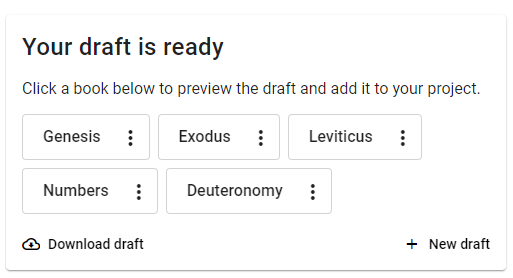

## Questions sur Scripture Forge {#1b30d745ac9e80a38ebef8610e57c100}

1. Comment Scripture Forge s'intègre-t-il dans ma démarche de traduction ?

   _Scripture Forge est un outil conçu pour vous aider à naviguer plus efficacement et plus rapidement dans la phase de rédaction tout en maintenant la qualité de votre travail. Il ne remplace pas les étapes de la traduction. Au lieu de cela, pensez à cela comme une ressource pour vous aider à être plus productif pendant la rédaction et la vérification de la communauté._

2. Scripture Forge conserve-t-il une sauvegarde des données de mon projet ? Qui est responsable de la sécurité des données ?

   _Scripture Forge maintient une version du projet sur les serveurs contrôlés par SIL, et est responsable de la sécurisation de ce projet. Le projet est également synchronisé avec votre projet Paratext, qui est stocké sur les serveurs Paratext. Sachez que les données voyagent sur Internet lorsque vous vous connectez à l'interface de Scripture Forge en ligne._

3. Comment puis-je obtenir le soutien ou l'aide de l'équipe SF ?

   _Vous pouvez utiliser les liens suivants pour nous contacter ou trouver de l'aide:_

   - **Apprentissage et documentation:** [https://software.sil.org/ScriptureForge](https://software.sil.org/ScriptureForge) et [https://help.scriptureforge.org](https://help.scriptureforge.org/)
   - **Signaler un problème :** [https://scriptureforge.freshdesk.com/support/tickets/new](https://scriptureforge.freshdesk.com/support/tickets/new) email: help@scriptureforge.org
   - **Questions et assistance:** courriel : support_team@scriptureforge.org

## Questions sur les sources et la formation du modèle {#1b30d745ac9e80e791d9f0c3ee971c5c}

1. Comment puis-je améliorer la qualité de mes ébauches

   _Il y a 2 façons principales d'améliorer les brouillons._

   - _Le premier est d'ajouter plus de données au modèle de traduction. Vous pouvez le faire en choisissant plus de livres à l'étape 2 - "Sélectionnez les livres à former". Plus il y aura de données disponibles pour la formation, mieux ce seront les résultats des ébauches._
   - _La seconde façon est d'améliorer la qualité des données dans le Modèle de traduction. Vous pouvez le faire en vous assurant que les livres que vous avez choisis sont bien vérifiés pour la cohérence dans des domaines tels que l'orthographe, la ponctuation et le contenu. Plus la qualité des données est élevée, plus le système apprendra à générer de bonnes ébauches._
   - _De nombreuses équipes voient également les avantages d'utiliser une traduction à jour comme source de formation supplémentaire_

2. Pourquoi voulez-vous que je définisse une source de formation distincte de ma source principale ?

   _S'il y a un texte plus proche de votre traduction, il peut faciliter l'apprentissage des relations entre les deux langues. Une source de formation séparée n'est pas toujours nécessaire, mais est une option que nous fournissons_

3. Comment puis-je changer la source ou utiliser une version différente pour former le modèle de traduction?

   _Vous pouvez changer la source de votre projet en naviguant dans Paramètres puis en sélectionnant celui requis en tant que ressource sous « Traduire »._

4. Pourquoi le livre que je veux n'est-il pas visible dans ma liste de livres?

   _Le livre doit exister à la fois dans les projets source et cible dans Paratext. Veuillez vous assurer que ceci et ensuite exécuter un Envoyer/Recevoir dans Paratext et une synchronisation dans Scripture Forge afin que Scripture Forge ait les dernières informations de Paratext_

5. Pourquoi y a-t-il un point d'exclamation rouge lorsque je sélectionne une nouvelle traduction de source principale dans la page Paramètres?

   _Cela signifie que la configuration de la source a échoué. Vous pouvez actualiser la page et essayer à nouveau_

## Questions sur l'ébauchage {#1b30d745ac9e8095b256da102cecb88a}

1. Combien de temps faut-il pour générer mon ébauche

   _Il faut actuellement environ 3 heures pour générer une ébauche. Cependant, comme cela dépend de la disponibilité du serveur et du nombre de livres que vous avez demandés, nous vous recommandons de ne pas générer plus de 3 livres à la fois. Si la génération d'ébauche prend un temps exceptionnellement long, veuillez nous contacter pour signaler le problème._

2. Comment saurai-je que mon ébauche est terminé ?

   _Vous pouvez vérifier la page « Générer une ébauche » pour voir le statut, et une fois terminé, vous verrez un message similaire à ceci :_

   

3. Pourquoi mon livre ne comporte-t-il que le chapitre 1 dans le projet ?
   - _L'ajout d'une ébauche au projet se fait chapitre par chapitre à partir de la fenêtre « AutoEbauche» sous « Édition et revue ». Ainsi, si un seul chapitre est ajouté, ce sera le seul chapitre disponible dans le projet. D'autres chapitres devront être ajoutés individuellement._
   - _Vous pouvez ajouter le livre entier en naviguant vers « Générer une ébauche » et en trouvant l'ébauche qui a été généré. Cliquez sur le menu à 3 points disponible à côté du nom du livre que vous souhaitez ajouter, puis cliquez sur « Ajouter au projet ». Cela va ajouter tout le livre à votre projet_

4. Pourquoi mon bouton dit-il "ré-ajouter au projet"?

   _Si vous éditez un chapitre après "ajout au projet" et que vous voulez revenir au projet SF ébauche non éditée, vous pouvez réimporter l''ebauche originale en cliquant sur le bouton « Ré-ajouter au projet »_

5. Que montre l'onglet Historique ?

   _Lorsque vous apportez des modifications à votre brouillon, Scripture Forge enregistre une version de ces modifications auxquelles vous pouvez accéder via l'onglet Historique. Vous pouvez revenir à une ancienne version de votre projet ici en cliquant sur le bouton « Restaurer cette version »._

