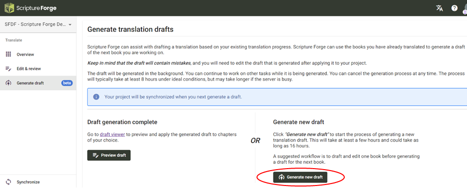
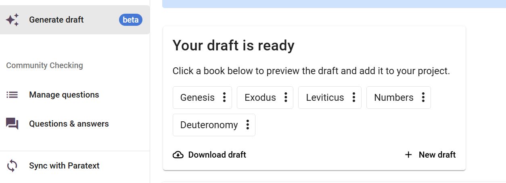

import ReactPlayer from "react-player";

<ReactPlayer controls url="https://youtu.be/binHoeAGGvU" />

Une fois que vous êtes inscrit au brouillon et que vous avez configuré les paramètres requis, vous pouvez accéder au brouillon de l'Ecriture de Forge AI en cliquant sur le bouton « Générer un brouillon » dans le menu principal. Vous aurez maintenant accès au bouton "Générer un nouveau brouillon".

Une fois que vous aurez cliqué, vous serez dirigé vers un **processus en deux étapes** pour générer votre brouillon.

- **Étape 1 :** La première étape pour générer un brouillon est de sélectionner les livres que vous voulez traduire. Seuls les livres qui sont déjà ajoutés à votre projet Paratext seront affichés ici. Nous vous recommandons de sélectionner jusqu'à 5 livres à traduire à la fois.

- **Étape 2:** Ensuite, vous sélectionnerez les livres à utiliser pour former le modèle de langue. Ces livres devraient être bien vérifiés mais ne doivent pas être vérifiés par un consultant. Plus il y a de livres, plus le résultat de la rédaction est important. Si vous avez choisi un livre à traduire à l'étape 1, vous ne pouvez pas le choisir pour former le modèle à cette étape

- Étape 3 (optionnel) : Ensuite, vous pouvez également télécharger des fichiers supplémentaires pour former le modèle de langue. Celles-ci doivent être au format .csv. Cette étape est facultative.

Une fois ces étapes terminées, vous verrez le bouton « Générer un brouillon ». Une fois que vous avez cliqué, donnez du temps à la Forge biblique pour générer les brouillons. This may take roughly 3 hours or longer depending on how busy our servers are.

Once the Draft is ready you should see a notification as shown in the below screenshot.

