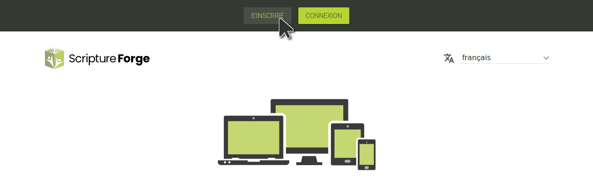
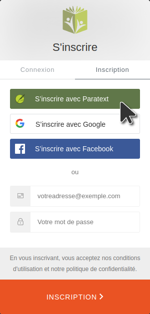
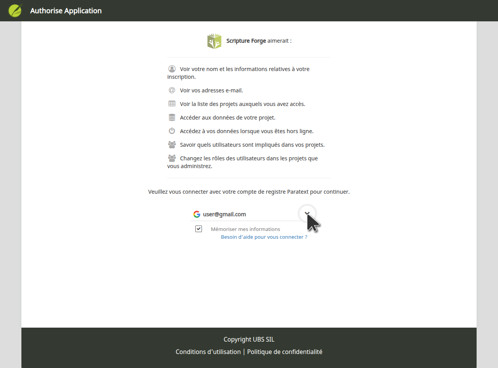

## Se connecter à Scripture Forge avec un compte Paratext {#68acbb7da03045a7b357e41c0107f6d1}

1. Aller sur [https://scriptureforge.org/](https://scriptureforge.org/)
2. Si vous avez déjà une inscription à Paratext (ou si vous avez créé un compte Scripture Forge), cliquez sur le bouton "Connexion" :

Puis cliquez sur Se connecter avec Paratext :

Ensuite, autorisez Scripture Forge à se connecter à votre compte Paratext. Lorsque vous y êtes invité, tapez l'adresse e-mail associée à votre compte de registre [Paratext](https://registry.paratext.org/users/me) puis cliquez sur la flèche de connexion (ou appuyez sur la touche Entrée)

