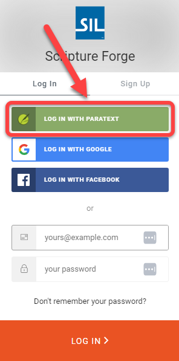

## Se connecter à Scripture Forge avec un compte Paratext {#68acbb7da03045a7b357e41c0107f6d1}

1. Aller sur [https://scriptureforge.org/](https://scriptureforge.org/)
2. Si vous avez déjà une inscription Paratext (ou si vous avez créé un compte Scripture Forge), cliquez sur le bouton Se connecter :

    

3. Cliquez sur Se connecter avec Paratext :

    

4. Autoriser Scripture Forge à se connecter à votre compte Paratext.
    1. Saisissez l'adresse e-mail associée à votre [compte de registre Paratext](https://registry.paratext.org/users/me) (#1 ci-dessous) :

        

    2. Cliquez sur la flèche de connexion (#2 ci-dessus).
