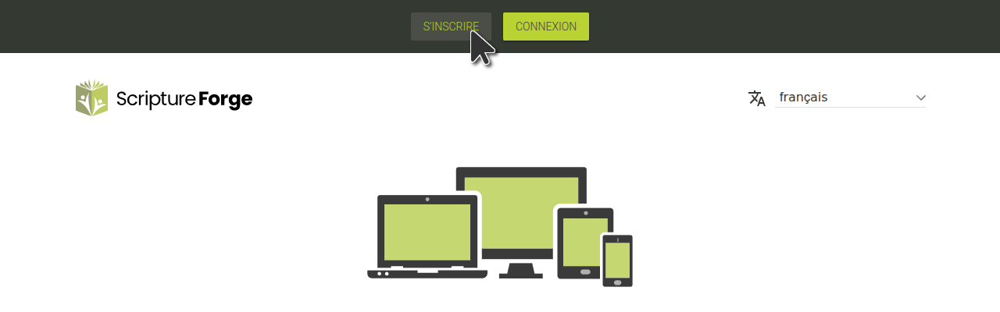
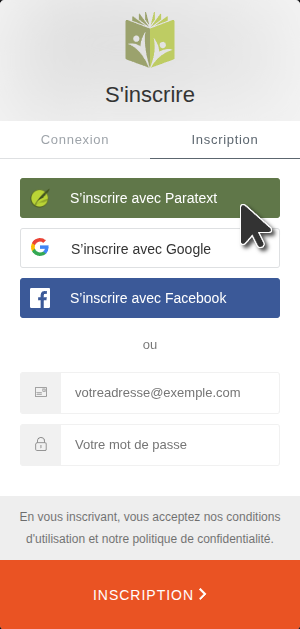
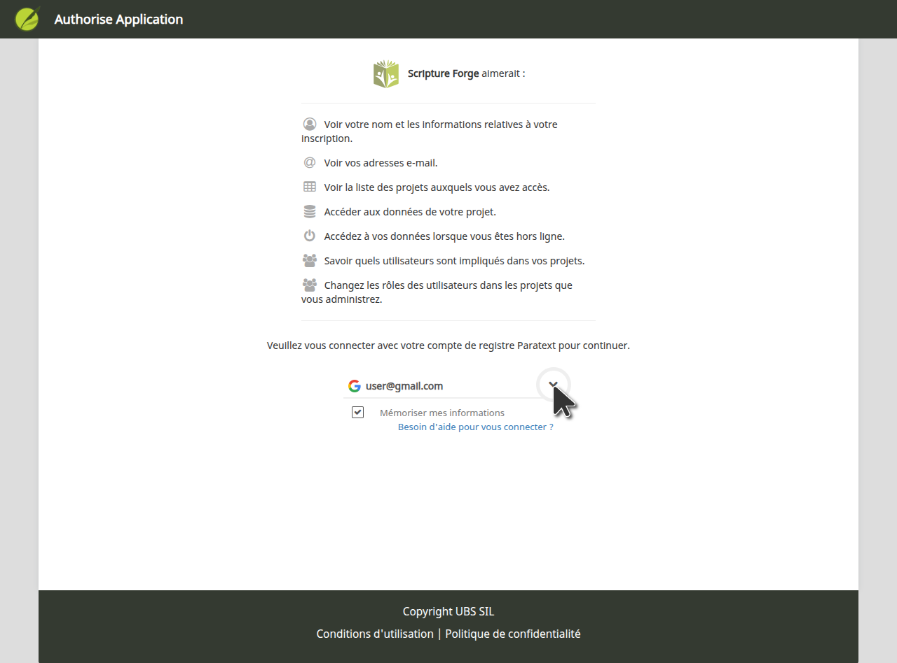

## Se connecter à Scripture Forge avec un compte Paratext

1. Aller sur [https://scriptureforge.org/](https://scriptureforge.org/)
2. If you already have a Paratext registration (or have created a Scripture Forge account), click the **Log In** button. Otherwise click the **Sign Up** button.

Then click **Log in with Paratext** or **Sign up with Paratext**, depending on which button you clicked previously:

Ensuite, autorisez Scripture Forge à se connecter à votre compte Paratext. Lorsque vous y êtes invité, tapez l'adresse e-mail associée à votre compte de registre [Paratext](https://registry.paratext.org/users/me) puis cliquez sur la flèche de connexion (ou appuyez sur la touche Entrée)

