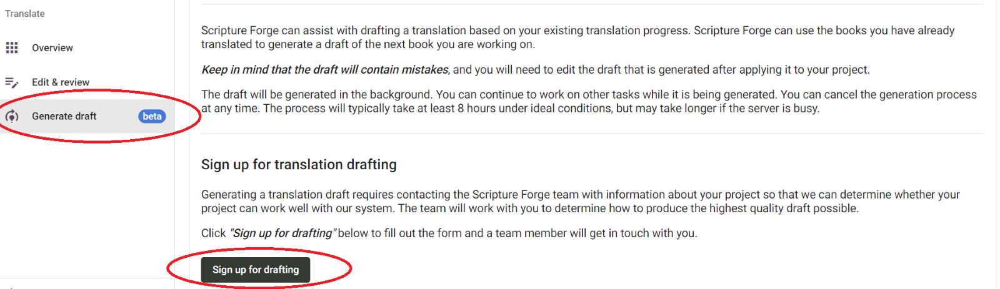

## **Inscrivez-vous pour la rédaction automatique.** {#c01e77600a3b440ead3f1b816837d614}

Pour accéder à la rédaction automatique de Scripture Forge, vous devrez cliquer sur le bouton « Générer un brouillon » dans le menu principal. Si c'est la première fois que vous générez un brouillon dans votre projet, vous serez invité à vous inscrire au projet de traduction et à remplir le formulaire d'ébauche de traduction. Vous verrez le bouton "S'inscrire à la rédaction" comme indiqué dans l'image ci-dessous.

Après avoir rempli le formulaire, veuillez laisser quelques jours à l'équipe d'intégration de Scripture Forge pour l'examiner et rechercher les meilleurs paramètres pour votre projet. Une fois cette étape franchie, l'équipe vous contactera pour vous donner des instructions supplémentaires afin de vous guider dans le processus de rédaction.

### **Sélectionner la traduction de référence principale** {#26e1244e99c0459bad277d7cff4417b8}

Pour sélectionner ou modifier votre Traduction de Référence Primaire, accédez à la fenêtre “Paramètres”. Ici, sous la sous-section Traduire, vous trouverez un menu déroulant qui affichera une liste de ressources. Vous pouvez cliquer ici pour sélectionner ou modifier la traduction de référence de votre projet.

Cela affectera l'ensemble du projet et toute autre personne qui y a accès sur Scripture Forge.

_**Vous ne pouvez pas utiliser la Rédaction Automatique sans sélectionner une traduction de référence principale.**_

Vous avez également la possibilité de cocher la case "Activer les suggestions de traduction" juste en dessous de ce menu déroulant. Cette case permet d'activer les suggestions pour tous les utilisateurs du projet. Veuillez noter que ceci est séparé de la rédaction automatique.

Nous recommandons de désactiver les suggestions de traduction si vous prévoyez d'utiliser la Rédaction Automatique.

## **Paramètres de génération du brouillon de traduction** {#4e17f4ac70274b9d8d615ad3d2679a82}

Une fois que l'équipe d'intégration de Scripture Forge vous a notifié que votre projet est prêt pour la rédaction automatique, cette section apparaîtra dans les paramètres. L'équipe de Scripture Forge vous aidera à obtenir des instructions sur ces paramètres dans le cadre du processus d'intégration.

Comme indiqué dans l'image ci-dessus, vous aurez quelques options présentées. Vous pouvez choisir de laisser ces éléments non cochés si vous ne souhaitez pas les utiliser. Une fois que vous avez sélectionné une case à cocher, utilisez la liste déroulante qui apparaît pour sélectionner votre source alternative.

**1) Utilisez une source différente pour ébaucher une case à cocher**

- Cela vous permettra de sélectionner une traduction qui sera utilisée **à la place de** la traduction de référence principale pour générer un brouillon.
- La traduction alternative sélectionnée ici doit être la **même langue** que la traduction de référence principale.
- Cette traduction influencera le style ainsi que le contenu lexical et exégétique du brouillon.

**2) Utilisez une source différente pour la case à cocher Formation**

- Cela vous permettra de sélectionner une traduction qui sera utilisée **à la place de** la traduction de référence principale pour former le modèle de langue.
- La traduction alternative sélectionnée ici doit être la **même langue** que la traduction de référence principale.
- Il s'agit d'une configuration technique qui ne devrait être définie que si l'équipe de l'Écriture Forge l'indique.

**3) Cochez la case à cocher Pré-traduire les en-têtes et les matériaux non versets** – Nous vous recommandons de laisser cette case décochée. Les titres de section seront encore traduits.

**4) Autorisez la case à cocher des données de formation supplémentaires** – Si vous cochez cette case, vous pourrez télécharger tout autre document pouvant être utilisé pour former le modèle de langue. Ces fichiers doivent contenir des phrases parallèles dans les mêmes langues source et cible que la traduction de référence principale et le projet cible. Veuillez noter que vous ne pouvez **envoyer que des fichiers .csv** à cette fin.
