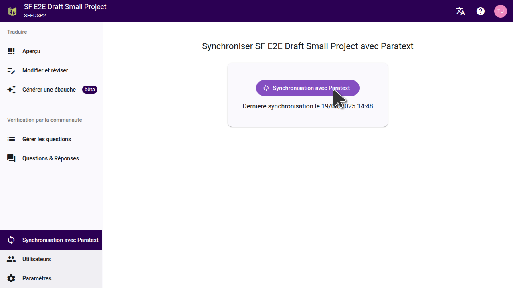

Synchroniser votre projet Scripture Forge avec Paratext est très important car cela permet de sauvegarder les modifications que vous avez faites dans Scripture Forge sur les serveurs Paratext et de tirer les dernières données de votre projet Paratext dans Scripture Forge.

Il est similaire à la fonction Envoyer/Recevoir dans Paratext.

_Notez que la synchronisation d'un projet dans Scripture Forge s'applique à **TOUS LES UTILISATEURs** du projet SF. Il sera également appliqué au serveur Paratext comme une fonction Envoyer/Recevoir._

## Comment synchroniser votre projet {#d0af3ae0f98640c6a88fe4132a015be0}

Ceci vous montrera le bouton « Synchroniser » dans votre fenêtre. Une fois que vous avez cliqué, veuillez patienter jusqu'à ce que la synchronisation soit terminée et que les deux flèches arrêtent de tourner, avant de faire quoi que ce soit d'autre, comme indiqué dans l'image ci-dessous.

## Quand est-il nécessaire de synchroniser un projet {#b19f92d1a5714c4fb57b61672d95b898}

- Une synchronisation automatique se produit lorsque vous connectez initialement un projet à Scripture Forge à partir de Paratext pour la première fois. Scripture Forge est toujours en train d'importer les données de votre projet depuis le serveur Paratext pendant sa synchronisation. Il est important d'attendre que la synchronisation soit terminée (les deux flèches arrêtent de tourner) avant d'essayer de faire autre chose.
- Après avoir apporté des modifications à votre projet Paratext et cliquez sur « Envoyer/Recevoir », Il est important d'exécuter une synchronisation dans Scripture Forge pour permettre l'importation de ces changements dans la Forge. Il ne suffit pas d'exécuter la fonction « Envoyer / recevoir » dans Paratext pour que les changements se reflètent dans la Forge des Écritures.
- Une synchronisation automatique se produit lorsque vous sélectionnez une traduction de référence ou générer une ébauche.
- Après avoir ajouté une ébauche à votre projet dans Scripture Forge, n'oubliez pas d'exécuter une synchronisation pour enregistrer les données sur le serveur Paratext. Ne générez pas une nouvelle ébauche à moins que le premier n'ait été ajouté à votre projet ou qu'il ne soit pas enregistré sur le serveur Paratext et que les données ne soient pas perdues.
- Toute modification ou modification apportée à votre projet dans Scripture Forge doit être synchronisée pour les enregistrer sur le serveur Paratext. Une fois cela fait, vous devrez également exécuter un Envoyer/Recevoir sur votre projet Paratext local pour importer ces modifications.
