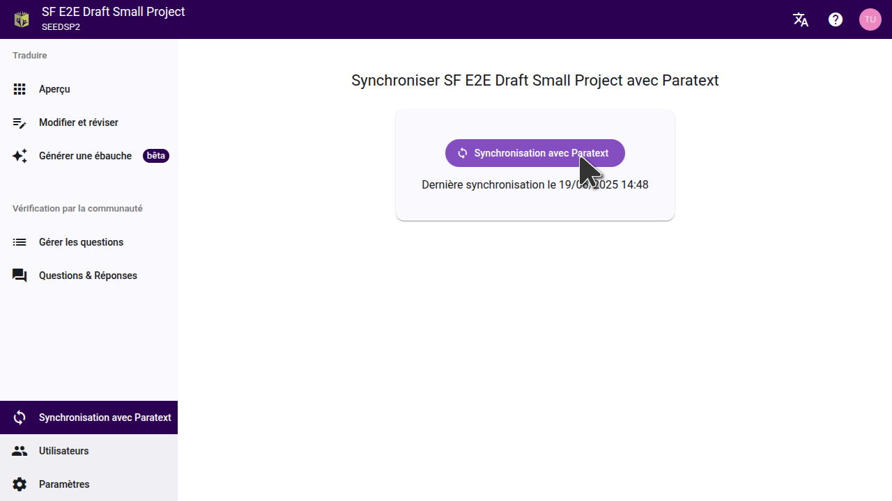

<!-- The following paragraph is an EXACT copy of one of the paragraphs on the /connect-paratext-project page and should be kept in sync with it. Both pages have the need to explain the relationship between Paratext and Scripture Forge projects, and having them identical means translators only have to translate it once. -->

Dans Paratext, chaque membre du projet possède une copie du projet sur son propre ordinateur, et la fonction Envoyer/Recevoir est utilisée pour partager les modifications avec les autres membres. Quand un projet est connecté à Scripture Forge, tous les membres du projet dans Scripture Forge travaillent sur une seule copie du projet, de sorte que tout changement effectué par un membre est immédiatement vu par un autre membre, si les deux membres sont en ligne. Ces modifications seront envoyées au projet Paratext quand une synchronisation est effectuée dans Scripture Forge, et toutes les modifications apportées dans Paratext seront synchronisées avec le projet Scripture Forge.

## Comment synchroniser votre projet {#d0af3ae0f98640c6a88fe4132a015be0}

Pour synchroniser un projet, cliquez sur **Synchroniser avec Paratext** dans le menu de navigation principal. Cliquez ensuite sur le bouton **Synchroniser avec Paratext** comme indiqué ci-dessous. La progression sera affichée pendant que la synchronisation est en cours d'exécution, ce qui prend généralement de 1 à 3 minutes, selon la taille du projet.

Si Scripture Forge est occupé à synchroniser d'autres projets, cela peut prendre un certain temps avant que la synchronisation ne démarre, même si c'est rare. Parfois, une synchronisation échouera et vous devrez réessayer. Si une synchronisation continue à échouer, ou que cela prend beaucoup de temps, veuillez [nous contacter pour obtenir de l'aide](mailto:help@scriptureforge.org).

## Quand synchroniser un projet {#b19f92d1a5714c4fb57b61672d95b898}

À divers moments, Scripture Forge synchronisera automatiquement votre projet avec Paratext. Ceux-ci inclus :

- La première fois que vous connectez un projet.
- Lorsque vous commencez à générer une nouvelle ébauche.
- Quand la source d'un projet est modifiée, ou les sources de rédaction sont configurées.

Vous devriez exécuter une synchronisation à chaque fois que vous voulez envoyer des changements de Paratext vers Scripture Forge ou de Scripture Forge vers Paratext. Voici quelques exemples de quand vous devriez exécuter une synchronisation :

- Un livre vient d'être complété dans Paratext et vous voulez générer une ébauche d'un autre livre. Vous devriez faire un Envoyer/Recevoir dans Paratext, puis une synchronisation dans Scripture Forge afin que le livre terminé soit disponible en tant que formation des données dans Scripture Forge.
- Un livre est prêt pour la vérification de la communauté. Vous devriez faire un Envoyer/Recevoir dans Paratext, puis une synchronisation dans Scripture Forge pour que la dernière copie du livre soit montrée aux vérificateurs de la communauté.
- Les traducteurs ont modifié le texte dans la Forge des Écritures, ou ont fait d'autres changements que vous voulez dans Paratext. Vous devriez faire une synchronisation dans Scripture Forge puis un envoyer/recevoir dans Paratext pour obtenir les dernières modifications.

Vous devriez éviter d'attendre beaucoup de temps pour synchroniser après avoir modifié le texte dans la Forge des Écritures. Si quelqu'un fait des modifications dans Paratext avant de synchroniser les modifications sur Paratext, cela peut causer des conflits dans Paratext.