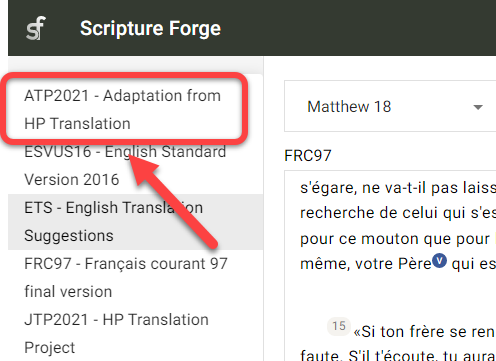

## Que sont les suggestions de traduction ? {#5f721bd65922446f8eefb001acc89f30}

:::info

"info"Suggestions de traduction" est une ancienne fonctionnalité de Scripture Forge qui fournit des suggestions interactives aux traducteurs lorsqu'ils tapent dans Scripture Forge. Il fonctionne mieux lorsque vous traduisez entre des langues très similaires.

La rédaction de la traduction est un outil de traduction plus récent, plus souple et plus puissant dans Scripture Forge qui crée des ébauches pour les traducteurs à réviser et à modifier.

:::

Les suggestions de traduction permettent à Scripture Forge d'analyser une langue source et une langue cible ensemble, et de suggérer automatiquement des mots/phrases à utiliser dans le processus de traduction.

- Les suggestions de traduction sont basées sur l'analyse par Scripture Forge des versets du projet cible qui ont déjà été traduits à partir du projet source.
- Plus vous avez de versets à la fois dans la langue source et dans la langue cible, meilleures seront les suggestions.
- Les suggestions fonctionnent mieux avec des langues qui sont plus similaires, et ne fonctionnent pas bien avec des langues qui ne sont pas apparentées.
- Avant de commencer à utiliser les suggestions de traduction, un administrateur du projet Paratext doit activer les suggestions de traduction pour votre projet.

## Configuration de votre fenêtre de suggestions de traduction {#055dfd61aa9442e3b6c787613c8085d6}

:::note

Ceci doit être fait par chaque utilisateur qui souhaite utiliser les suggestions de traduction.

:::

### Sélectionner Votre Projet {#4de2ee23101e4a498e465465740c5a51}

:::tip

Tout d'abord, vous devez **sélectionner votre projet** à partir de la page de navigation, si ce n'est pas déjà fait.

:::

1. Cliquez sur le volet de navigation Scripture Forge :

    

2. Sélectionnez votre projet :

    

**OU**

1. Cliquez sur l'icône de menu Scripture Forge :

    

2. Cliquez sur le menu déroulant du projet :

    

3. Cliquez sur votre projet :

    

### Configuration de la fenêtre des suggestions de traduction {#8798a078b0464f5190de5d6dd7e4d132}

1. Dans le volet de navigation, cliquez sur la section Traduire :

    

2. Cliquez sur le livre sur lequel vous voulez travailler :

    

3. Le texte source s'affiche dans la partie gauche et le texte du projet cible dans la partie droite :

    

    1. **Remarque :** Le nom du projet/de la ressource que vous utilisez se trouve dans le coin supérieur gauche de chaque fenêtre :

        

4. Pour passer d'un livre à l'autre :
    1. Allez dans le volet de navigation > Section Traduire.
    2. Cliquez sur le nom du livre :

    

5. Pour passer d'un chapitre à l'autre :
    1. Cliquez sur les flèches droite et gauche en haut de la fenêtre :

    

6. Pour changer de côté les projet source et cible :
    1. Cliquez sur le bouton "Intervertir la source et la cible" :

    

    1. Cela déplacer le projet cible vers la gauche et le projet/la ressource source vers la droite :

    

## Qu'est-ce qu'un segment ? {#3931f83c77104d27bfa1bcd797303914}

:::tip

Avant d'effectuer des travaux de traduction dans Scripture Forge, vous devez comprendre ce qu'est un "**segment**".

:::

Dans Scripture Forge, un segment est une section des Écritures à traduire. Il peut s'agir d'un titre de section, d'un verset ou d'une partie de verset (comme dans la poésie).

Par exemple, le passage suivant comporte 6 segments (titre, titre de section, verset 1, etc.) :

Dans le passage suivant, il y a 8 segments au total (remarque : le verset 23 a 6 segments) :

## Comment utiliser les suggestions de traduction {#007fd10ab17d498ea44ffb913d92663f}

Maintenant que vous comprenez comment naviguer dans Scripture Forge, il est temps d'apprendre à utiliser **les suggestions de traduction**. Souvenez-vous que les suggestions de traduction permettent à Scripture Forge d'analyser votre travail de traduction et de suggérer automatiquement des mots/phrases à utiliser dans le processus de traduction.

1. Dans votre projet, allez au livre et au chapitre que vous voulez traduire.
2. Cliquez dans le segment que vous souhaitez traduire.
3. Commencez à saisir votre traduction (côté droit) :

    

    1. Remarque : Scripture Forge enregistre les modifications au fur et à mesure de la saisie.
4. Au fur et à mesure que vous saisissez, des suggestions peuvent apparaître dans une case située en dessous de l'endroit où vous tapez :

    

5. À côté des suggestions se trouve un pourcentage :

    

    1. Il indique le degré de confiance du système dans la justesse de cette suggestion. Une suggestion avec pourcentage élevé a plus de chances d'être une suggestion de meilleure qualité.
6. Si vous souhaitez utiliser une suggestion, cliquez dessus ou appuyez sur **Entrée** lorsque cette suggestion est mise en surbrillance.

    

7. Ceci insérera cette suggestion dans le texte :

    

8. Si vous n'aimez pas une suggestion qui a été insérée dans le texte :
    1. Supprimez ou modifiez simplement les mots qui doivent être changés.

        

9. Si aucune des suggestions n'est suffisamment bonne, vous pouvez les ignorer et continuer à traduire.

### Continuer à traduire {#9e130c3ad9c048a4822e37e0d0ba0750}

:::tip

Scripture Forge continuera à apprendre et à faire de meilleures suggestions pendant que vous traduisez.

Pour ajuster les _**Paramètres des suggestions de traduction**_ pour votre utilisateur, voir les étapes [ici](/translation-suggestions).

:::

### Raccourcis clavier {#228a943ddd984192b78ae4ccb39c6211}

1. Lorsque Scripture Forge vous propose des suggestions de traduction, vous pouvez utiliser **les touches fléchées Haut** et **Bas** pour mettre en surbrillance la suggestion que vous souhaitez.

    

    1. Appuyez ensuite sur **Entrée** pour utiliser la suggestion.
2. Vous pouvez également appuyer sur **CTRL + &lt;a number key&gt;** pour insérer ce nombre de mots pour la suggestion mise en évidence.
    1. Par exemple, si "Capernaüm et ils disent" est mis en évidence :

        

    2. Voici ce que les touches de raccourci inséreraient :

        | Raccourci | Mots insérés            |
        | --------- | ----------------------- |
        | Ctrl + 1  | Capernaüm               |
        | Ctrl + 2  | Capernaüm et            |
        | Ctrl + 3  | Capernaüm et ils        |
        | Ctrl + 4  | Capernaüm et ils disent |

## Ajuster les paramètres des suggestions de traduction - par utilisateur {#3822d035acfd42ae888cefbd7b71fcb5}

:::note

Vous pouvez configurer les paramètres des suggestions de traduction pour votre utilisateur individuel.

:::

1. Sélectionnez votre projet dans le volet de navigation.
2. Cliquez sur la section Traduire.
3. Cliquez sur le livre sur lequel vous voulez travailler :
    1. **Remarque :** Vous pouvez sélectionner n'importe quel livre pour cette partie, les paramètres sont les mêmes pour tous les livres.
4. Cliquez sur le bouton Paramètres des suggestions de traduction :

    

5. La boîte de dialogue Paramètres des suggestions de traduction s'affiche :

    

6. **Suggestions de traduction** : Cela permet d'afficher ou de masquer les suggestions dans le **projet en cours** pour **votre utilisateur**.
    1. Cliquez sur le bouton Suggestions de traduction pour afficher ou masquer les suggestions de traduction pendant que vous saisissez :

    

7. **Nombre de suggestions** : Cette option permet de modifier le nombre de suggestions que vous verrez en même temps.
    1. Cliquez sur la zone Nombre de suggestions :

        

    2. Cliquez ensuite sur le nombre maximum de suggestions que vous souhaitez voir apparaître en même temps :

        

8. **Confiance dans les suggestions** : La valeur en pourcentage qui apparaît au-dessus du curseur affiche le niveau de confiance minimum des suggestions qui seront proposées.
    1. Cliquez et faites glisser le curseur pour ajuster le niveau de confiance :

        

    2. **Plus** _augmente_ le nombre de suggestions en incluant _plus_ de suggestions qui ont un faible niveau de confiance.
    3. **Mieux** _diminue_ le nombre de suggestions en incluant _moins_ de suggestions qui ont un faible niveau de confiance.
9. Cliquez sur Fermer lorsque vous avez terminé.
