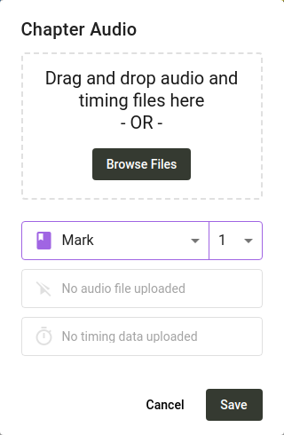

import ReactPlayer from "react-player";

## Menambahkan Pertanyaan ke Proyek {#1850d745ac9e80e09444cb3564752e31}

Untuk mendapatkan umpan balik atas terjemahan Anda, Anda perlu menambahkan pertanyaan pemeriksaan pemahaman. Anda dapat mengimpor pertanyaan yang dibuat oleh orang lain, atau membuat pertanyaan sendiri.

:::note

Saat ini satu-satunya cara untuk mendapatkan umpan balik dari para masyarakat pemeriksa adalah dengan mengajukan pertanyaan-pertanyaan pemeriksaan. Beberapa administrator proyek telah meminta agar pemeriksa dapat menambahkan komentar pada teks bahkan tanpa adanya pertanyaan. If that's something your project may benefit from, please [voice your support for the proposal](https://community.scripture.software.sil.org/t/feature-request-comments-to-any-bible-verse-chosen/2506/6) on the [Scripture Forge community site](https://community.scripture.software.sil.org/).

:::

<ReactPlayer controls url="https://youtu.be/J-led5En3D8" />

### Membuat pertanyaan secara individu di Scripture Forge {#1850d745ac9e8031908ef693ff578eec}

Untuk menambahkan pertanyaan ke proyek Anda, klik **Ringkasan** di bawah bagian **Pemeriksaan Masyarakat** pada bilah sisi navigasi. Kemudian klik tombol **Tambah Pertanyaan**. Sebuah dialog akan terbuka yang memungkinkan Anda untuk membuat pertanyaan.

Sebuah pertanyaan dapat berlaku untuk satu ayat, atau beberapa ayat. Ketik referensi ke dalam kotak **Referensi Alkitab**, atau klik panah tarik-turun untuk memilih kitab, pasal, dan ayat. Jika Anda ingin pertanyaan mencakup beberapa ayat, masukkan referensi akhir di kotak kedua. Once you've input a reference, the text will show up, with the verses you chose highlighted.

Ketik pertanyaan Anda di kotak **Pertanyaan**. Jika Anda ingin menambahkan versi audio dari pertanyaan tersebut, klik tombol **Rekam**. Anda mungkin akan diminta untuk memberikan izin untuk mengakses mikrofon Anda. Setelah Anda selesai merekam, klik **Hentikan Perekaman**. Kemudian, Anda dapat memutar rekaman untuk mendengar hasilnya. Click the **Try Again** button if you're not satisfied with it. Anda juga dapat mengunggah file audio alih-alih merekam, jika Anda mau.

Klik **Simpan** dan pertanyaan Anda akan ditambahkan ke daftar pertanyaan pemeriksaan masyarakat.

### Mengimpor pertanyaan dari spreadsheet {#1850d745ac9e8085960dd88b648f0c7a}

Creating questions one by one can be tedious, so we've also made it possible to import questions from a spreadsheet. Anda dapat menggunakan program seperti Microsoft Excel, Google Spreadsheet, atau LibreOffice Calc untuk membuat atau menyunting daftar pertanyaan. If you're looking for a set of pre-made questions, consider the [unfoldingWord® Translation Questions](https://git.door43.org/unfoldingWord/en_tq). Jika Anda membuka halaman yang ditautkan dan mengklik salah satu file, Anda dapat mengunduhnya, membukanya sebagai spreadsheet, dan menyunting daftar pertanyaan.

Here's an example of how the rows in your spreadsheet should look in order to be able to import it to Scripture Forge:

| Referensi                 | Pertanyaan                                              |
| ------------------------- | ------------------------------------------------------- |
| HEB 1:1   | What does "our fathers" refer to?                       |
| HEB 1:2   | What does it mean that the Son is "heir of all things"? |
| HEB 1:2-3 | Who is the "Son" spoken of in these verses?             |

The spreadsheet can have more columns as well, but all columns except the "reference" and "question" columns will not be used. File TSV yang diterbitkan oleh unfoldingWord memiliki format yang sedikit berbeda, tetapi dapat diimpor ke Scripture Forge juga.

:::note

Referensi harus memiliki nama kitab yang disingkat dengan cara yang sama seperti Paratext menyingkat nama kitab. Sebagai contoh, **Ibr 1:1** dapat digunakan, tetapi **Ibrani 1:1** tidak dapat digunakan.

:::

Jika Anda membutuhkan bantuan untuk memasukkan spreadsheet Anda ke dalam format yang tepat untuk diimpor ke Scripture Forge, kami akan dengan senang hati membantu Anda. Cukup kirimkan email ke [help@scriptureforge.org](mailto:help@scriptureforge.org).

1. Simpan spreadsheet Anda menjadi file CSV.

   :::note

   If you are using Microsoft Excel, be sure to select "CSV UTF-8 (Comma delimited) (\*.csv)" as the file type when exporting as CSV.

   :::

2. Kemudian di Scripture Forge, klik **Ringkasan** di bawah bagian **Pemeriksaan Masyarakat** di bilah sisi navigasi.

3. Kemudian klik tombol **Impor masal**. Sebuah dialog akan terbuka dan meminta Anda untuk memilih dari mana Anda ingin mengimpor pertanyaan.

4. Klik **Import dari file CSV** dan pilih file.
   1. If you have some rows in your file that don't have a valid reference and question, a warning will be shown letting you know that these rows will be skipped.
   2. Jika tidak, Anda akan diperlihatkan daftar pertanyaan.

### Impor semua pertanyaan {#1850d745ac9e80b59ae8cabac1b67e7f}

Untuk mengimpor semua pertanyaan dalam file CSV, ikuti langkah-langkah berikut:

1. Klik kotak centang di bagian atas daftar. Ini akan memilih semua pertanyaan.
2. Klik **Import Pertanyaan yang Dipilih**.

### Mengimpor sebagian pertanyaan {#1850d745ac9e8045aa5bd2ab9ce99fbc}

Anda juga dapat menyaring sebagian pertanyaan:

1. Gunakan kotak **Referensi dari** dan **Referensi ke** untuk menentukan ayat-ayat yang Anda inginkan untuk memulai dan mengakhiri pertanyaan.
2. Misalnya, jika Anda hanya ingin mengimpor pertanyaan untuk Markus 5:
   1. Masukkan **Mrk 5:1** ke dalam kotak **Referensi dari**.
   2. Masukkan **Mrk 5:43** ke dalam kotak **Referensi dari**.
3. Klik kotak centang di bagian atas daftar untuk memilih semua pertanyaan. Hanya pertanyaan yang ditampilkan yang akan dipilih.
4. Klik **Import Pertanyaan yang Dipilih**.

:::note

You don't have to remember that there are 43 verses in Mark 5 in order to filter for all the verses in the chapter. Jika Anda mengklik panah tarik-turun pada kotak **Referensi Ayat** ke, sebuah dialog akan terbuka yang memungkinkan Anda untuk memilih kitab, pasal, dan ayat. Once you select Mark 5, it will list the verses in Mark 5, and you'll be able to select the last one, which is verse 43. Alternatively you can type **MRK 5:100** in the **Reference to** box, and all the verses in Mark 5 will be included, even though there isn't actually a verse 100 in Mark 5.

:::

### Mengimpor pertanyaan dari Transcelerator {#1850d745ac9e8003815fc894b8baaeb7}

[Transcelerator](https://software.sil.org/transcelerator/) adalah plugin untuk Paratext yang memiliki gudang pertanyaan untuk pemeriksaan pemahaman siap pakai dalam beberapa bahasa utama. Pertanyaan-pertanyaan tersebut dapat diterjemahkan di dalam Paratext, diekspor ke Scripture Forge, dan kemudian setelah disinkronkan, diimpor ke dalam Scripture Forge.

Untuk mengimpor pertanyaan dari Transcelerator:

1. Unduh dan pasang Transcelerator dari [software.sil.org/transcelerator/download](https://software.sil.org/transcelerator/download/).
2. Restart Paratext.
3. Dari dalam Paratext, luncurkan Transcelerator.
4. Di dalam Transcelerator, buka menu **File** dan klik **Buat File Scripture Forge**.
5. Ketik terjemahan dari pertanyaan bahasa Inggris yang ingin Anda gunakan di kolom **Terjemahan**. For each question that's ready, select the **Confirmed** check box for the questions.
6. Tutup Transcelerator, dan lakukan Kirim/Terima Paratext.
7. Di Scripture Forge, di bilah sisi navigasi, klik **Sinkronisasi**. Pada halaman yang terbuka, klik **Sinkronisasi** untuk mengirim dan menerima pertanyaan Transcelerator dari Paratext.
8. Klik **Ringkasan** di bawah bagian **Pemeriksaan Masyarakat** di bilah sisi navigasi. Kemudian klik tombol **Impor masal**.
9. Sebuah dialog akan terbuka dan meminta Anda untuk memilih dari mana Anda ingin mengimpor pertanyaan. Klik **Import dari Transcelerator**.
10. Pilih pertanyaan yang ingin Anda impor. Langkah-langkah untuk melakukan hal ini sama persis dengan bagian di atas yang berjudul **Mengimpor pertanyaan dari spreadsheet**. Lihat bagian tersebut untuk petunjuk tentang penyaringan pertanyaan yang Anda inginkan.
11. Klik **Import Pertanyaan Terpilih** dan pertanyaan Anda akan ditambahkan ke proyek.

## Lampirkan rekaman audio teks {#1850d745ac9e80e795f3d611356e74d5}

Scripture Forge dapat memutar rekaman audio dari setiap bagian untuk para masyarakat pemeriksa. Untuk melakukan ini, Anda perlu mengunggah berkas audio dan data waktu untuk setiap pasal. File pengaturan waktu memungkinkan Scripture Forge untuk menyorot setiap ayat saat sedang diucapkan.

### Merekam teks {#1850d745ac9e805eb4b1c0f05d6da02a}

Scripture Forge mendukung audio dalam format file .mp3 dan .wav. File pengaturan waktu didukung dari HearThis, aeneas, Audacity, dan Adobe Audition.

Salah satu opsi yang paling sederhana adalah dengan menggunakan [HearThis](http://software.sil.org/hearthis) untuk merekam terjemahan. [Panduan ini](https://software.sil.org/downloads/r/scriptureappbuilder/Scripture-App-Builder-08-Using-HearThis-for-Audio-Recording.pdf) akan memandu Anda melalui proses perekaman Akitab dan menghasilkan file audio dan file waktu. Lewati langkah-langkah di bagian akhir tentang menggunakan Scripture App Builder.

[Sumber](https://software.sil.org/scriptureappbuilder/resources/) untuk Scripture App Builder membahas pendekatan yang lebih canggih, seperti menggunakan Glyssen untuk rekaman audio yang didramatisasi.

### Membuat file waktu {#1850d745ac9e80c7b583c6d50193d7c9}

Jika Anda sudah merekam audio, ada beberapa opsi untuk membuat data waktu.

Anda dapat secara otomatis menghasilkan file waktu menggunakan aeneas dengan mengikuti [petunjuk ini](https://software.sil.org/downloads/r/scriptureappbuilder/Scripture-App-Builder-07-Using-aeneas-for-Audio-Text-Synchronization.pdf).

Sebagai alternatif, Anda dapat membuat file waktu secara manual menggunakan Audacity dengan mengikuti [panduan ini](https://software.sil.org/downloads/r/scriptureappbuilder/Scripture-App-Builder-06-Using-Audacity-for-Audio-Text-Synchronization.pdf). Pilihan lainnya adalah Adobe Audition. Data waktu dari Adobe Audition didukung dalam format waktu desimal atau FPS. We don't support the "samples" format.

### Melampirkan audio {#1850d745ac9e80668685c9ea58252d6b}

Untuk mengunggah berkas audio dan data waktu, pada bilah sisi klik **Pertanyaan & jawaban**, arahkan ke pasal yang ingin Anda lampirkan audionya, lalu klik ikon **Kelola Audio** di pojok kanan atas. Klik **Jelajahi File** dan pilih rekaman audio dan data waktu terkait untuk pasal tersebut, lalu klik **Simpan**.

