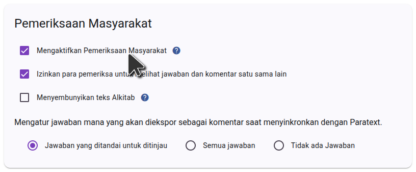

Untuk menggunakan pemeriksaan masyarakat Scripture Forge, Anda harus terlebih dahulu masuk ke Scripture Forge menggunakan akun Paratext Anda dan Hubungkan proyek Anda. Setelah proyek Anda terhubung, navigasikan ke Pengaturan dan gulir ke bawah ke bagian Pemeriksaan Masyarakat. Pastikan kotak centang "Aktifkan Pemeriksaan Masyarakat" dipilih seperti yang ditunjukkan pada gambar di bawah ini

