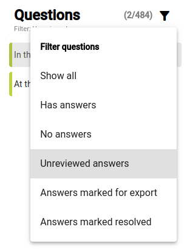
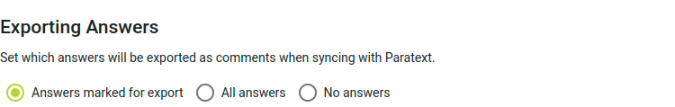

import ReactPlayer from "react-player";

## Menerima dan berinteraksi dengan jawaban atas pertanyaan-pertanyaan yang diajukan {#1850d745ac9e800db3dacdee0053beca}

<ReactPlayer controls url="https://youtu.be/C3bgh3yufVg" />

Untuk memantau tanggapan pemeriksaan masyarakat, klik **Ringkasan** di bawah bagian **Pemeriksaan masyarakat** pada bilah navigasi. Bersama dengan daftar pertanyaan, statistik dasar tentang tanggapan akan ditampilkan.

Untuk melihat jawaban dari para masyarakat pemeriksa, klik salah satu kitab di bagian **Pemeriksaan Masyarakat** pada bilah sisi navigasi. Kemudian klik pada sebuah pertanyaan untuk melihat jawaban yang telah diberikan. Jika Anda ingin jawaban diekspor ke Paratext, klik **Tandai untuk diekspor** pada jawaban tersebut. Jika Anda tidak ingin melakukan apa pun lebih lanjut dengan jawabannya, klik **Selesaikan**. Hal ini tidak menghapus jawaban, tetapi menandainya sebagai tidak memerlukan tindakan lebih lanjut.

Jika Anda ingin menemukan jawaban yang belum ditandai untuk diekspor, atau ditandai diselesaikan, gunakan filter di atas daftar pertanyaan untuk menemukan **Jawaban yang belum ditinjau**.

Jika Anda lebih suka semua jawaban diekspor ke Paratext tanpa menandainya satu per satu untuk diekspor, buka pengaturan proyek dan temukan bagian **Mengekspor Jawaban**. Opsi standar adalah hanya mengekspor **Jawaban yang ditandai untuk diekspor**, tetapi pengaturan ini dapat diubah menjadi **Semua jawaban** atau **Tanpa jawaban**.

## Sinkronkan proyek sehingga jawaban muncul sebagai catatan di Paratext {#1850d745ac9e80a8b3f0f50bcdd0be58}

Pada bilah sisi navigasi, klik **Sinkronisasi**. Pada halaman yang terbuka, klik **Sinkronisasi** untuk mengirim dan menerima perubahan dari Paratext. Kemudian buka proyek Anda di Paratext dan lakukan Kirim dan Terima. Jawaban dari pemeriksa masyarakat akan muncul di proyek Anda sebagai catatan. Harap diperhatikan bahwa jika Anda membalas catatan-catatan ini di Paratext, balasan Anda tidak akan muncul sebagai komentar pada jawaban di Scripture Forge.

Catatan tersebut akan menampilkan pertanyaan asli, nama masyarakat pemeriksa yang menjawab, dan jawabannya, seperti yang ditunjukkan di bawah ini.

Catatan yang dihasilkan dari jawaban pemeriksaan masyarakat akan memiliki tagar catatan yang unik, dengan ikon yang berbeda dari catatan lain di proyek Paratext Anda. Anda dapat mengubah ikon dengan menyunting tagar catatan. Untuk detailnya, lihat [artikel bantuan Paratext tentang tagar catatan khusus](https://paratext.org/paratext-training/tutorials/custom-project-note-tags-tutorial/). Anda juga dapat [memfilter catatan berdasarkan tag catatan mereka](https://paratext.org/2022/08/15/custom-note-tags/#Filter_for_Custom_Note_Tags), yang memungkinkan Anda untuk hanya menampilkan tanggapan yang diperiksa oleh komunitas, atau menyembunyikannya dari tampilan.

:::note

Saat ini jawaban audio muncul di Paratext tetapi audio tidak dapat diputar. Untuk memutar audio dari sebuah jawaban, jawaban tersebut harus dibuka di Scripture Forge. Hal ini dapat ditingkatkan di masa mendatang.

:::

