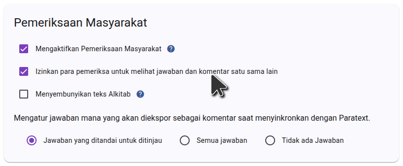
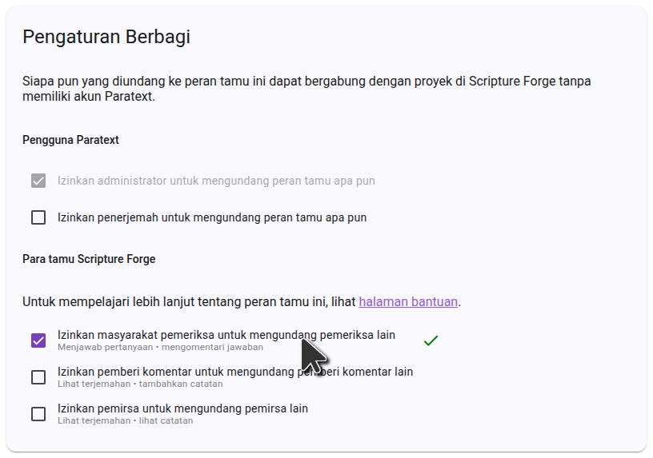
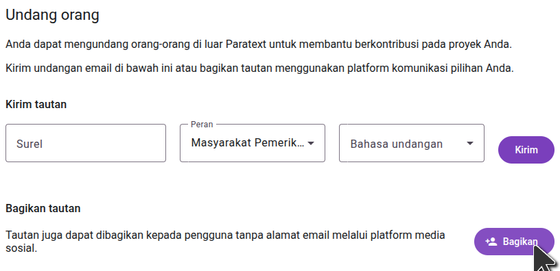

import ReactPlayer from "react-player";

## Undang orang untuk memeriksa proyek Anda {#1850d745ac9e80caacf5e643bb216f77}

<ReactPlayer controls url="https://youtu.be/aBPHCF56hxA" />

Setelah Anda memiliki pertanyaan-pertanyaan tentang proyek Anda, sekarang saatnya untuk mengundang para masyarakat pemeriksa.

In the side bar, click **Settings**, and scroll down to **Sharing settings**.

### Pengaturan interaksi pengguna {#1850d745ac9e8018b5a7ff9f3ea349e9}

The first setting to consider is **Allow checkers to see each other's answers and comments**. Ketika masyarakat pemeriksa diberikan pertanyaan, jawaban yang sudah ada dari masyarakat pemeriksa lain tidak ditampilkan sehingga tidak akan mempengaruhi jawaban yang diberikan. Setelah sebuah pertanyaan dijawab, jawaban lain dari pertanyaan tersebut akan ditampilkan, dan para pemeriksa dapat mengomentari dan menyukai jawaban satu sama lain. If you don't want this interaction and want answers from other checkers to always be hidden, turn off **Allow checkers to see each other's answers and comments**.

### Pengaturan berbagi {#1850d745ac9e8097ad4efcb063fc2603}

If you want community checkers to be able to invite friends to the project, make sure **Allow community checkers to invite community checkers** is enabled. Jika pengaturan ini tidak aktif, hanya admin proyek yang dapat menambahkan masyarakat pemeriksa ke dalam proyek.

### Mengundang masyarakat pemeriksa {#1850d745ac9e802d84d8e00da4fe25c2}

Pada bilah samping, klik **Pengguna**, dan Anda akan disajikan opsi berbagi.

To invite someone by sending a link, click **Share**, select the language you want Scripture Forge to show the recipient, and copy the link. You can then send this link to anyone you want to invite to the project. When they click the link, they will be able to join the project as a community checker.

If you want to send email invitations to users, type the email of the user you want to invite, select the **Community Checker** role, and choose an invitation language. Kemudian klik **Kirim**. Sebuah email berisi tautan akan dikirimkan kepada orang tersebut, yang harus mengklik tautan tersebut dan mendaftar untuk bergabung dengan proyek ini.

